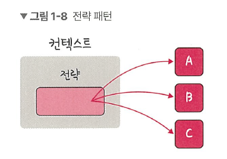
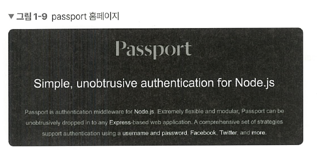

# 1.1.3 전략 패턴
전략 패턴(strategy)은 정책 패턴(policy)이라고도 하며, 객체의 행위를 바꾸고 싶은 경우 ‘직접’ 수정하지 않고 전략이라고 부르는 ‘캡슐화한 알고리즘’을 컨텍스트 안에서 바꿔주면서 상호 교체가 가능하게 만드는 패턴입니다. 



아래는 어떤 것을 살 때 네이버페이, 카카오페이 등 다양한 방법으로 결제하듯이 어떤 아이템을 살 때 LUNACard로 사는 것과 KAKAOCard로 사는 것을 구현한 예제입니다. 결제 방식의 ‘전략’만 바꿔서 두 가지 방식을 결제하는 것을 구현했습니다. 

## 자바의 전략 패턴
```java
import java.text.DecimalFormat;
import java.util.ArrayList;
import java.util.List;

// PaymentStrategy 인터페이스
interface PaymentStrategy {
	public void pay(int amount);  // 모든 결제 방식이 pay() 메서드를 공통으로 가져야 한다고 강제
}

// PaymentStrategy 인터페이스를 구현한 실제 전략 - KAKAOCardStrategy
class KAKAOCardStrategy implements PaymentStrategy {
	private String name;
	private String cardNumber;
	private String cvv;
	private String dateOfExpiry;
	
	public KAKAOCardStrategy(String nm, String ccNum, String cvv, String expiryDate) {
		this.name = nm;
		this.cardNumber = ccNum;
		this.cvv = cvv;
		this.dateOfExpiry = expiryDate;
	}
	
	// pay() 메서드 안에서 결제 방식을 다르게 구현 
	@Override
	public void pay(int amount) {  
		System.out.println(amount + " paid using KAKAOCard.");
	}
}

// PaymentStrategy 인터페이스를 구현한 실제 전략 - LUNACardStrategy 
class LUNACardStrategy implements PaymentStrategy {
	private String emailId;
	private String password;
	
	public LUNACardStrategy(String email, String pwd) {
		this.emailId = email;
		this.password = pwd;
	}
	
	@Override
	public void pay(int amount) {
		System.out.println(amount + " paid using LUNACard.");
	}
}

// 상품 하나를 표현 
class Item {
	private String name;
	private int price;
	public Item(String name, int cost) {
		this.name = name;
		this.price = cost;
	}
	
	public String getName() {
		return name;
	}
	
	public int getPrice() {
		return price;
	}
}

// (위의 Item 클래스 예시 사용법)
Item itemA = new Item("커피", 3000);
System.out.println(itemA.getName()); // "커피"
System.out.println(itemA.getPrice()); // 3000

// 장바구니 전체 
class ShoppingCart {
	List<Item> items;
	
	public ShoppingCart() {
		this.items = new ArrayList<Item>();
	}
	
	public void addItem(Item item) {
		this.items.add(item);
	}
	
	public void removeItem(Item item) {
		this.items.remove(item);
	}
	
	public int calculateTotal() {
		int sum = 0;
		for (Item item : items) {
			sum += item.getPrice();
		}
		return sum;
	}
	
	public void pay(PaymentStrategy paymentMethod) {
		int amount = calculateTotal();
		paymentMethod.pay(amount);
	}
}

public class HelloWorld {
	public static void main(String[] args) {
		ShoppingCart cart = new ShoppingCart();
		
		Item A = new Item("kundolA", 100);
		Item B = new Item("kundolB", 300);
		
		cart.addItem(A);
		cart.addItem(B);
		
		// pay by LUNACard
		cart.pay(new LUNACardStrategy("kundol@example.com", "pukubababo"));
		
		// pay by KAKAOCard
		cart.pay(new KAKAOCardSTrategy("Ju hongchul", "123456789", "123", "12/01"));
	}
}

/*
400 paid using LUNACard.
400 paid using KAKAOCard.
*/
```

위의 코드는 쇼핑 카트에 아이템을 담아 `LUNACard` 또는 `KAKAOCard`라는 두 개의 전략으로 결제하는 코드입니다.

> **💡 용어**
> 
> **1. 컨텍스트**  
프로그래밍에서의 컨텍스트는 상황, 맥락, 문맥을 의미하며 개발자가 어떠한 작업을 완료하는 데 필요한 모든 관련 정보를 말한다.


## passport의 전략 패턴  
전략 패턴을 활용한 라이브러리로는 `passport`가 있습니다.  


`passport`는 Node.js에서 인증 모듈을 구현할 때 쓰는 미들웨어 라이브러리로, 여러 가지 ‘전략’을 기반으로 인증할 수 있게 합니다. 서비스 내의 회원가입된 아이디와 비밀번호를 기반으로 인증하는 **LocalStrategy 전략**과 페이스북, 네이버 등 다른 서비스를 기반으로 인증하는 **OAuth 전략** 등을 지원합니다. 

다음 코드처럼 ‘전략’만 바꿔서 인증하는 것을 볼 수 있습니다. 

```jsx
var passport = require('passport')
	, LocalStrategy = require('passport-local').Strategy;

passport.use(new LocalStrategy(
	function(username, password, done) {
		// User 모델(DB)에서 username과 일치하는 사용자 찾기
		User.findOne({ username: username }, function (err, user) {
			if (err) { return done(err); }
				// 사용자가 없으면 로그인 실패 처리 (done(null, false, ...))
				if (!user) {
					return done(null, false, { message: 'Incorrect username.'
});
				}
				// 비밀번호가 일치하지 않으면 실패 처리 
				if (!user.validPassword(password)) {
					return done(null, false, { message: 'Incorrect password.'
});
				}
				return done(null, user);  // 모든 조건 통과 시 로그인 성공! 
			});
		}
	));
	
// passport: Node.js에서 로그인, 인증 처리를 도와주는 미들웨어 라이브러리
// passport-local: 사용자명/비밀번호 방식의 인증을 지원하는 전략(strategy) 모듈
```

passport.use(new LocalStrategy( …처럼 passport.use()라는 메서드에 ‘전략’을 매개변수로 넣어서 로직을 수행하는 것을 볼 수 있습니다.  
(+) **`passport-local` 모듈의 `LocalStrategy`**, 즉 로컬 전략(Local Strategy)을 사용  
사용자명(username) + 비밀번호(password)**를 직접 받아서 로그인 처리하는 전략