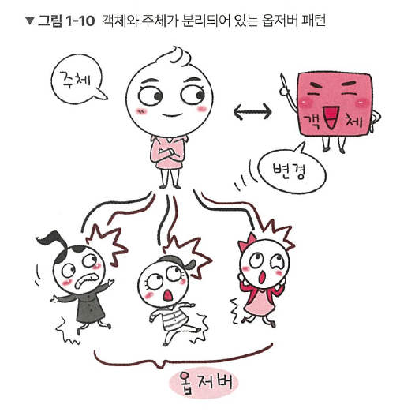
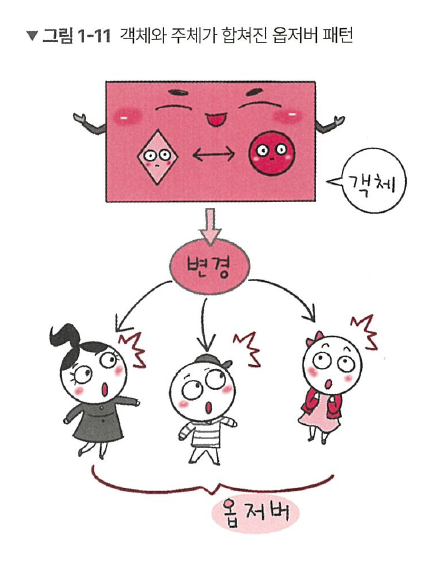
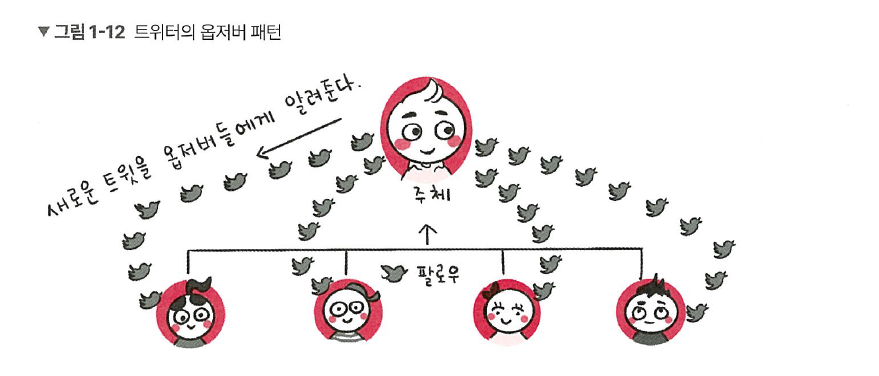

# 1.1.4 옵저버 패턴

**옵저버 패턴(observer pattern)** 은 주체가 어떤 객체(subject)의 상태 변화를 관찰하다가 상태 변화가 있을 때마다 메서드 등을 통해 옵저버 목록에 있는 옵저버들에게 변화를 알려주는 디자인 패턴입니다. 

- observe : 지켜보다, 관찰하다 (→ observer : 관찰자)
- 알림 기능, 뉴스 구독 서비스, SNS 실시간 피드, 쇼핑 앱의 가격 알림 등



여기서 **주체**란 객체의 상태 변화를 보고 있는 관찰자이며, **옵저버**들이란 이 객체의 상태 변화에 따라 전달되는 메서드 등을 기반으로 ‘추가 변화 사항’이 생기는 객체들을 의미합니다. 

- **주체 (Subject) :** 상태를 가지며, 그 상태가 변할 때 관찰자에게 알림을 주는 객체
- **객체 (Observer) :** 주체를 구독하고, 상태가 바뀌면 반응하는 객체  


| 주체(Subject) | 객체(Observer) | 설명 |  
| --- | --- | --- |  
| 유튜버 | 구독자 | 유튜버가 새 영상을 올리면 구독자에게 알림이 발송됨 |  
| 날씨  | 사람들 / 앱들 | 날씨가 바뀌면 사람들이 우산을 챙김 / 앱이 알림을 보냄 |  
| 증시(주식시장) | 주식 투자자 | 주가가 바뀌면 투자자가 반응함  | 



또한, 앞의 그림처럼 주체와 객체를 따로 두지 않고 상태가 변경되는 객체를 기반으로 구축하기도 합니다. 

옵저버 패턴을 활용한 서비스로는 트위터가 있습니다.  
- **분리된 경우**: 유튜버(Subject)가 누가 구독했는지 모르고 "새 영상 알림"만 발송
    
    → 구독자는 알아서 받음 → 유연하고 안전함
    
- **합쳐진 경우**: 유튜버가 구독자 한 명 한 명에게 직접 전화
    
    → 간단하긴 한데, 사람 많아지면 힘듦


앞의 그림처럼 내가 어떤 사람인 주체를 `‘팔로우’` 했다면 주체가 포스팅을 올리게 되면 알림이 `‘팔로워’`에게 가야 합니다.


또한, 옵저버 패턴은 주로 이벤트 기반 시스템에 사용하며 MVC(Model-View-Controller) 패턴에도 사용됩니다.

예를 들어 주체라고 볼 수 있는 모델(model)에서 변경 사항이 생겨 update() 메서드로 옵저버인 뷰에 알려주고 이를 기반으로 컨트롤러(controller) 등이 작동하는 것입니다.

## 자바에서의 옵저버 패턴
```java
import java.util.ArrayList;
import java.util.List;

// Subject 인터페이스 
interface Subject {
	public void register(Observer obj);     // 옵저버 등록
	public void unregister(Observer obj);   // 옵저버 제거
	public void notifyObservers();          // 등록된 옵저버들에게 알림
	public Object getUpdate(Observer obj);  // 최신 메시지 전달 
}

// Observer 인터페이스 
interface Observer {
	public void update();  // 알림 받았을 때 동작 정의 
}

// Topic 클래스 (주체 역할) 
class Topic implements Subject {
	private List<Observer> observers;  // 이 토픽 구독한 모든 옵저버 리스트
	private String message;            // 현재 게시된 메시지 
	
	// 토픽 만들기 (처음이라 옵저버, 메시지 다 비어 있음) 
	public Topic() {
		this.observers = new ArrayList<>();
		this.message = "";
	}
	
	// 구독자 등록 
	@Override
	public void register(Observer obj) {
		if (!observers.contains(obj)) observers.add(obj);
	}
	
	// 구독자 해지 
	@Override
	public void unregister(Observer obj) {
		observers.remove(obj);
	}
	
	// 구독자에게 알림 
	@Override
	public void notifyObservers() {
		this.observers.forEach(Observer::update);
	}
	
	// 최신 메시지 알려주기 
	@Override
	public Object getUpdate(Observer obj) {
		return this.message;
	}
	
	// 실제 메시지 게시 
	public void postMessage(String msg) {
		System.out.println("Message sended to Topic: " + msg);
		this.message = msg;
		notifyObservers();  // 메시지 저장하고, 구독자들에게 알림
	}
}

// TopicSubscriber 클래스 (옵저버 역할) 
class TopicSubscriber implements Observer {
	private String name;
	private Subject topic;
	
	public TopicSubscriber(String name, Subject topic) {
		this.name = name;
		this.topic = topic;
	}
	
	// 알림 받기 기능 
	@Override
	public void update() {
		String msg = (String) topic.getUpdate(this);
		System.out.println(name + ":: got message >> " + msg);
	}
}

// 실행 
public class HelloWorld {
	public static void main(String[] args) {
		Topic topic = new Topic();
		Observer a = new TopicSubscriber("a", topic);
		Observer b = new TopicSubscriber("b", topic);
		Observer c = new TopicSubscriber("c", topic);
		topic.register(a);
		topic.register(b);
		topic.register(c);
		
		topic.postMessage("amumu is op champion!!");
	}
}
/*
Message sended to Topic: amumu is op champion!!
a:: got message >> amumu is op champion!!
b:: got message >> amumu is op champion!!
c:: got message >> amumu is op champion!!
*/
```

topic을 기반으로 옵저버 패턴을 구현했습니다. 여기서 topic은 주체이자 객체가 됩니다.  `class Topic implements Subject`를 통해  `Subject interface`를 구현했고 `Observer a = new TopicSubscriber(”a”, topic);`으로 옵저버를 선언할 때 해당 이름과 어떠한 토픽의 옵저버가 될 것인지를 정했습니다.

> 자바: 상속과 구현
> 
> 잠시 앞의 코드에 나온 implements 등 자바의 상속과 구현의 특징과 차이에 대해 알아보겠습니다.
> 1. **상속**  
> 상속(extends)은 자식 클래스가 부모 클래스의 메서드 등을 상속받아 사용하며 자식 클래스에서 추가 및 확장을 할 수 있는 것을 말합니다. 이로 인해 재사용성, 중복성의 최소화가 이루어집니다.
>
> 2. **구현**  
> 구현(implements)은 부모 인터페이스(interface)를 자식 클래스에서 재정의하여 구현하는 것을 말하며, 상속과는 달리 반드시 부모 클래스의 메서드를 재정의하여 구현해야 합니다.
>
> 3. **상속과 구현의 차이**  
> 상속은 일반 클래스, abstract 클래스를 기반으로 구현하며, 구현은 인터페이스를 기반으로 구현합니다.

## 자바스크립트에서의 옵저버 패턴
자바스크립트에서의 옵저버 패턴은 프록시 객체를 통해 구현할 수도 있습니다.

> **프록시 객체**  
> **프록시(proxy) 객체**는 어떠한 대상의 기본적인 동작(속성 접근, 할당, 순회, 열거, 함수 호출 등)의 작업을 가로챌 수 있는 객체를 뜻하며, 자바스크립트에서 프록시 객체는 두 개의 매개변수를 가집니다.
> - `target` : 프록시할 **대상**
> - `handler` : target 동작을 가로채고 어떠한 **동작**을 할 것인지가 설정되어 있는 함수  


다음은 프록시 객체를 구현한 코드입니다.

```jsx
const handler = {
	get: function(target, name) {
	  // name 요청이면 a + b 붙여서 반환, 그 외 속성은 원래 값 그대로 반환
		return name === 'name' ? `${target.a} ${target.b}` : target[name]
	}
}

const p = new Proxy({ a: 'KUNDOL', b: 'IS AUMUMU ZANGIN' }, handler)
console.log(p.name)  // KUNDOL IS ANUMUMU ZANGIN
```

`new Proxy()`로 a와 b 속성을 가지고 있는 객체와 handler 함수를 매개변수로 넣고 p라는 변수를 선언했습니다. 이후 p의 name 속성을 참조하니 a와 b라는 속성밖에 없는 객체가 handler의 “name”이라는 속성에 접근할 때 a와 b를 합쳐서 문자열을 만들라” 는 로직에 따라 어떤 문자열을 만듭니다. 이렇게 name 속성 등 특정 속성에 접근할 때 그 부분을 가로채서 어떠한 로직을 강제할 수 있는 것이 **프록시 객체**입니다.  


> 프록시 객체를 이용한 옵저버 패턴
> 

그렇다면 자바스크립트의 프록시 객체를 통해 옵저버 패턴을 구현해보겠습니다.

```jsx
function createReactiveObject(target, callback) {
	const proxy = new Proxy(target, {
		set(obj, prop, value) {  // 원래 객체(a), 바꾸려는 속성의 이름("형규"), 새로 설정하려는 값("커플") 
			if (value != obj[prop]) {
				const prev = obj[prop]
				obj[prop] = value
				callback(`${prop}가 [${prev}] >> [${value}] 로 변경되었습니다. `)
			}
			return true
		}
	})
	return proxy
}
const a = {
	"형규" : "솔로"
}
const b = createReactiveObject(a, console.log)
b.형규 = "솔로"
b.형규 = "커플"
// 형규가 [솔로] >> [커플] 로 변경되었습니다.
```

프록시 객체의 `get()` 함수는 속성과 함수에 대한 접근을 가로채며, `has()` 함수는 in 연산자의 사용을 가로챕니다. `set()` 함수는 속성에 대한 접근을 가로챕니다. `set()` 함수를 통해 속성에 대한 접근을 “가로채”서 형규라는 속성이 솔로에서 커플로 되는 것을 감시할 수 있었습니다.

  
프론트엔드에서 많이 쓰는 프레임워크 Vue.js 3.0에서 ref나 reactive로 정의하면 해당 값이 변경되었을 때 자동으로 DOM이 있는 값이 변경되는데, 이는 앞서 설명한 프록시 객체를 이용한 옵저버 패턴을 이용하여 구현한 것입니다.

> **💡 용어**
> 
> **1. DOM(Document Object Model)**  
문서 객체 모델을 말하며, 웹 브라우저상의 화면을 이루고 있는 요소들을 지칭한다.

```jsx
function createReactiveObject(
    target: Target,
    isReadonly: boolean,
    baseHAndlers: ProxyHandler<any>,
    collectionHandlers: ProxyHandler<any>,
    proxyMap: WeakMap<Target, any>
) {
        if (!isObject(target)) {
            if (__DEV__) {
                console.warn(`value cannot be made reactive: ${String(target)}`)
            }
            return target
        }
        // target is already a Proxy, return it.
        // exception: calling readonly() on a reactive object
        if (
            target[ReactiveFlasg.RAW] &&
            !(isReadonly && target[ReactiveFlags.IS_REACTIVE])
        ) {
            return target
        }
        // target already has corresponding Proxy
        const existingProxy = proxyMap.get(target)
        if (existingProxy) {
            return existingProxy
        }
        // only a whitelist of value types can be observed.
        const targetType = getTargetType(target)
        if (targetType === TargetType.INVALID) {
            return target
        }
        const proxy = new Proxy(
            target,
            targetType === TargetType.COLLECTION ? collectionHandlers : baseHandlers
        )
        proxyMap.set(target, proxy)
        return proxy
}
```

앞의 코드는 실제로 Vue.js 3.0의 옵저버 패턴이 담긴 코드입니다. `proxyMap` 이라는 프록시 객체를 사용했고, 객체 내부의 `get()`, `set()` 메서드를 사용한 것을 볼 수 있습니다. 