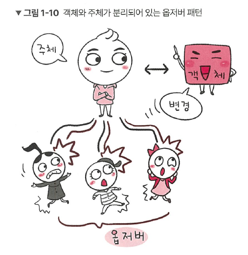
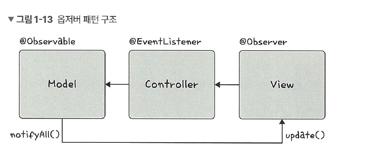
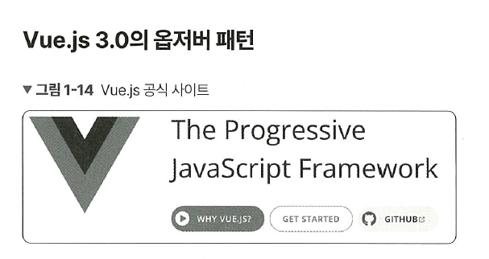

# 1.1.4 옵저버 패턴

옵저버 패턴(observer pattern)은 주체가 어떤 객체(subject)의 상태 변화를 관찰하다가 상태 변화가 있을 때마다 메서드 등을 통해 옵저버 목록에 있는 옵저버들에게 변화를 알려주는 디자인 패턴입니다. 



여기서 주체란 객체의 상태 변화를 보고 있는 관찰자이며, 옵저버들이란 이 객체의 상태 변화에 따라 전달되는 메서드 등을 기반으로 ‘추가 변화 사항’이 생기는 객체들을 의미합니다. 


또한, 앞의 그림처럼 주체와 객체를 따로 두지 않고 상태가 변경되는 객체를 기반으로 구축하기도 합니다. 

옵저버 패턴을 활용한 서비스로는 트위터가 있습니다. 


앞의 그림처럼 내가 어떤 사람인 주체를 `‘팔로우’` 했다면 주체가 포스팅을 올리게 되면 알림이 `‘팔로워’`에게 가야 합니다.


또한, 옵저버 패턴은 주로 이벤트 기반 시스템에 사용하며 MVC(Model-View-Controller) 패턴에도 사용됩니다.

예를 들어 주체라고 볼 수 있는 모델(model)에서 변경 사항이 생겨 update() 메서드로 옵저버인 뷰에 알려주고 이를 기반으로 컨트롤러(controller) 등이 작동하는 것입니다.

## 자바에서의 옵저버 패턴
```java
import java.util.ArrayList;
import java.util.List;

interface Subject {
    public void register(Observer obj);
    public void unregister(Observer obj);
    public void notifyObservers();
    public Object getUpdate(Observer obj);
}

interface Observer {
    public void update();
}

class Topic implements Subject {
    private List<Observer> observers;
    private String message;
    
    public Topic() {
        this.observers = new ArrayList<>();
        this.message = "";
    }
    
    @Override
    public void register(Observer obj) {
        if (!observers.contains(obj)) observers.add(obj);
    }
    
    @Override
    public void unregister(Observer obj) {
        observers.remove(obj);
    }
    
    @Override
    public void notifyObservers() {
        this.observers.forEach(Observer::update);
    }
    
    @Override
    public Object getUpdate(Observer obj) {
        return this.message;
    }
    
    public void postMessage(String msg) {
        System.out.printIn("Message sended to Topic: " + msg);
        this.message = msg;
        notifyObservers();
    }
}

class TopicSubscriber implements Observer {
    private String name;
    private Subject topic;
    
    public TopicSubscriber(String name, Subject topic) {
        this.name = name;
        this.topic = topic;
    }
    
    @Override
    public void update() {
        String msg = (String) topic.getUpdate(this);
        System.out.printIn(name + ":: got message >> " + msg);
    }
}

public class HelloWorld {
    public static void main(String[] args) {
        Topic topic = new Topic();
        Observer a = new TopicSubscriber("a", topic);
        Observer b = new TopicSubscriber("b", topic);
        Observer c = new TopicSubscriber("c", topic);
        topic.register(a);
        topic.register(b);
        topic.register(c);
        
        topic.postMessage("amumu is op champion!!");
    }
}
/*
Message sended to Topic: amumu is op champion!!
a:: got message >> amumu is op champion!!
b:: got message >> amumu is op champion!!
c:: got message >> amumu is op champion!!
*/
```

topic을 기반으로 옵저버 패턴을 구현했습니다. 여기서 topic은 주체이자 객체가 됩니다.  `class Topic implements Subject`를 통해  `Subject interface`를 구현했고 `Observer a = new TopicSubscriber(”a”, topic);`으로 옵저버를 선언할 때 해당 이름과 어떠한 토픽의 옵저버가 될 것인지를 정했습니다.

> 자바: 상속과 구현
> 
> 잠시 앞의 코드에 나온 implements 등 자바의 상속과 구현의 특징과 차이에 대해 알아보겠습니다.
> 1. **상속**  
> 상속(extends)은 자식 클래스가 부모 클래스의 메서드 등을 상속받아 사용하며 자식 클래스에서 추가 및 확장을 할 수 있는 것을 말합니다. 이로 인해 재사용성, 중복성의 최소화가 이루어집니다.
>
> 2. **구현**  
> 구현(implements)은 부모 인터페이스(interface)를 자식 클래스에서 재정의하여 구현하는 것을 말하며, 상속과는 달리 반드시 부모 클래스의 메서드를 재정의하여 구현해야 합니다.
>
> 3. **상속과 구현의 차이**  
> 상속은 일반 클래스, abstract 클래스를 기반으로 구현하며, 구현은 인터페이스를 기반으로 구현합니다.

## 자바스크립트에서의 옵저버 패턴
자바스크립트에서의 옵저버 패턴은 프록시 객체를 통해 구현할 수도 있습니다.

> 프록시 객체  
> 프록시(proxy) 객체는 어떠한 대상의 기본적인 동작(속성 접근, 할당, 순회, 열거, 함수 호출 등)의 작업을 가로챌 수 있는 객체를 뜻하며, 자바스크립트에서 프록시 객체는 두 개의 매개변수를 가집니다.
> - `target` : 프록시할 대상
> - `handler` : target 동작을 가로채고 어떠한 동작을 할 것인지가 설정되어 있는 함수  


다음은 프록시 객체를 구현한 코드입니다.

```jsx
const handler = {
    get: function(target, name) {
        return name === 'name' ? `${target.a} ${target.b}` : target[name]
    }
}

const p = new Proxy({a: 'KUNDOL'}, b: 'IS AUMUMU ZANGIN', handler)
console.log(p.name)  // KUNDOL IS ANUMUMU ZANGIN
```

`new Proxy()`로 a와 b 속성을 가지고 있는 객체와 handler 함수를 매개변수로 넣고 p라는 변수를 선언했습니다. 이후 p의 name 속성을 참조하니 a와 b라는 속성밖에 없는 객체가 handler의 “name”이라는 속성에 접근할 때 a와 b를 합쳐서 문자열을 만들라” 는 로직에 따라 어떤 문자열을 만듭니다. 이렇게 name 속성 등 특정 속성에 접근할 때 그 부분을 가로채서 어떠한 로직을 강제할 수 있는 것이 **프록시 객체**입니다.  


> 프록시 객체를 이용한 옵저버 패턴
> 

그렇다면 자바스크립트의 프록시 객체를 통해 옵저버 패턴을 구현해보겠습니다.

```jsx
function createReactiveObject(target, callback) {
    const proxy = new Proxy(target, {
        set(obj, prop, value) {
            if (value != obj[prop]) {
                const prev = obj[prop]
                obj[prop] = value
                callback(`${prop}가 [${prev}] >> [${value}] 로 변경되었습니다. `)
            }
            return true
        }
    })
    return proxy
}
const a = {
    "형규" : "솔로"
}
const b = createReactiveObject(a, console.log)
b.형규 = "솔로"
b.형규 = "커플"
// 형규가 [솔로] >> [커플] 로 변경되었습니다.
```

프록시 객체의 `get()` 함수는 속성과 함수에 대한 접근을 가로채며, `has()` 함수는 in ㅇ녀산자의 사용을 가로챕니다. `set()` 함수는 속성에 대한 접근을 가로챕니다. `set()` 함수를 통해 속성에 대한 접근을 “가로채”서 형규라는 속성이 솔로에서 커플로 되는 것을 감시할 수 있었습니다.

  
프론트엔드에서 많이 쓰는 프레임워크 Vue.js 3.0에서 ref나 reactive로 정의하면 해당 값이 변경되었을 때 자동으로 DOM이 있는 값이 변경되는데, 이는 앞서 설명한 프록시 객체를 이용한 옵저버 패턴을 이용하여 구현한 것입니다.

> **💡 용어**
> 
> **1. DOM(Document Object Model)**  
문서 객체 모델을 말하며, 웹 브라우저상의 화면을 이루고 있는 요소들을 지칭한다.

```jsx
function createReactiveObject(
    target: Target,
    isReadonly: boolean,
    baseHAndlers: ProxyHandler<any>,
    collectionHandlers: ProxyHandler<any>,
    proxyMap: WeakMap<Target, any>
) {
        if (!isObject(target)) {
            if (__DEV__) {
                console.warn(`value cannot be made reactive: ${String(target)}`)
            }
            return target
        }
        // target is already a Proxy, return it.
        // exception: calling readonly() on a reactive object
        if (
            target[ReactiveFlasg.RAW] &&
            !(isReadonly && target[ReactiveFlags.IS_REACTIVE])
        ) {
            return target
        }
        // target already has corresponding Proxy
        const existingProxy = proxyMap.get(target)
        if (existingProxy) {
            return existingProxy
        }
        // only a whitelist of value types can be observed.
        const targetType = getTargetType(target)
        if (targetType === TargetType.INVALID) {
            return target
        }
        const proxy = new Proxy(
            target,
            targetType === TargetType.COLLECTION ? collectionHandlers : baseHandlers
        )
        proxyMap.set(target, proxy)
        return proxy
}
```

앞의 코드는 실제로 Vue.js 3.0의 옵저버 패턴이 담긴 코드입니다. `proxyMap` 이라는 프록시 객체를 사용했고, 객체 내부의 `get()`, `set()` 메서드를 사용한 것을 볼 수 있습니다. 