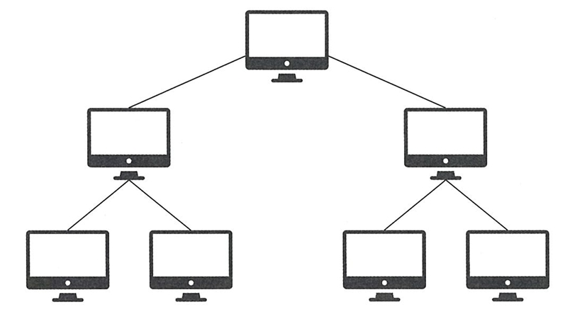
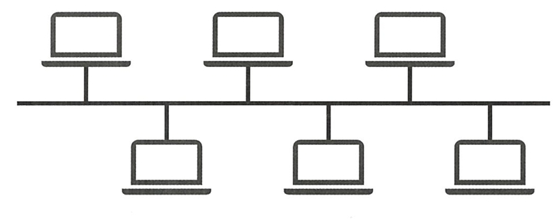
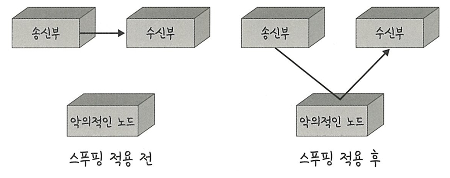
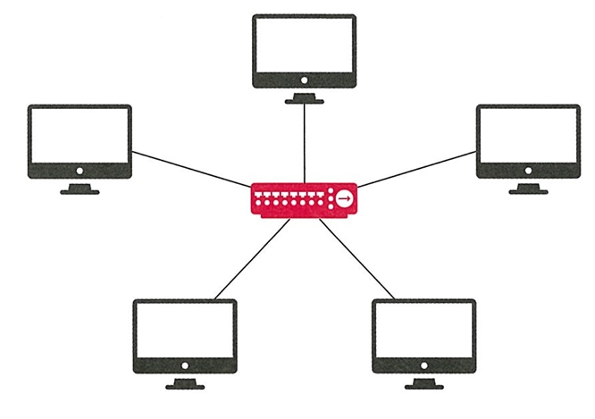
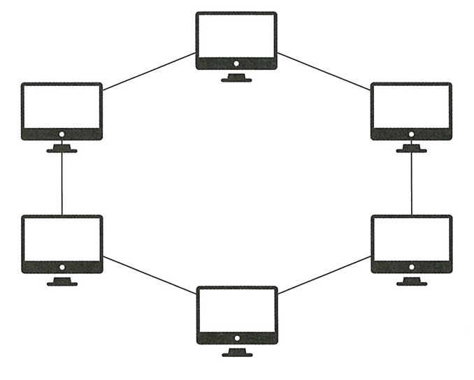
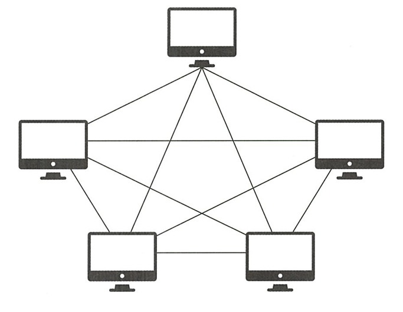
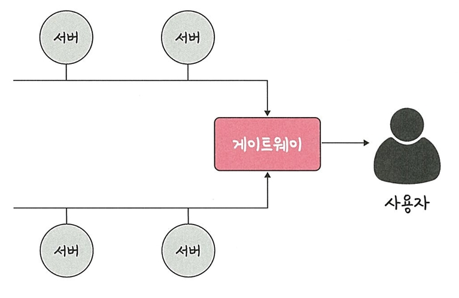
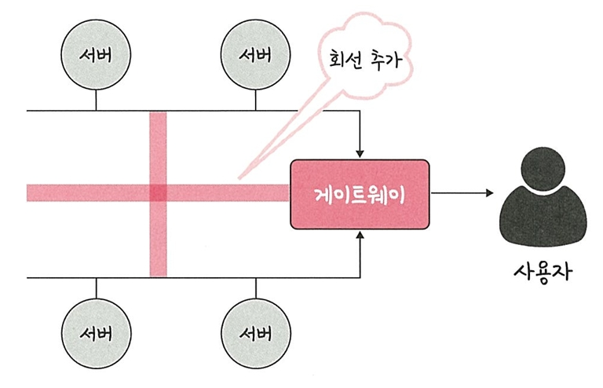

# 🔄 2.1.2 네트워크 토폴로지와 병목 현상

## ✅ 네트워크 토폴로지란?
- **네트워크 토폴로지(Topology)**: 노드와 링크가 **어떻게 연결되어 있는지**에 대한 구조를 의미
- 즉, **네트워크의 연결 방식**을 나타냄

---

## 🌳 1. 트리 토폴로지 (Tree Topology)

- 계층적인 구조로, 트리처럼 분기된 형태의 토폴로지  
- **장점**: 노드의 추가, 삭제가 쉬움  
- **단점**: 특정 노드에 트래픽이 집중되면 하위 노드에 영향을 끼칠 수 있음(병목 가능성)

---

## 🔗 2. 버스 토폴로지 (Bus Topology)

- **중앙 통신 회선 하나**에 여러 노드가 연결되어 공유하는 네트워크 구성 → **근거리 통신망(LAN)**에서 사용
- **장점**: 설치 비용 저렴, 신뢰성 우수, 중앙 통신 회선에 노드를 추가하거나 삭제하기 쉬움  
- **단점**: 스푸핑이 가능함

- ### 스푸핑
  
  - **스푸핑**: LAN상에서 송신부의 패킷을 송신과 관련 없는 다른 호스트에 가지 않도록 하는 스위치 기능을 마비시키거나 속여서 특정 노드에 해당 패킷이 오도록 처리하는 것
  - 스푸핑을 적용하면 올바르게 수신부로 가야 할 패킷이 악의적인 노드에 전달되게 됨

---

## 🔀 3. 스타 토폴로지 (Star Topology)

- **중앙 노드**를 통해 모든 노드가 연결된 구조  
- **장점**
  - 노드를 추가하거나 에러를 탐지하기 쉬움
   - 패킷 충돌 발생 가능성이 적음
   - 어떠한 노드에 장애가 발생해도 쉽게 에러를 발견할 수 있음
   - 장애 노드가 중앙 노드가 아닐 경우 다른 노드에 영향을 끼치는 것이 적음
- **단점**: 중앙 노드에 장애 발생 시 전체 통신 중단, 설치 비용이 고가

---

## 🕸 4. 링형 토폴로지 (Ring Topology)

- 각각의 노드가 양 옆의 두 노드와 연결하여 전체적으로 **고리처럼 하나의 연속된 길**을 통해 통신을 하는 망 구성 방식
   - 데이터는 노드에서 노드로 이동을 하게 되며, 각각의 노드는 고리 모양의 길을 통해 패킷을 처리
- **장점**: 노드 수가 증가되어도 네트워크상의 손실이 거의 없음, 충돌이 발생되는 가능성이 적고, 노드의 고장 발견을 쉽게 찾을 수 있음
- **단점**: 네트워크 구성 변경이 어렵고, 회선에 장애 발생 시 전체 네트워크에 영향을 크게 끼침

---

## 🔁 5. 메시 토폴로지 (Mesh Topology)

- 망형 토폴로지라고도 하며 그물망처럼 연결되어 있는 구조 
- **장점**: 한 단말 장치에 장애가 발생해도 여러 개의 경로가 존재 → 네트워크를 계속 사용할 수 있고, 트래픽도 분산 처리 가능
- **단점**: 노드의 추가가 어렵고, 구축 비용과 운용 비용이 고가

---

## ⚠️ 병목 현상이란?

- **병목 현상(Bottleneck)**: 네트워크에서 **특정 지점**이 과부하되어 전체 성능이 떨어지는 현상  
- 예: 고속도로에서 **병목 구간**처럼, 요청이 몰리는 부분에서 지연 발생

### 📉 병목 현상 발생

 - **예시**: 병목 현상이 일어나서 사용자가 서비스를 이용할 때 지연 시간이 길게 발생하고 있다고 가정
   - 지연 시간을 짧게 만들기 위해 대역폭을 크게 설정했음에도 성능이 개선되지 않음

### 📈 병목 해결 (회선 추가)

- 병목 해결 방법
  - **네트워크 구조(토폴로지)**를 분석
  - 서버와 서버 간 그리고 게이트웨이로 이어지는 **회선을 추가**

  → 네트워크가 어떤 토폴로지를 갖는지, 어떠한 경로로 이루어져 있는지 알아야 병목 현상을 올바르게 해결 가능

---
