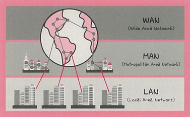

# 🌐 2.1.3 네트워크 분류

네트워크는 **규모에 따라** 다음과 같이 세 가지로 분류할 수 있음.

---

## 📶 LAN (Local Area Network)

- **근거리 통신망**을 의미
- 같은 건물이나 캠퍼스처럼 **좁은 공간**에서 운영됨
- **전송 속도 빠름**, **혼잡도 낮음**
- 예시: 회사 사무실, 학교 컴퓨터실 등

---

## 🏙 MAN (Metropolitan Area Network)

- **대도시 지역 규모의 네트워크**
- 서울시 전체 같은 **넓은 지역**에서 운영됨
- **속도는 평균적**, **LAN보다 혼잡도가 더 높음**

---

## 🌍 WAN (Wide Area Network)

- **국가 또는 대륙 수준**의 광역 네트워크
- 인터넷처럼 **전 세계적으로 연결된 통신망**
- **전송 속도는 낮고**, **혼잡도는 가장 높음**

---

## 📌 정리

| 구분 | 범위 | 전송 속도 | 혼잡도 |
|------|------|------------|--------|
| LAN  | 건물 내, 캠퍼스 수준 | 빠름 | 낮음 |
| MAN  | 대도시, 시 단위 | 중간 | 중간 |
| WAN  | 국가, 대륙, 전 세계 | 느림 | 높음 |
- 네트워크 규모가 커질수록 **속도는 느려지고**, **혼잡도는 증가**
---

## ❓ QnA – 네트워크 규모와 성능의 관계

#### Q. LAN에 비해 MAN과 WAN이 전송 속도가 느리고 혼잡도가 높은 것은 단점인가? 특징인가?

####  A. 구조적인 특징이나, 단점처럼 작용할 수도 있기 때문에 기술적으로 해결하려는 노력이 함께 필요함

- **LAN**은 같은 건물이나 같은 층처럼 거리도 가깝고, 통신 대상도 적음  
  → 그래서 **지연이 적고**, **속도가 빠르며**, **혼잡도도 낮음**

- **MAN/WAN**은 도시 단위 혹은 대륙 단위로 범위가 넓어지기 때문에  
  - 통신 거리가 길고  
  - 중간에 거쳐야 할 라우터나 장비가 많고  
  - 사용자 수도 많아지게 됨  
  → 따라서 자연스럽게 **속도는 느려지고**, **혼잡도는 높아지는 구조**

| 항목 | 설명 |
|------|------|
|  단점처럼 보이는 부분 | 전송 속도 저하, 혼잡도 증가, 안정성 저하 가능성 |
|  기술적 특징 | 네트워크 범위가 커질수록 자연스럽게 발생하는 현상 (물리적 한계) |
|  해결 가능성 | 다양한 기술로 극복 및 최적화 가능 (CDN, 캐싱, 라우팅 최적화 등) |

### 🎯 결론

- MAN과 WAN의 전송 속도 저하와 혼잡도 증가는  
  **단점이 아닌 구조적 특징**으로 이해해야 함.