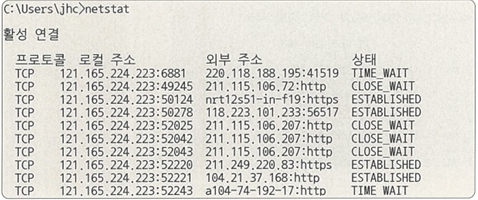
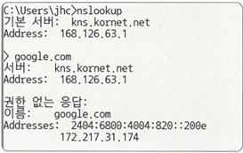
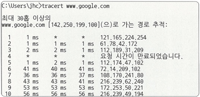

# 🧪 2.1.4 네트워크 성능 분석 명령어 요약

애플리케이션 코드에는 문제가 없지만, 네트워크 병목 현상으로 인해 데이터 전송 지연이 발생할 수 있음.  
이때 병목의 주요 원인은 다음과 같음

- 네트워크 대역폭
- 네트워크 토폴로지
- 서버 CPU 및 메모리 사용량
- 비효율적인 네트워크 구성

이러한 문제를 파악하기 위해 다음과 같은 명령어들을 사용하여 네트워크 상태 분석이 가능함

---

## 🔍 ping (Packet INternet Groper)

- **설명**: 네트워크 상태를 확인하려는 대상 노드를 향해 일정 크기의 패킷을 전송하는 명령어
- **사용 목적**: 
    - 해당 노드의 패킷 수신 상태와 도달하기까지의 시간 파악
    - 해당 노드까지의 네트워크 연결 여부
- **동작 방식**: TCP/IP 프로토콜 중 ICMP 프로토콜을 통해 동작  
  → ICMP 프로토콜을 지원하지 않는 기기 대상으로는 실행 불가
- **사용 예시**: `ping www.google.com -n 12`명령어 구동 

   

  → 12번의 패킷을 전송하여 평균 응답 시간 측정

---

## 📊 netstat

- **설명**: 접속되어 있는 서비스들의 네트워크 상태를 표시하는데 사용
- **사용 목적**: 주로 서비스의 포트가 열려 있는지 확인할 때 사용
- **정보 제공**:
  - 네트워크 접속, 라우팅 테이블, 네트워크 프로토콜 등 리스트 출력
- **사용 예시**:

   
  → 접속하고 있는 사이트 등에 관한 네트워크 상태 리스트 확인 가능
---

## 🌐 nslookup

- **설명**: DNS에 관련된 내용을 확인하기 위해 쓰는 명령어
- **사용 목적**: 특정 도메인에 매핑된 IP를 확인하기 위해 사용
- **사용 예시**: 

   
  → google.com의 DNS를 확인
---

## 🧭 tracert / traceroute

- **설명**: 목적지 노드까지 네트워크 경로를 확인할 때 사용하는 명령어
- **Windows 명령어**: `tracert`
- **Linux 명령어**: `traceroute`
- **사용 목적**: 목적지 노드까지 구간들 중 어느 구간에서 응답 시간이 느려지는지 등 확인 가능
- **사용 예시**:

   
  → 구글 사이트에 도달하기까지의 경로 추적을 하는 모습

---

## 🛠 기타 명령어 및 도구

- **ftp**: 대용량 파일 전송 테스트
- **tcpdump**: 노드로 오고 가는 패킷 캡처
- **wireshark / netmon**: 네트워크 분석 프로그램

---
