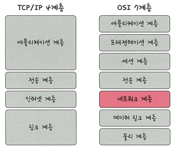
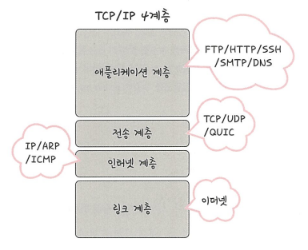
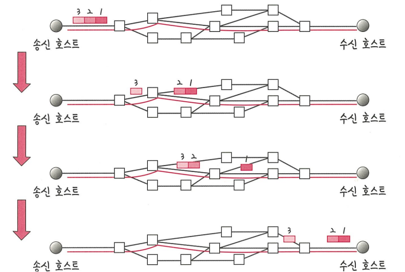
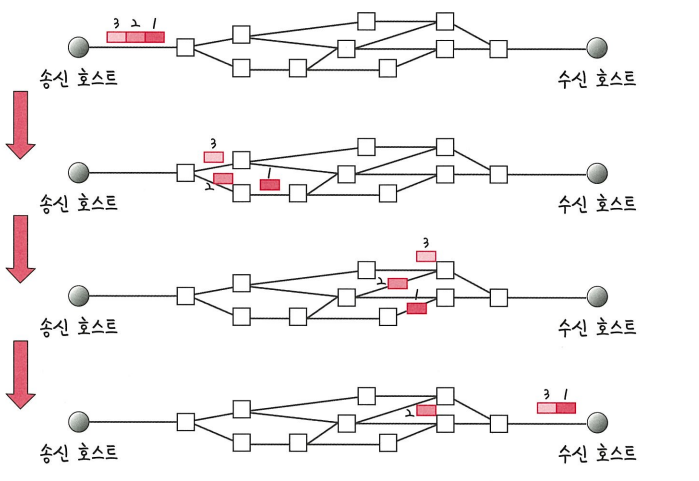
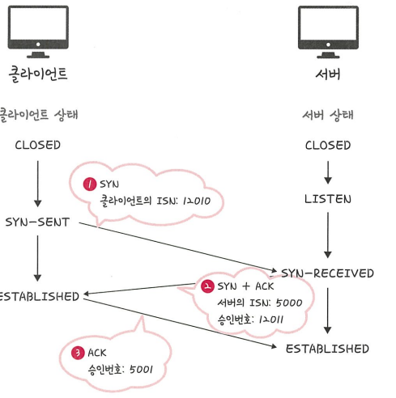
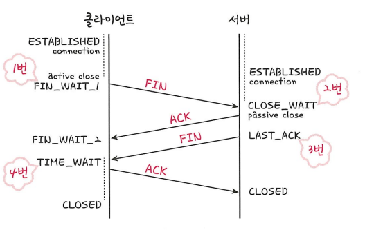
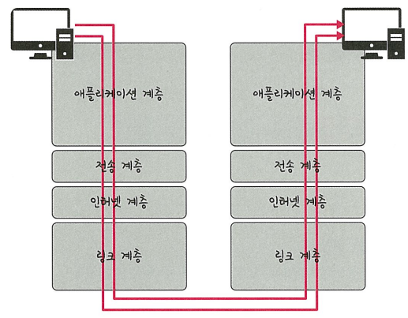
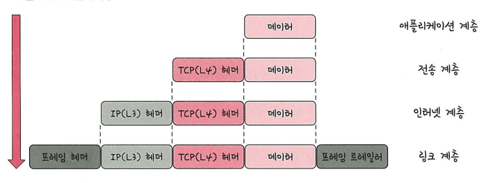
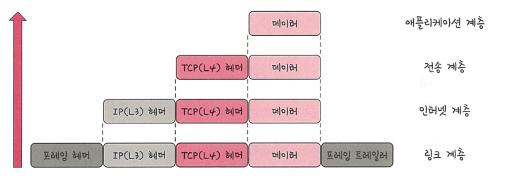

## 🌐 TCP/IP 4계층 모델

> 인터넷에서 컴퓨터들이 정보를 주고받기 위해 사용하는 **인터넷 프로토콜 스위트(Internet Protocol Suite)**  
> 일반적으로 **TCP/IP 4계층 모델** 또는 **OSI 7계층 모델**로 설명됨

---

## 📦 계층 구조

| 계층 | 설명 | 대표 프로토콜 |
|------|------|----------------|
| **응용 계층** Application Layer | 사용자와 직접적으로 상호작용하며 데이터를 처리 | HTTP, FTP, DNS, SMTP |
| **전송 계층** Transport Layer | 통신의 신뢰성과 순서를 보장 | TCP, UDP |
| **인터넷 계층** Internet Layer | 목적지까지의 **패킷 전달 및 라우팅** 담당 | IP, ICMP, ARP |
| **네트워크 인터페이스 계층** Network Interface Layer | 실제 데이터 전송을 위한 물리적 연결 관리 | 이더넷, Wi-Fi 등 (MAC, PHY 계층 포함) |

---

## TCP/IP 계층

---

## 🧩 애플리케이션 계층 (Application Layer)

> 응용 프로그램이 사용하는 프로토콜 계층으로,  
> **웹 서비스, 이메일, 파일 전송 등 실질적인 사용자 서비스**를 제공하는 계층

### ✅ 주요 프로토콜

- **FTP**  
  : 장치 간 **파일 전송**에 사용되는 표준 통신 프로토콜  
  (File Transfer Protocol)

- **SSH**  
  : 보안되지 않은 네트워크에서 **암호화된 안전한 통신**을 가능하게 함  
  (Secure Shell)

- **HTTP (HyperText Transfer Protocol)**  
  : **WWW (World Wide Web)** 기반의 데이터 통신을 위한 프로토콜  
  웹 사이트를 이용할 때 주로 사용되며, 웹의 핵심이 되는 통신 규약

- **SMTP**  
  : 이메일을 **전송**하기 위한 표준 인터넷 프로토콜  
  (Simple Mail Transfer Protocol)

- **DNS**  
  : 도메인 이름을 IP 주소로 **변환해주는 시스템**  
  (Domain Name System)

---

📌 애플리케이션 계층은 **사용자와 가장 밀접한 계층**으로,  
실제 우리가 사용하는 대부분의 인터넷 서비스는 이 계층을 통해 이루어진다

---

## 전송 계층 (Transport Layer)

전송 계층은 송신자와 수신자 간 **신뢰성 있는 통신 서비스**를 제공하며,  
**애플리케이션 계층**과 **인터넷 계층** 사이에서 **데이터 전달의 중계 역할**을 한다.

---

### 주요 기능

- 연결 지향 데이터 스트림 지원
- 데이터의 순서 보장 및 오류 제어
- 흐름 제어 및 혼잡 제어
- 대표 프로토콜: `TCP`, `UDP`

---

### 🔗 TCP vs UDP 

| 항목        | TCP                                | UDP                              |
|-------------|-------------------------------------|-----------------------------------|
| 연결 방식   | 연결 지향 (3-way handshake)        | 비연결 지향                      |
| 신뢰성      | 있음 (순서 보장, 재전송, 수신 확인) | 없음 (순서 보장 X, 확인 X)      |
| 제어 기능   | 흐름 제어, 혼잡 제어 있음           | 없음                             |
| 전송 방식   | 바이트 스트림, 가상 회선 방식        | 데이터그램 방식                  |
| 속도        | 느림 (신뢰성 우선)                  | 빠름 (속도 우선)                 |
| 사용 예시   | 웹, 이메일, 파일 전송               | 스트리밍, 게임, VoIP             |

#### ✅ 기억 포인트
- **TCP**: 신뢰성 O → 순서, 재전송, 흐름/혼잡 제어  
- **UDP**: 신뢰성 X → 빠름, 단순 전송

---

### 📡 패킷 교환 방식 요약

#### 가상 회선 방식 (TCP)
- 통신 전에 **논리적 연결(가상 회선)**을 설정
- 모든 패킷이 **같은 경로**로 전달됨
- **순서 보장**, **오류 제어 가능**
- 전송 전 연결 설정(3-way handshake) 필요 → 지연 발생
- 예시: **TCP**

> 📌 마치 택배 한 건을 보낼 때, **한 명의 배송 기사**가 끝까지 책임지고 전달하는 느낌

---

#### 데이터그램 방식 (UDP)
- **연결 없이** 바로 전송 (비연결형)
- 패킷마다 **경로가 다를 수 있음**
- **순서 보장 X**, **오류 제어 X**
- 전송 속도 빠름
- 예시: **UDP**

> 📌 마치 일반 우편처럼 **각 편지가 독립적으로** 전송되는 느낌

---

## ✅ 비교 정리

| 항목           | 가상 회선 방식 (TCP)        | 데이터그램 방식 (UDP)         |
|----------------|-----------------------------|-------------------------------|
| 연결 여부      | 전송 전 연결 설정           | 연결 없이 전송                |
| 패킷 경로      | 동일 경로                   | 각기 다른 경로 가능           |
| 순서 보장      | 보장함                      | 보장하지 않음                 |
| 신뢰성         | 높음                        | 낮음                          |
|

---

### 🔗 TCP 연결 과정 정리 

### ✅ 연결 성립: 3-Way Handshake

TCP는 신뢰성 있는 연결을 위해 **3단계 핸드셰이크**를 통해 연결을 설정합니다.

1. **SYN**  
   클라이언트 → 서버 : 연결 요청 (SYN, Seq = x)

2. **SYN+ACK**  
   서버 → 클라이언트 : 요청 수락 + 연결 요청 (SYN, ACK, Seq = y, Ack = x+1)

3. **ACK**  
   클라이언트 → 서버 : 서버 요청 수락 (ACK, Ack = y+1)

> 연결 성립 후 데이터 송수신 가능

---

## 🔚 연결 해제: 4-Way Handshake

연결 종료는 **4단계**로 이루어지며, **양방향 종료**를 위해 각각 FIN/ACK 교환이 필요합니다.

1. **FIN**  
   클라이언트 → 서버 : 연결 종료 요청

2. **ACK**  
   서버 → 클라이언트 : 요청 수락 (수신 버퍼 비움)

3. **FIN**  
   서버 → 클라이언트 : 서버도 종료 요청

4. **ACK**  
   클라이언트 → 서버 : 종료 요청 수락

> 연결 종료 후, 클라이언트는 TIME_WAIT 상태로 일정 시간 대기

---

## 📝 요약 정리

| 단계         | 연결 성립 (3-Way)      | 연결 해제 (4-Way)        |
|--------------|------------------------|---------------------------|
| 1단계        | SYN                    | FIN (클라이언트 → 서버)  |
| 2단계        | SYN + ACK              | ACK (서버 → 클라이언트)  |
| 3단계        | ACK                    | FIN (서버 → 클라이언트)  |
| 4단계        | —                      | ACK (클라이언트 → 서버)  |

---

## 인터넷 계층 (Internet Layer)

네트워크 상에서 **패킷을 목적지까지 전달**하는 역할을 수행하며,  
**IP 주소 기반**으로 라우팅을 처리하는 계층

### 📌 주요 프로토콜

- **IP** : 패킷 전달 (주소 지정 & 라우팅)
- **ARP** : IP ↔ MAC 주소 변환
- **ICMP** : 오류 메시지 및 상태 알림 (예: ping)

---
## 🔗 링크 계층 (Data Link Layer)

- **같은 네트워크 내 장치 간 데이터 전송** 담당 (프레임 단위)
- **MAC 주소 기반 통신** 수행
- **오류 검출**, **흐름 제어**, **충돌 처리** 제공

---

### 📌 주요 프로토콜

- **Ethernet** : 유선 LAN에서 사용
- **ARP** : IP ↔ MAC 주소 변환
- **PPP** : 점대점 연결
  
> 물리 계층과 인터넷 계층 사이의 연결 담당

---

## 📌 CSMA/CD (Carrier Sense Multiple Access with Collision Detection)
- **이더넷에서 충돌을 감지하고 재전송**하는 방식
- 먼저 채널이 비었는지 확인(Carrier Sense) → 전송 시 충돌 발생하면 중지하고 **랜덤 시간 후 재시도**
  
---
## 계층 간 데이터 송수신 과정

## 📦 캡슐화(Encapsulation)

- 데이터를 전송할 때, 각 계층에서 **헤더(또는 정보)**를 추가하여 하위 계층으로 넘기는 과정  
- 송신 측에서 발생
- 예: 애플리케이션 데이터 → TCP 헤더 → IP 헤더 → 이더넷 헤더 → 전송
 

## 📤 비캡슐화(Decapsulation)

- 수신 측에서, 받은 데이터에서 계층별로 **헤더를 제거**하고 상위 계층으로 전달하는 과정
- 수신 측에서 발생

---

### 🔄 OSI 7계층과의 비교 

| OSI 7계층       | TCP/IP 4계층          |
|----------------|------------------------|
| 응용, 표현, 세션 계층 | 응용 계층 (Application) |
| 전송 계층         | 전송 계층 (Transport)    |
| 네트워크 계층       | 인터넷 계층 (Internet)   |
| 데이터 링크, 물리 계층 | 네트워크 인터페이스 계층 (Link) |