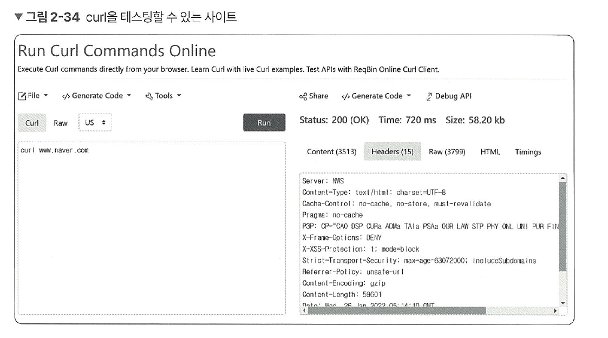

# 2.2.2 PDU
네트워크의 어떠한 계층에서 계층으로 데이터가 전달될 때 한 덩어리의 단위를 PDU(Protocol Data Unit)라고 합니다.

PDU는 제어 관련 정보들이 포함된 ‘헤더’, 데이터를 의미하는 ‘페이로드’로 구성되어 있으며 계층마다 부르는 명칭이 다릅니다. 

- **애플리케이션 계층** : 메시지
- **전송 계층** : 세그먼트(TCP), 데이터그램(UDP)
- **인터넷 계층** : 패킷
- **링크 계층** : 프레임(데이터 링크 계층), 비트(물리 계층)

예를 들어 애플리케이션 층은 ‘메시지’를 기반으로 데이터를 전달하는데, HTTP의 헤더가 문자열인 것을 예로 들 수 있습니다.

잠시 `curl` 명령어를 이용하여 `www.naver.com`으로 HTTP 요청을 해서 PDU 테스팅을 해보겠습니다.

참고로 다음 사이트를 통해 쉽게 curl 명령어로 다른 사이트에 요청할 수 있습니다.

- `curl commands` 온라인 사이트 링크 : https://reqbin.com/curl



앞의 그림처럼 `curl [www.naver.com](http://www.naver.com)` 이란 명령어를 통해 요청했고 다음과 같은 응답(response) 헤더 값이 나오는데, 이는 모두 문자열인 것을 알 수 있습니다.

```sql
// 출력
Server: NWS
Content-Type: text/html; charset=UTF-8
Cache-Control: no-cache, no-store, must-revalidate
Pragma: no-cache
P3P: CP="CAO DSP CURA ADMa TAIa PSAa OUR LAW STP PHY ONL UNI PUR FIN COM
NAV INT DEM STA PRE"
X-Frame-Options: DENY
X-XSS-Protection: 1; mode=block
Strict-Transport-Security: max-age=63072000; includeSubdomains
Referrer-Policy: unsafe-url
Content-Encoding: gzip
Content-Length: 59601
Date: Wed, 26 Jan 2022 05:14:10 GMT
Connection: keep-alive
Vary: Accept-Encoding
```

참고로 PDU 중 아래 계층인 비트로 송수신하는 것이 모든 PDU 중 가장 빠르고 효율성 이 높습니다. 하지만 애플리케이션 계층에서는 문자열을 기반으로 송수신을 하는데, 그 이유는 헤더에 authorization 값 등 다른 값들을 넣는 확장이 쉽기 때문입니다.