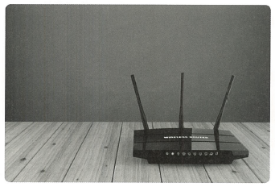

# 📘 2.3.3 인터넷 계층을 처리하는 기기

### 🔍 핵심 개념

> **인터넷 계층**을 처리하는 대표적인 기기로는 **라우터(Router)** 와 **L3 스위치**가 있습니다.  
> 이들은 OSI 7계층 중 **3계층(인터넷 계층)**에서 동작하며,  
> 네트워크 간의 데이터 전달과 라우팅을 담당합니다.

---

## 🔹 라우터 (Router)

> 여러 개의 네트워크를 연결하고, **데이터를 최적의 경로로 전달**하며  
> **네트워크 간 분할과 구분** 역할을 수행하는 네트워크 장비입니다.

### ✅ 주요 기능
- 네트워크 간 데이터 전달 (인터네트워킹)  
- 경로 최적화 및 패킷 포워딩  
- 패킷 소모 최소화 및 지연 감소  

📌 핵심 키워드:
- 경로 설정
- 패킷 포워딩
- 다른 네트워크 간 데이터 전달

### 🖼️ 라우터

---

## 🔹 L3 스위치

> **L2 스위치의 기능** + **라우팅 기능**을 모두 갖춘 장비로,  
> **하드웨어 기반 라우팅을 수행**하여 빠르고 효율적인 데이터 전송이 가능합니다.

### ✅ 특징 및 역할
- **MAC 주소** 기반의 L2 스위치 기능 포함  
- **IP 주소** 기반의 L3 라우팅 테이블을 통해 트래픽 제어  
- 라우터와 유사하지만 더 빠른 성능을 제공 (하드웨어 기반)  

📌 핵심 키워드:
- 하드웨어 라우팅
- L2 + L3 기능 결합
- 고성능 스위칭

---

## 🔹 L2 스위치 vs L3 스위치 비교

| 구분       | L2 스위치         | L3 스위치          |
|------------|-------------------|---------------------|
| 참조 테이블 | MAC 주소 테이블    | 라우팅 테이블       |
| 참조 단위   | 이더넷 프레임      | IP 패킷             |
| 참조 주소   | MAC 주소          | IP 주소             |

> 💡 참고:  
> - L2 스위치는 **같은 네트워크 내 장치 연결**  
> - L3 스위치는 **다른 네트워크 간 데이터 전달** + 라우팅 처리  

---

## 📘 용어 정리

| 용어         | 설명 |
|--------------|------|
| 인터넷 계층   | OSI 7계층 중 3계층, 네트워크 간 IP 패킷 전달을 담당 |
| 라우터       | 서로 다른 네트워크를 연결하고 최적 경로로 데이터를 전달하는 장비 |
| L3 스위치    | L2 스위치의 기능과 라우팅 기능을 동시에 수행하는 고성능 장비 |
| 라우팅 테이블 | 목적지 IP 주소에 따른 최적 경로 정보를 저장한 테이블 |
| 패킷 포워딩  | 수신한 패킷을 목적지로 전달하는 네트워크 기능 |

---

### ✅ 정리

- **라우터**는 네트워크를 연결하고, 경로를 설정하여 데이터를 전달  
- **L3 스위치**는 스위칭 + 라우팅 기능을 동시에 갖춘 고성능 네트워크 장비  
- 둘 다 인터넷 계층에서 동작하며 IP 기반으로 데이터를 전달  
- L2 스위치와 L3 스위치는 참조 방식과 처리 계층에서 차이가 있음
