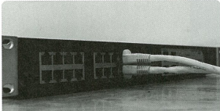
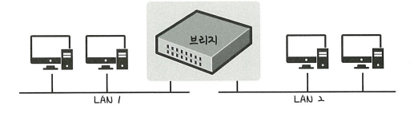

# 🧩 데이터 링크 계층을 처리하는 기기

> **데이터 링크 계층(Layer 2)** 은 네트워크 장치들이 서로 데이터를 전달할 때 **물리적인 주소(MAC 주소)** 를 기반으로 통신을 처리한다 
> 
> 대표 장치:  **L2 스위치**,  **브리지(Bridge)**

---

## 📦 L2 스위치 (Layer 2 Switch)

> MAC 주소 기반으로 장치들을 식별하고, **MAC 주소 테이블**을 이용해 패킷을 전달하는 네트워크 장치

### 특징

- 장치들의 **MAC 주소를 저장**하고 관리
- IP 주소는 이해하지 못함 → 라우팅 불가
- **MAC 주소 기반**으로 패킷을 적절한 포트로 전송
- 목적지 MAC 주소를 모르면 **전체 포트로 브로드캐스트**
- MAC 주소 테이블은 **일정 시간 이후 자동 삭제**

### 💡 예시

> 아파트 경비실의 택배 보관실 시스템

- 경비 아저씨가 각 세대의 **호수(MAC 주소)** 를 알고 있음
- 택배가 도착하면 → 해당 호수에 맞는 집으로 직접 전달  
- 만약 처음 보는 택배면 → 모든 집에 방송해서 "누구 택배냐고" 물어봄 (브로드캐스트)

---

## 🧱 브리지 (Bridge)

> 두 개의 근거리 통신망(LAN)을 연결하여 **서로 다른 네트워크를 하나로 연결**해주는 장치

### 특징

- 포트와 포트 사이의 **다리 역할**
- 장치에서 받아온 MAC 주소를 기반으로 **MAC 주소 테이블**을 관리
- 네트워크 구간을 나누어 **충돌 도메인**을 줄이고 성능 향상
- 서로 다른 LAN을 연결하여 **하나의 큰 통신망**처럼 작동 가능

### 💡 예시

> 두 동의 학교 건물을 연결하는 복도

- 각 건물은 하나의 네트워크(LAN)
- 브리지는 두 건물 사이의 복도처럼 → 서로 이동 가능하게 연결
- 학생(데이터)은 이 복도를 통해 자유롭게 오가며 정보 교환 가능

---

## 🔄 비교 요약

| 항목          | L2 스위치                            | 브리지 (Bridge)                        |
|---------------|--------------------------------------|----------------------------------------|
| 기능          | MAC 주소 기반으로 패킷 전송          | 두 LAN을 연결해 하나로 통합            |
| MAC 주소 테이블 | 관리함                               | 관리함                                 |
| 포트 수       | 일반적으로 다수                      | 보통 2~4개                              |
| 라우팅 기능    | 불가능                                | 불가능                                 |
| 활용 예       | 회사 내 사무실 간 장치 연결          | 다른 건물 또는 부서 네트워크 연결       |