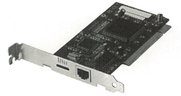
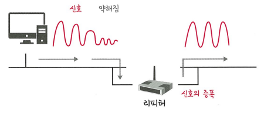
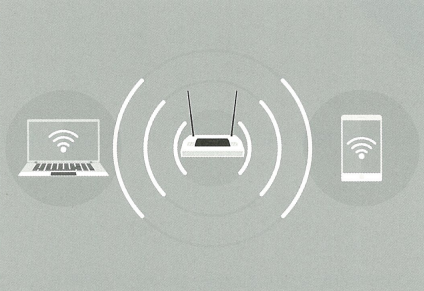

# 물리 계층을 처리하는 기기
> **물리 계층(Physical Layer)** 은 네트워크의 가장 하위 계층으로, **실제로 데이터를 전기적 신호로 변환하여 전송하는 역할**을 합니다. 
> 
> 대표적인 장치: **NIC, 리피터, AP**

## 🖥️ NIC (Network Interface Card)

> 컴퓨터와 네트워크를 연결하는 **랜카드**로, 데이터를 전기적 신호로 바꾸거나 반대로 해석하는 역할을 한다

### 🔧 특징

- 컴퓨터 내부에 설치되어 네트워크 통신을 가능하게 함
- **MAC 주소**: NIC 마다 고유한 하드웨어 주소를 가짐 (장치 식별용) 
- 물리적인 데이터 전송의 출발점

### 💡 일상 예시

> 택배번호  = MAC 주소  
> NIC는 이 주소를 붙여서 데이터를 네트워크로 전송

## 🔌 리피터 (Repeater)

> 전송 거리가 멀어지며 **약해진 신호를 증폭**하여 다시 보내주는 장치

### 🔧 특징

- 신호의 세기를 증폭하여 더 먼 거리까지 전송 가능하게 함
- 두 구간의 **물리적 거리 연장**에 사용
- 광케이블이 널리 보급되며 현재는 거의 사용되지 않음

### 💡 일상 예시

> 와이파이 중계기  
>  
> 집 안방에서 와이파이가 잘 안 터질 때 설치하는 중계기처럼, 리피터도 **신호가 약한 곳에 중간 역할**을 해준다

---

## 📡 AP (Access Point)

> 유선 네트워크를 **무선 신호로 변환**하여 무선 장치들이 네트워크에 접속할 수 있도록 하는 장치

### 🔧 특징

- 유선 LAN을 연결한 후, 무선 장치들과 연결 가능하게 함
- 무선 클라이언트들이 유선 네트워크에 접근할 수 있도록 **중계 역할** 수행
- 흔히 **Wi-Fi 공유기** 라고도 불림

### 💡 일상 예시

> 집이나 카페의 **와이파이 공유기**  
>  
> 인터넷 선(LAN)을 연결하면, 휴대폰이나 노트북이 무선으로 인터넷을 사용할 수 있게 해준다.

---

## 🧠 정리표

| 장치  | 역할                                  | 일상 예시             |
|-------|---------------------------------------|------------------------|
| NIC   | 컴퓨터에 네트워크 기능 제공            | 택배 라벨 (MAC 주소)  |
| 리피터 | 약한 신호를 증폭하여 거리 연장         | 와이파이 중계기       |
| AP    | 유선 → 무선 변환, 무선 장치 연결 제공  | 와이파이 공유기       |