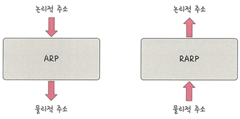
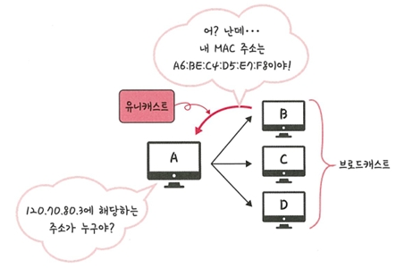

# 📮 2.4.1 ARP (Address Resolution Protocol)

컴퓨터는 흔히 **IP 주소로 통신**하는 것처럼 보이지만, 실제로는 **MAC 주소를 통해 통신**함  
즉, IP 주소로 목적지를 지정하되, **ARP를 통해 MAC 주소를 찾아 실제 통신**이 이루어지는 것

---

## 🔗 ARP란?

> ARP(Address Resolution Protocol)는  
> **IP 주소(논리 주소) → MAC 주소(물리 주소)** 로 변환해주는 프로토콜

- IP 주소를 기반으로 실제 데이터를 **전송할 MAC 주소를 찾는 역할**을 함
- 반대로 **MAC → IP 주소**로 변환하는 프로토콜은 `RARP(Reverse ARP)`라고 함

---

## 📊 ARP vs RARP

| 방향 | 설명 |
|------|------|
| ARP  | 논리 주소(IP) → 물리 주소(MAC) |
| RARP | 물리 주소(MAC) → 논리 주소(IP) |

## 🧭 ARP 동작 예시

### ▶ 상황: A가 IP `120.70.80.3`에 해당하는 MAC 주소를 알고 싶음

1. A가 **ARP Request**를 **브로드캐스트**로 전송  

2. B가 해당 IP를 갖고 있다면  
   → **ARP Reply**를 **유니캐스트**로 A에게 응답

3. A는 이제 B의 MAC 주소를 알고 데이터 전송 가능

---

## 💬 용어 정리

| 용어 | 설명 |
|------|------|
| **브로드캐스트** | 네트워크에 연결된 모든 호스트에게 데이터를 전송하는 방식 |
| **유니캐스트**   | 특정 하나의 호스트에게 1:1로 데이터를 전송하는 방식 |

---

## 🧠 핵심 요약

- 통신은 **MAC 주소로 이루어짐**
- **IP → MAC** 변환이 필요 = **ARP의 역할**
- **브로드캐스트로 요청**, **유니캐스트로 응답**
- **RARP**는 ARP의 반대 역할