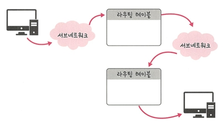
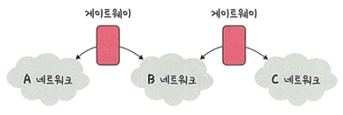
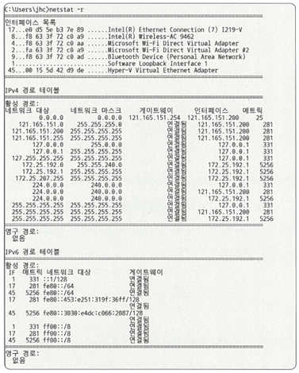

# 📡 2.4.2 홉바이홉 통신

IP 주소를 통해 통신하는 과정을 **홉바이홉 통신**이라고 함.  
여기서 "홉(hop)"이란 단어는 건너뛴다는 의미로,  
**패킷이 여러 개의 라우터를 거쳐 목적지로 향하는 과정**을 뜻함.

---

## 📌 개념 요약

- 네트워크에서는 **하나의 패킷이 여러 라우터를 거치며 전달**됨
- 각 라우터는 **라우팅 테이블**을 참조해 다음 목적지로 전달함
- 이 과정을 반복하며 최종 목적지까지 패킷을 전달

---

## 🧭 동작 방식

1. **송신 장치**는 목적지 IP 주소를 갖고 있음
2. **라우팅 테이블**을 참조하여 다음으로 보낼 라우터를 결정
3. 중간 라우터들도 계속 **라우팅 테이블 기반으로 다음 경로** 선택
4. 반복 끝에 **최종 수신지에 도달**


---

## 📘 라우팅 테이블(Routing Table)

> 목적지까지 어떤 경로를 거칠지 **IP 주소 기반**으로 지정한 **리스트**

- 목적지 주소와 이를 향한 다음 라우터 정보를 가지고 있음
- 라우팅 테이블에는 목적지로 가기 위한 다음 **게이트웨이** 정보가 포함되어 있으며,<br>
  이 정보를 통해 실제 전송 경로를 결정할 수 있음
```text
라우팅 테이블 = 목적지 IP + 게이트웨이 + 서브넷 마스크 + 인터페이스 정보
```

---

## 🔌 게이트웨이(Gateway)



> 서로 다른 네트워크 간 **통신을 연결**해주는 **출입구** 역할

- 서로 다른 프로토콜/통신망 간 데이터 전달 가능
- 게이트웨이는 일종의 **중계자 / 변환자** 역할
- 게이트웨이 정보는 라우팅 테이블에 포함되어 있으며,
이를 확인하려면 **명령어 netstat -r**을 사용하면 됨


---

## 💻 netstat -r 명령어

> 현재 **라우팅 테이블 상태**를 확인할 수 있는 명령어

- 실행하면 목적지 주소, 서브넷 마스크, 게이트웨이 주소, 인터페이스 정보 등이 출력됨
- 이를 통해 각 목적지로 가기 위한 게이트웨이 경로를 확인할 수 있음

  

---

## 🧠 핵심 요약

- 홉바이홉 통신은 **여러 라우터를 거치며 IP 기반으로 패킷 전송**
- **라우팅 테이블**을 참조하여 다음 홉(Hop)을 결정
- **게이트웨이**는 네트워크 간 경계 역할
- **netstat -r** 명령어로 라우팅 테이블과 게이트웨이 정보를 확인할 수 있음
