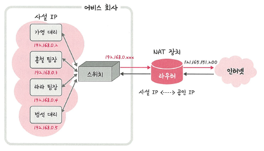

# 📘 2.4.3 IP 주소 체계

### 🔍 핵심 개념

> IP 주소는 **IPv4**와 **IPv6**로 나뉘며,  
> 현재 가장 널리 사용되는 주소 체계는 **IPv4**입니다.  
> 이후 설명도 IPv4 기준으로 진행됩니다.

- **IPv4**: 32비트, 점(.)으로 구분 → 예: `123.45.67.89`
- **IPv6**: 128비트, 콜론(:)으로 구분 → 예: `2001:db8::ff00:42:8329`

> 🖼️ IPv4와 IPv6 비교  
> 

---

## 🔹 클래스 기반 할당 방식 (Classful Addressing)

> 과거 IP 주소는 **A, B, C, D, E 클래스**로 구분되었고,  
> 네트워크 주소와 호스트 주소 부분으로 나눠 사용했습니다.

### ✅ 클래스 구분

- 클래스 A: 대규모 네트워크 (예: `0.0.0.0` ~ `127.255.255.255`)
- 클래스 B: 중간 규모 네트워크
- 클래스 C: 소규모 네트워크
- 클래스 D: 멀티캐스트
- 클래스 E: 실험/예약

> 🖼️ 클래스 기반 할당 방식  
> 

> 🖼️ 클래스 기반 할당 상세 내역  
> 

### ✅ 구분 비트

| 클래스 | 구분 비트 | IP 범위                |
|--------|------------|-------------------------|
| A      | `0`        | `0.0.0.0 ~ 127.255.255.255` |
| B      | `10`       | `128.0.0.0 ~ 191.255.255.255` |
| C      | `110`      | `192.0.0.0 ~ 223.255.255.255` |

---

## 🔹 브로드캐스트 주소

> 네트워크의 **가장 마지막 주소**는  
> 모든 호스트에게 패킷을 전송할 수 있는 **브로드캐스트 주소**로 사용됩니다.

- 첫 번째 주소 → 네트워크 주소 (사용 불가)
- 마지막 주소 → 브로드캐스트 주소 (사용 불가)

📌 예시: 클래스 A `12.0.0.0` 네트워크

- 사용 가능한 범위: `12.0.0.1 ~ 12.255.255.254`

> 🖼️ 네트워크 주소와 브로드캐스트 주소  
> 

⚠️ 낭비되는 주소가 많음 → 이를 보완하기 위해 **DHCP, NAT, IPv6** 도입

---

## 🔹 DHCP (Dynamic Host Configuration Protocol)

> **IP 주소를 자동으로 할당**해주는 프로토콜입니다.  
> 네트워크 접속 시 IP 주소 및 통신 설정을 자동으로 구성합니다.

### ✅ 주요 기능

- 수동 설정 없이 IP 자동 할당
- 대부분의 공유기 및 게이트웨이에 탑재
- 연결 시점마다 유동 IP 제공 가능

---

## 🔹 NAT (Network Address Translation)

> 하나의 **공인 IP**를 여러 **사설 IP**가 공유할 수 있도록  
> **IP 주소를 변환**해주는 기술입니다.

📌 목적:
- IPv4 주소 고갈 문제 해결
- 외부에서 내부 IP를 알 수 없어 **보안성 강화**

> 🖼️ NAT  
> 

📌 예시:

- 내부 IP: `192.168.0.10`
- 외부로 나가는 공인 IP: `121.165.151.200`

> 소프트웨어 기반 NAT 구현 예: ICS, Netfilter, RRAS

---

## 🔹 공유기와 NAT

> 대부분의 **인터넷 공유기에는 NAT 기능**이 내장되어 있습니다.  
> 여러 대의 장치가 **하나의 공인 IP로 인터넷**에 접속할 수 있게 해줍니다.

---

## 🔹 NAT를 이용한 보안

- 내부 IP 주소는 외부에 노출되지 않음
- 외부 공격자가 내부 구조를 알기 어려움
- 기본적인 **방화벽 효과**를 기대할 수 있음

---

## 🔹 NAT의 단점

- 접속하는 호스트 수가 많을 경우
- **속도 저하** 발생 가능 (특히 포트 충돌 시)

---

### ✅ 정리

| 용어 | 설명 |
|------|------|
| IPv4 / IPv6 | 각각 32비트 / 128비트 주소 체계 |
| 클래스 기반 할당 | A~E 클래스로 나눠 주소 범위를 지정 |
| 브로드캐스트 주소 | 네트워크에 속한 모든 장비에 데이터 전송 |
| DHCP | IP 주소 자동 할당 프로토콜 |
| NAT | 공인 IP 하나로 여러 사설 IP 사용 가능 |