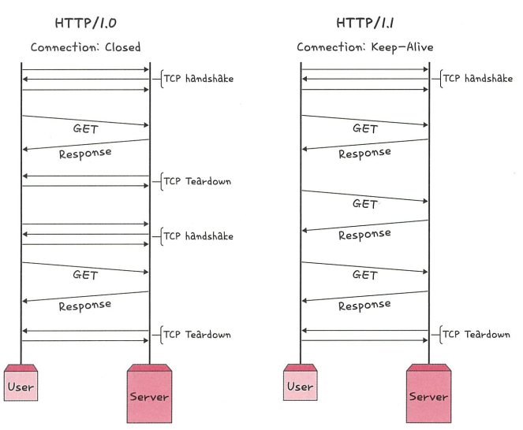
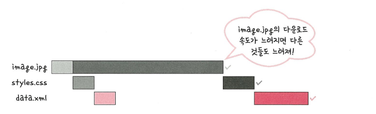

# HTTP/1.1

HTTP/1.1은 HTTP/1.0의 단점을 개선하여 등장한 프로토콜로, **Persistent Connection(지속 연결)** 기능을 통해 매 요청마다 TCP 연결을 재설정하지 않아도 되도록 개선되었습니다.

--- 

- HTTP/1.1에서는 **처음 한 번만 TCP 3-way 핸드셰이크**가 발생하고,  
  이후에는 **지속 연결(Keep-Alive)**을 통해 추가 요청을 처리합니다.

- 하지만 하나의 HTML 문서에 포함된 **여러 리소스(이미지, 동영상, CSS, JS 등)**를 불러올 경우,  
  **요청 개수에 비례하여 대기 시간이 증가**하는 단점이 있습니다.

---

## HOL Blocking (Head-Of-Line Blocking)

> 같은 큐에서 첫 번째 패킷이 지연되면, 그 뒤의 패킷들도 함께 지연되는 현상

- HTTP/1.1은 기본적으로 **순차적인 요청-응답 처리 방식**을 사용합니다.
- 하나의 리소스(image.jpg 등)의 응답이 느릴 경우, 다음 리소스(css, js 등)도 함께 **지연**됩니다.
- 이는 **병목 현상**을 초래하고, 사용자 응답 속도를 저하시킵니다.

---

- 여러 리소스(img, style.css, data.xml 등)를 다운로드할 때,  
  보통은 순차적으로 잘 받아지지만 특정 리소스(`image.jpg`)가 느리게 로드되면  
  **그 뒤에 요청된 리소스들도 함께 대기**하게 됩니다.

- 이로 인해 전체 다운로드가 지연되는 현상이 발생하며,  
  이를 **HOL Blocking(선두 지연 차단)**이라고 합니다.

### 무거운 헤더 구조
- HTTP/1.1의 요청/응답 헤더는 **텍스트 기반**이며, **압축되지 않은 메타데이터**(쿠키, 인증 정보 등)가 포함됩니다.
- 중복된 헤더 필드가 반복적으로 포함되어 **네트워크 전송량이 증가**하고, **성능 저하**의 원인이 됩니다.

---

