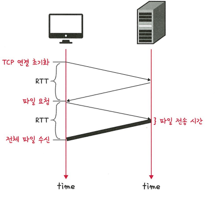
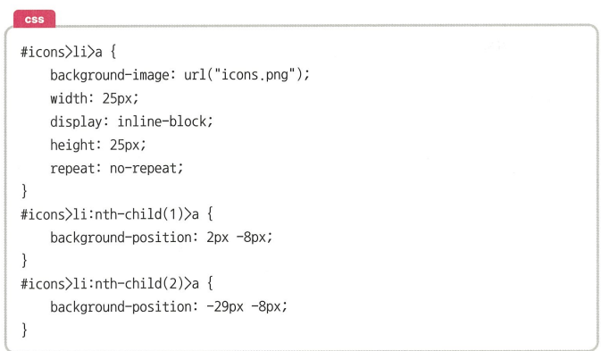
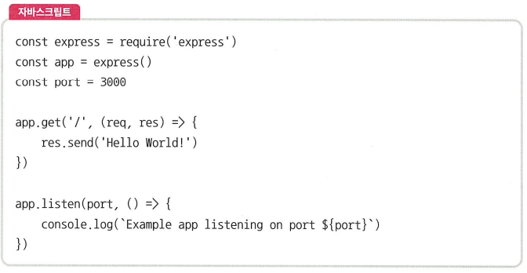

# HTTP
> HTTP는 전송 계층 위에 위치한 **애플리케이션 계층** 프로토콜로, **웹 서비스 통신**에 사용된다. 
> 
> HTTP/1.0부터 시작하여 발전을 거듭해 현재는 **HTTP/3**까지 도달했다. 
---
# HTTP/1.0
- 기본적으로 **한 연결당 하나의 요청**만 처리하도록 설계됨
- 이로 인해 **RTT(Round Trip Time)** 증가 문제가 발생

### 🔁 RTT(Round Trip Time)란?

> 패킷이 **목적지에 도달하고 응답이 출발지로 돌아오기까지** 걸리는 왕복 시간

- HTTP/1.0에서는 요청마다 **TCP 3-way 핸드셰이크**를 반복 수행해야 하므로 RTT가 증가  
- 이는 **서버 부하 증가**, **응답 시간 지연**이라는 문제로 이어짐




### RTT의 증가를 해결하기 위한 방법
> HTTP/1.0의 한계를 극복하기 위해 다양한 최적화 기법이 도입됨:


#### 1. 이미지 스플리팅
> 다수의 이미지를 하나의 이미지(sprite)로 합쳐서 다운로드 후  
> `background-position` 속성을 이용해 필요한 부분만 표시하는 방식


앞으로 코드처럼 하나의 이미지인 icons.png를 기반으로 background - position을 통해 2개의 이미지를 설정한것을 볼수 있다. 

📌 장점: 서버 요청 횟수를 줄여 성능 향상

📌 단점: 이미지 변경 시 전체 이미지를 다시 받아야 함

---

#### 2. 코드 압축 (Minify)
> HTML, CSS, JS 파일에서 개행 문자, 공백, 주석 등을 제거하여 파일 크기를 줄이는 방식



- 앞 코드를 다음과 같은 코드를 바꾸는 방법


- 이렇게 개행 문자, 띄어쓰기 등이 사라져 코드가 압축되면 코드용량이 줄어든다.

📌 장점: 전송 속도 향상, 응답 시간 단축

📌 단점: 가독성이 낮아 디버깅 어려움

---
#### 3. 이미지 Base64 인코딩
> 이미지를 Base64 문자열로 변환하여 HTML/CSS 내부에 포함시키는 방법

```

```

📌 장점:

별도의 HTTP 요청 없이 이미지 렌더링 가능

서버 연결 수 감소

📌 단점:

원래 이미지보다 약 37% 용량 증가

이미지 재사용 어려움

##### 인코딩
> 정보를 표준화, 보안, 처리 속도 향상, 저장 공간 절약 등을 목적으로
다른 형식으로 변환하는 처리 과정

- 문자열 → 바이너리

- 이미지 → Base64

- 텍스트 → URL 인코딩

