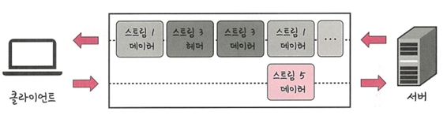
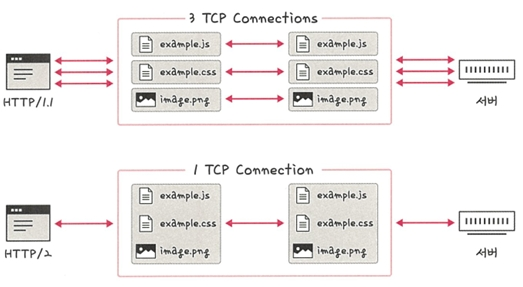
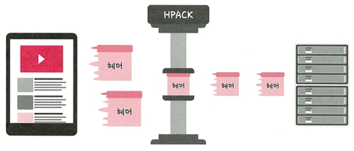
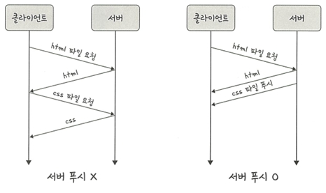

# 🚀 2.5.3 HTTP/2

HTTP/2는 SPDY 프로토콜에서 파생된 프로토콜로,  
HTTP/1.x보다 지연 시간을 줄이고 응답 시간을 더 빠르게 할 수 있음  
또한 **멀티플렉싱**, **헤더 압축**, **서버 푸시**, **요청 우선순위 처리**를 지원

---

## 🔀 멀티플렉싱

멀티플렉싱 : 여러 개의 **스트림(stream)** 을 사용하여 데이터를 송수신하는 방식  
이를 통해 특정 스트림의 패킷이 손실되더라도 해당 스트림에만 영향을 미치며, 나머지 스트림은 멀쩡하게 동작할 수 있음

>📌 **스트림(stream)** : 시간의 흐름에 따라 사용 가능한 일련의 데이터 흐름
 

- 하나의 TCP 연결 내 여러 개의 스트림이 병렬로 데이터를 주고받는 구조
- 애플리케이션에서 받은 메시지는 독립된 프레임으로 쪼개져서 전달

- HTTP/1.x: 파일마다 TCP 연결을 따로 사용
- HTTP/2: 단일 TCP 연결로 여러 요청/응답 처리 → **HOL Blocking** 문제 해결

---

## 📦 헤더 압축 (HPACK)

 
HTTP/1.x에서는 **헤더가 너무 커지는 문제**가 있었는데,  
HTTP/2에서는 이를 해결하기 위해 **헤더 압축** 방식을 사용  
→ **HPACK 포맷** 사용

### ✍️ 허프만 코딩 (Huffman Coding)
- 자주 나오는 문자는 짧은 비트 수로
- 덜 나오는 문자는 긴 비트 수로 표현
→ 전체 데이터의 표현에 필요한 비트 양을 줄임

---

## 📡 서버 푸시 (Server Push)

HTTP/1.x에서는 **클라이언트가 요청해야만** 리소스를 받을 수 있었지만,  
HTTP/2에서는 **서버가 먼저 리소스를 클라이언트에 푸시**할 수 있음

- HTML을 분석하며 CSS/JS 파일을 서버가 먼저 푸시
- 클라이언트 요청 전에 필요한 리소스를 받을 수 있음

---

## 🧠 핵심 요약

| 기능 | 설명 |
|------|------|
| 멀티플렉싱 | 하나의 TCP 연결에서 여러 스트림을 통해 병렬 데이터 전송 |
| 헤더 압축 | HPACK 방식 사용, 허프만 코딩 기반 |
| 서버 푸시 | 클라이언트 요청 없이 서버가 리소스를 먼저 전송 |

