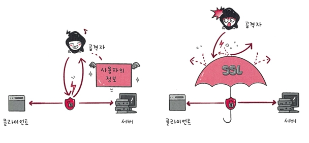
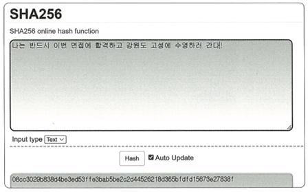

## 2.5.4 HTTPS

HTTPS는 HTTP에 **보안 기능(암호화 계층)** 을 더한 통신 방식.<br>
즉, 클라이언트(사용자)와 서버 사이의 데이터를 **안전하게 암호화하여 전송**할 수 있게 해주는 HTTP 프로토콜의 확장

- HTTP/2는 기본적으로 HTTPS 위에서 동작
- **SSL/TLS**라는 보안 계층을 사용해 제3자가 통신 내용을 볼 수 없도록 함

---
---
---

### 🔐 SSL/TLS

**SSL(Secure Socket Layer)** 와 **TLS(Transport Layer Security)** 는  
인터넷에서 정보를 **암호화해서 안전하게 주고받기 위한 통신 프로토콜**

- SSL은 1.0부터 시작해 2.0, 3.0까지 발전했고,
- 이후에는 **TLS 1.0 ~ 1.3**까지 이어지며, 현재는 **TLS 1.3**이 최신 버전
- 실무에서는 SSL과 TLS를 통칭해서 **SSL/TLS**라고 부름

>  요약: SSL/TLS는 **웹 통신을 암호화하여 안전하게 만들어주는 기술**

---

### 🧠 SSL/TLS의 역할

- 클라이언트와 서버가 데이터를 주고받을 때, **제3자가 내용을 가로채거나 훔쳐보지 못하게 암호화**
- 예를 들어, **로그인 정보, 결제 정보**와 같이 민감한 데이터를 안전하게 지킬 수 있음

---

> 📌 SSL/TLS를 이용한 인터셉팅 방지



---

### 🔐 SSL/TLS에 사용되는 암호화 기술

SSL/TLS는 보안 세션을 기반으로 데이터를 암호화하며<br>
보안 세션이 만들어질 때 다양한 기술이 사용됨

| 기술 종류 | 설명 |
|-----------|------|
| 인증 매커니즘 | 서버가 진짜인지 인증 |
| 키 교환 알고리즘 | 안전하게 대칭키를 교환 |
| 해싱 알고리즘 | 데이터가 위조되지 않았는지 검증 |

---

> ✨ 요약

- HTTPS는 HTTP + SSL/TLS
- SSL/TLS는 **암호화된 안전한 세션을 만들어서** 데이터를 보호
- 사용자의 개인정보, 로그인 정보 등을 **공격자로부터 안전하게 지켜줌**

---

### 🔐 보안 세션 & TLS 핸드셰이크

### 🧩 보안 세션

- **보안 세션** :  보안이 시작되고 종료될 때까지 유지되는 **암호화된 통신 상태**
- SSL/TLS는 **핸드셰이크(HandShake)** 과정을 통해 보안 세션을 생성하고, 
<br>이 세션을 바탕으로 서로 **키 정보, 상태 정보** 등을 주고받음

> 📘 용어: **세션(Session)**  
> 운영체제가 특정 사용자에게 자원 이용을 허락한 일정 시간 동안의 상태<br> 
> SSL/TLS에서는 보안 연결을 위한 지속적인 상태를 의미함

---

### 🤝 TLS의 핸드셰이크 과정

아래는 **클라이언트와 서버가 보안 통신을 시작하기 전 거치는 단계들**


✔ 이 과정을 통해 클라이언트와 서버는 **암호화 키를 공유**하고 인증, 암호화 설정을 마친 후  
✔ 실질적인 **데이터 통신(Application Data)** 을 암호화된 상태로 시작

---

### 🔐 사이퍼 슈트(Cipher Suite)

**사이퍼 슈트**란?

- TLS에서 사용할 **암호화 알고리즘 묶음(프로토콜 규약)**
- 어떤 암호화 기술을 사용할지 정하기 위해 클라이언트는 사이퍼 슈트를 제안하고, 서버는 지원 여부를 판단
- 이후 인증이 완료되면 이 규약에 따라 실제 데이터를 암호화

#### ✅ 대표적인 사이퍼 슈트 예시

- `TLS_AES_128_GCM_SHA256`
- `TLS_AES_256_GCM_SHA384`
- `TLS_CHACHA20_POLY1305_SHA256`
- `TLS_AES_128_CCM_SHA256`
- `TLS_AES_128_CCM_8_SHA256`

이 중 하나인 `TLS_AES_128_GCM_SHA256`은 다음의 3가지 규약으로 구성됨:

| 구성 요소 | 설명 |
|-----------|------|
| TLS | 전송 계층 보안 프로토콜 |
| AES_128_GCM | 128비트 키를 사용하는 AEAD 암호화 알고리즘 |
| SHA256 | 해시 함수로 데이터 무결성 검증 |

---

### 🔄 AEAD 사이퍼 모드란?

**AEAD(Authenticated Encryption with Associated Data)**는 인증 기능이 포함된 암호화 방식

예시:  
- `AES_128_GCM`  
  → 128비트 키를 사용하는 표준 블록 암호 기술(AES) + GCM이라는 병렬 연산 암호화 방식이 결합된 구조

> 🔐 AEAD는 데이터를 암호화하는 동시에, 변경 여부도 함께 검증하는 **고급 보안 암호화 방식**

---

### 🔐 인증 메커니즘 (CA 기반)

### 📄 CA란?

- **CA(Certificate Authority)** : 인증서를 발급해주는 공인된 기관
- 클라이언트(사용자)와 서버가 **안전한 연결**을 시작하기 위해 **신뢰할 수 있는 서버**임을 보장하는 인증서가 필요하며,<br> 이 인증서를 CA가 발급함

인증서에는 다음 정보들이 포함됨:

- 서버 정보 (도메인)
- 공개키 (서버가 가진 키)
- 지문 (공개키의 해시값)
- 디지털 서명 등

> 참고: 아무 기업이나 CA 역할을 할 수는 없으며, **신뢰성 있는 공인 기관**만이 참여할 수 있음.

대표적인 CA 기업:

- Comodo
- GoDaddy
- GlobalSign
- Amazon 등

---

### 🧾 CA 인증서 발급 과정

1. 사이트 소유자(서버)는 자신의 **사이트 정보**와 **공개키**를 CA에 제출
2. CA는 제출된 공개키를 바탕으로 **지문(Fingerprint)** 을 생성
3. 이 지문을 사용해 **자신의 비밀키**로 서명하고 인증서를 발급
4. 발급된 인증서는 클라이언트에게 전달되어 신뢰 여부를 확인하는 데 사용됨

---

### 📌 용어 정리

| 용어 | 설명 |
|------|------|
| 🔑 개인키 | 사용자가 직접 소유하며 절대로 외부에 노출되어선 안 되는 비밀키 |
| 🔓 공개키 | 누구나 볼 수 있도록 공개된 키로, 암호화 통신을 위한 정보 |

> 🔐 CA 인증서는 '공개키 기반 구조(PKI)'를 활용한 **비대칭 암호화**의 핵심 요소임

---

## 🔑 암호화 알고리즘 - 키 교환 방식

TLS에서는 **키 교환 암호화 알고리즘**을 통해 안전하게 암호화 키를 주고받음

### 🔁 키 교환 알고리즘이란?

- 서로 다른 두 통신 주체가 **공통된 암호화 키**를 만들어내는 방식
- 대표적인 방식:  
  - **DHE** (Diffie–Hellman Ephemeral) - 모듈러 기반
  - **ECDHE** (Elliptic Curve Diffie–Hellman Ephemeral) - 타원 곡선 기반  
  둘 다 **디피-헬만(Diffie–Hellman)** 방식을 응용한 것

---

### 🔐 디피–헬만 키 교환 방식(DHKE)

**디피–헬만 키 교환**은 서로 키를 직접 주고받지 않고, **공통된 암호 키(Shared Key)** 를 만들어내는 방식

수식 개념: y = g^x mod p


- `g`와 `p`는 공개 값
- `x`는 개인 비밀 값

공개 값 `g`와 `p`를 알고 있어도 `x`를 알지 않으면 `y`를 계산하기 어렵다는 **수학적 원리**에 기반

---

### 📊 동작 과정 예시

  

   1. 두 사람(A와 B)이 공개 값 `g`, `p`를 공유
   2. 각자 자신의 **비밀 값**을 공개 값과 섞어 새로운 값을 만듦
   3. 이 값을 상대방에게 **공개**
   4. 받은 값을 **자신의 비밀 값**과 다시 조합
   5. 결과적으로 A와 B는 **동일한 값**(공통된 암호 키)을 얻게 됨

🔒 이 키는 PSK(Pre-Shared Key)로 불리며, 통신을 암호화하는 데 사용

---

### ✅ 보안 효과

- 클라이언트와 서버는 서로 **공개키와 개인키를 조합**해 같은 암호 키를 만들게 됨
- 공격자가 중간에서 **공개키만 알 수 있어도 PSK는 알 수 없음**
- 따라서 공격자는 통신 내용을 복호화할 수 없음

> 이 과정을 통해 **안전하게 키를 주고받는 환경**이 만들어지게 됨

---

### 🔐 해싱 알고리즘 (Hash Algorithm)

해싱 알고리즘 : **데이터를 추적하기 힘들게 작고 섞여 있는 고정된 형태**로 바꾸는 암호화 기술

> 데이터를 '지문처럼' 변형하여, 같은 입력값은 항상 같은 출력값을 주지만, 결과값을 보고는 원래 데이터를 유추할 수 없음

---

### 🧠 TLS에서의 해싱 알고리즘

SSL/TLS에서는 주로 다음 두 가지 해싱 알고리즘을 사용:

- **SHA-256** (가장 일반적)
- **SHA-384** (보안 수준이 더 높은 버전)

이 중 가장 많이 쓰이는 **SHA-256** 알고리즘을 중심으로 교재는 설명하고 있음

---

### 🔍 SHA-256 알고리즘

- SHA-256은 **256비트 길이의 해시값**을 생성
- 비트코인과 같은 **블록체인 시스템**에서도 널리 사용됨
- 입력값이 아무리 길어도 항상 같은 길이의 출력값이 나오므로 **데이터 무결성** 검증 등에 유용

   
   > 예:  
   > 입력: "나는 반드시 이번 면접에 합격하고 강원도 고성에 수영하러 간다!"  
   > 출력: `08cc3029b838d4be3ed53ffe3bab5be2cd44526218d365bfdf1d5673e27838f`  
   > → 무슨 의미인지 알 수 없는 문자열로 바뀜

   🔗 SHA-256 테스트 사이트:  
   [https://emn178.github.io/online-tools/sha256.html](https://emn178.github.io/online-tools/sha256.html)

---

### 🧾 용어 정리

| 용어     | 설명 |
|----------|------|
| **해시** | 다양한 데이터를 **고정된 길이의 데이터**로 매핑한 값 |
| **해싱** | 데이터를 해시값으로 바꾸는 행위 |
| **해시 함수** | 데이터를 받아서 고정된 길이로 변환하는 수학적 함수 |

---

### ⏱️ 0-RTT란?

- TLS 1.3부터는 사용자가 이전에 방문한 사이트에 **다시 방문**할 경우,
- 기존에 만들어 둔 세션을 재사용하므로 **보안 세션을 새로 만들지 않아도 됨**.
- 이렇게 세션 없이 곧바로 데이터를 보내는 방식을 **0-RTT (0 Round Trip Time)** 라고 함<br><br>

---
---
---

## 📈 SEO에도 도움을 주는 HTTPS

HTTPS는 단순히 보안만 강화하는 것이 아닌  
**SEO(검색 엔진 최적화)** 에도 긍정적인 영향을 주게 됨.

> 예: 구글은 SSL 인증서를 적용하고 콘텐츠가 동일한 경우, **HTTPS 사이트의 SEO 점수를 더 높게 평가**

---

### 🔧 SEO를 위한 설정 요소

HTTPS를 적용한 뒤, 아래와 같은 설정도 함께 해주면 좋음:

1. **캐노니컬 설정 (Canonical Setting)**  
   - 중복 콘텐츠가 존재할 때, 대표 URL을 명시
   - 예시:
     ```html
     <link rel="canonical" href="https://example.com/page2.php" />
     ```

2. **메타 설정 (Meta Tag)**  
   - HTML 문서의 최상단에서 **검색엔진이 이해할 수 있도록 정보를 제공**
   - 애플의 메타 설정 예:
     ```html
     <meta property="og:title" content="Apple - iTunes" />
     <meta property="og:type" content="website" />
     ...
     ```

3. **페이지 속도**  
   - 사용자 경험과 SEO 모두에서 매우 중요
   - 구글의 [PageSpeed Insights](https://developers.google.com/speed/pagespeed/insights/)를 활용해 사이트 속도를 측정하고 리포팅 받아볼 수 있음

     <br>

     


4. **사이트맵 관리**  
   - `sitemap.xml` 파일을 정기적으로 업데이트하여 검색 엔진에 사이트 구조를 알려야 함.
   - 예시:
     ```xml
     <urlset xmlns="http://www.sitemaps.org/schemas/sitemap/0.9">
         <url>
             <loc>http://kundol.co.kr/</loc>
             <lastmod>수정날짜</lastmod>
             <changefreq>daily</changefreq>
             <priority>1.1</priority>
         </url>
     </urlset>
     ```

<br>

---
---
---
## 🔨 HTTPS 구축 방법

HTTPS는 다음 중 한 가지 방식으로 구축할 수 있음:

1. **직접 CA에서 인증서를 구매하여 설치**
2. **서버 앞단에 HTTPS를 제공하는 리버스 프록시 서버를 두는 방식**
3. **CDN(Content Delivery Network)을 활용하여 HTTPS 구성**

> 사이트 특성과 운영 방식에 따라 가장 적절한 방식을 선택해 적용하면 됨


