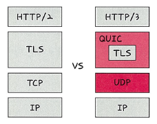
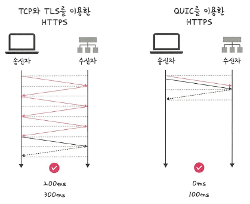

# 📘 2.5.5 HTTP/3

### 🔍 핵심 개념

> HTTP/3는 **HTTP/1.1** 및 **HTTP/2**와 함께  
> 웹에서 정보를 교환하는 데 사용되는 **세 번째 버전의 프로토콜**입니다.

- HTTP/1.1 및 HTTP/2는 **TCP** 기반이지만  
- **HTTP/3는 UDP 기반의 QUIC 프로토콜** 위에서 동작합니다.

📌 주요 차이점:
- HTTP/3는 **QUIC → TLS → UDP → IP** 순서
- HTTP/2는 **TLS → TCP → IP** 순서

> 🖼️ HTTP/2와 HTTP/3 비교  
> 

---

## 🔹 HTTP/3의 장점

### ✅ 1. 멀티플렉싱(Multiplexing)

- HTTP/2부터 지원된 기능으로,  
  여러 요청을 **하나의 연결에서 동시에 처리** 가능

### ✅ 2. 초기 연결 설정 시 지연 시간 감소

- QUIC은 **3-way 핸드셰이크 과정이 없음**
- 따라서 연결 시작 시 **지연 시간이 감소**함

> 🚀 **QUIC은 TCP를 사용하지 않기 때문에**  
> 통신 시작 시 번거로운 핸드셰이크 과정을 생략할 수 있음

---

## 🔹 RTT(Round Trip Time)의 감소

> 🖼️ RTT의 감소  
> 

| 방식 | RTT 횟수 | 지연 시간 |
|------|----------|------------|
| TCP + TLS (HTTPS) | 최소 2-RTT | 200~300ms |
| QUIC (HTTPS)      | 1-RTT      | 0~100ms   |

📌 **1-RTT만으로 본 통신 시작 가능**  
클라이언트가 신호 한 번 → 서버가 응답 → 본 통신 시작

---

## 🔹 QUIC의 기타 특징

### ✅ 오류 복구 메커니즘 (FEC)

- QUIC은 **FEC(Forward Error Correction)** 기능을 내장
- 손상된 패킷이 있어도 수신 측에서 **예측하고 복구** 가능
- 🔐 네트워크 환경이 열악해도 **패킷 손실률을 최소화**함

---

### ✅ 요약

| 항목 | HTTP/2 | HTTP/3 |
|------|--------|--------|
| 전송 계층 | TCP | UDP |
| 핸드셰이크 | 3-way 필요 | 불필요 |
| 멀티플렉싱 | 지원 | 지원 |
| 속도 | 상대적 느림 | 더 빠름 (1-RTT 연결) |
| 패킷 손실 복구 | 재전송 | FEC 통한 예측 및 복구 |