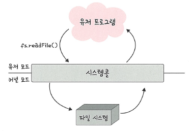

# 📘 3.1.1 운영체제의 역할과 구조

---

## 🔹 운영체제의 역할

운영체제의 역할은 크게 **네 가지**가 있습니다.

1. **CPU 스케줄링과 프로세스 관리**  
   - CPU 소유권을 어떤 프로세스에 할당할지  
   - 프로세스의 생성과 삭제, 자원 할당 및 반환을 관리

2. **메모리 관리**  
   - 제한된 메모리를 어떤 프로세스에 얼마만큼 할당할지를 관리

3. **디스크 파일 관리**  
   - 디스크 파일을 어떤 방식으로 보관할지를 관리

4. **I/O 디바이스 관리**  
   - 마우스, 키보드와 같은 I/O 장치와 컴퓨터 간의 데이터 주고받기 관리

---

## 🔹 운영체제의 구조

운영체제의 구조는 다음과 같습니다.

> 🖼️ 운영체제의 구조  
> 

- 유저 프로그램이 맨 위에 있고  
- 그 아래에 **GUI, 시스템콜, 커널, 드라이버**가 있으며  
- 가장 밑에 **하드웨어**가 위치  
- GUI, 시스템콜, 커널, 드라이버 부분을 **운영체제**라 부름

📌 참고: GUI가 없고 **CUI만 있는 리눅스 서버**도 있음

---

## 📘 용어 정리

### ✅ GUI  
- 사용자와 전자장치가 상호작용할 수 있도록 하는 **그래픽 사용자 인터페이스**
- 명령어 창이 아닌 **아이콘**이나 **버튼**을 마우스로 클릭하는 방식

### ✅ 드라이버  
- **하드웨어를 제어**하기 위한 소프트웨어

### ✅ CUI  
- 그래픽이 아닌 **명령어로 처리**하는 인터페이스 (예: 리눅스 쉘)

---

## 🔹 시스템콜

- **운영체제의 커널에 접근하기 위한 인터페이스**
- 유저 프로그램이 커널의 기능을 사용하고자 할 때 **커널 함수를 호출**

예시:

```js
fs.readFile() // 파일 시스템의 파일 읽기 요청
```

> 🖼️ 시스템콜 구조  
> 

---

## 🔹 시스템콜 동작 과정

1. 유저 프로그램이 I/O 요청 → **트랩(trap)** 발생  
2. **커널 모드**로 전환되어 요청 처리  
3. 다시 **유저 모드**로 돌아감

📌 이렇게 함으로써:
- **컴퓨터 자원에 직접 접근을 차단**
- 프로그램 간 **보호**가 가능

---

## 📘 용어 정리 (2)

### ✅ I/O 요청  
- 입력 장치, 데이터베이스, 파일 접근, 네트워크 등과 관련된 요청

### ✅ 드라이버  
- 하드웨어 제어를 위한 소프트웨어

---

## 🔹 시스템콜과 커널, 운영체제

> 🖼️ 시스템콜과 커널 관계  
> 

- 프로세스와 스레드는 시스템콜을 통해 커널에 접근  
- 커널은 **운영체제의 핵심**으로 OS 전체 자원을 관리

---

## 🔹 modebit의 역할

**modebit**: 유저 모드 / 커널 모드 구분하는 플래그 (0 또는 1)

- `modebit = 1` → 유저 모드  
- `modebit = 0` → 커널 모드

> 🖼️ modebit의 역할  
> 

### 📌 역할:
- 카메라, 키보드 같은 **I/O 장치는 운영체제를 통해서만 사용 가능**
- 만약 유저 모드에서 카메라를 직접 실행할 수 있다면 → **보안 위협**

운영체제를 **통해 우회**하게 함으로써 안전성 확보

---

## ✅ 요약

| 항목 | 설명 |
|------|------|
| 운영체제 역할 | CPU/메모리/디스크/I/O 자원 관리 |
| 구조 | GUI, 시스템콜, 커널, 드라이버 + 하드웨어 |
| 시스템콜 | 유저 프로그램 → 커널 기능 요청 인터페이스 |
| modebit | 유저 모드와 커널 모드 구분 (0: 커널, 1: 유저) |
| 보안성 | 자원 접근 통제 및 프로그램 간 보호 가능 |