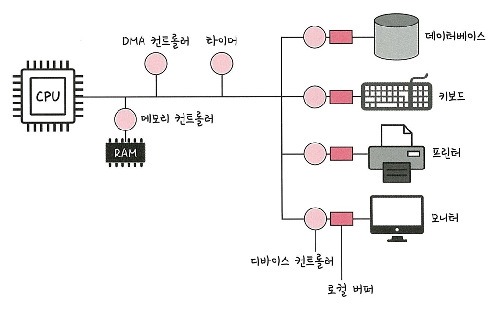
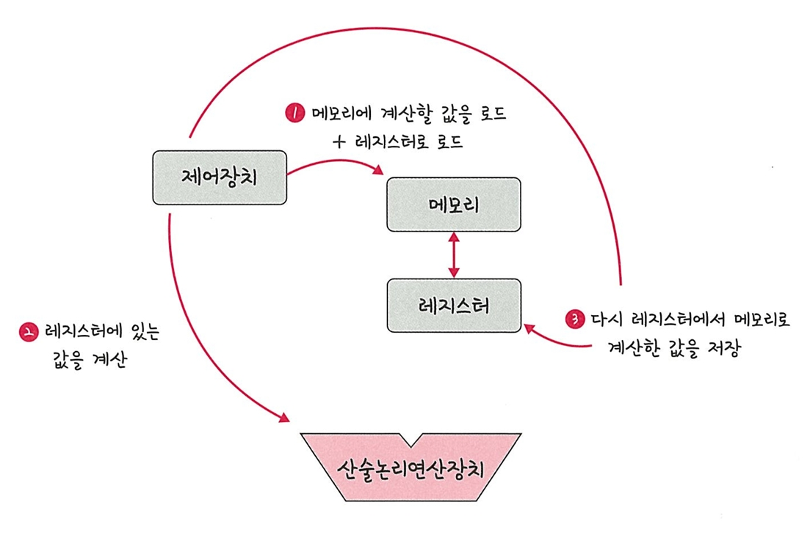

# 📘 3.1.2 컴퓨터의 요소

컴퓨터는 **CPU**, **DMA 컨트롤러**, **메모리**, **타이머**, **디바이스 컨트롤러** 등으로 구성됨
 

---

## 🧠 CPU (Central Processing Unit)

CPU는 **산술논리연산장치(ALU)**, **제어장치(CU)**, **레지스터**로 구성되어 있으며,  
메모리에 존재하는 명령어를 해석하고 실행하는 장치

운영체제는 프로그램을 메모리에 올려 프로세스를 생성하며,  
이 프로세스를 **CPU가 처리**하게 됨

### 🔹 제어장치 (Control Unit, CU)
- 프로세스의 흐름을 지시
- 입출력 장치와 통신하며, **어떤 명령을 어떤 순서로 실행할지** 결정

### 🔹 레지스터 (Register)
- CPU 내부의 **매우 빠른 임시 기억장치**
- 메모리보다 훨씬 빠르며, 계산에 필요한 데이터를 임시 저장

### 🔹 산술논리연산장치 (Arithmetic Logic Unit, ALU)
- 산술 연산 (덧셈, 뺄셈 등)과 논리 연산 (AND, OR 등)을 수행하는 회로

---

### 🧮 연산 처리 과정

1. **제어장치**가 메모리에서 값을 로드 (또는 레지스터에 로드)
2. **제어장치**가 ALU에 연산 지시
3. 연산 결과를 다시 레지스터 → 메모리에 저장
 

---

### 🔔 인터럽트 (Interrupt)

- 외부나 내부에서 **CPU 작업을 잠시 멈추게 하는 신호**
- **인터럽트 벡터**를 통해 관련된 인터럽트 핸들러가 실행됨
- 인터럽트에는 우선순위가 존재하며, 하드웨어/소프트웨어 인터럽트로 나뉨

#### 📌 용어
- **인터럽트 핸들러 함수**  
  인터럽트 발생 시 호출되는 함수.  
  `request_irq()` 등을 통해 등록 가능.

#### 🔸 하드웨어 인터럽트
- 키보드, 마우스 등 I/O 디바이스에서 발생
- 사용자의 입력에 반응

#### 🔸 소프트웨어 인터럽트
- **트랩(trap)** 이라고도 함  
- 프로세스 오류, 시스템 호출 등 소프트웨어적 신호

---

## 🚀 DMA 컨트롤러 (Direct Memory Access Controller)

- I/O 디바이스가 **CPU를 거치지 않고 메모리에 직접 접근** 가능하도록 하는 장치
- CPU가 처리할 인터럽트가 많아질 경우를 대비해, DMA가 CPU의 일을 대신 분담
- 단, **CPU와 DMA가 동시에 메모리에 접근하는 것은 방지**

> 📌 보조 일꾼 역할을 수행하는 하드웨어 장치

---

## 💾 메모리 (Memory)

- 전자회로에 데이터, 상태, 명령어 등을 기록하는 장치
- 일반적으로 **RAM(Random Access Memory)** 를 의미
- CPU는 계산을 담당하고, **메모리는 기억을 담당**

#### 🔸 공장 비유  
- **CPU = 일꾼**, **메모리 = 작업장(작업대)**  
- 작업장이 클수록 한 번에 더 많은 물건을 펼쳐놓고 처리 가능

> 메모리가 클수록 동시 처리 능력이 높아짐

---

## ⏱️ 타이머 (Timer)

- 특정 작업을 **몇 초 안에 끝내야 한다**는 시간 제한 설정
- 실행 시간이 긴 프로그램에 **제한을 걸기 위해 존재**

> 예: 타임아웃 설정, 무한 루프 방지 등

---

## 📟 디바이스 컨트롤러 (Device Controller)

- 각 I/O 디바이스에 연결된 **작은 CPU**
- 로컬 버퍼를 이용하여, 디바이스에서 데이터를 임시 저장

> 예:  
프린터 → 프린터 디바이스 컨트롤러 → 출력 버퍼  
키보드 → 키보드 디바이스 컨트롤러 → 입력 버퍼

---

## ✅ 정리

| 구성 요소          | 설명 요약 |
|-------------------|-----------|
| **CPU**           | 명령어 해석 및 실행, 연산과 제어 담당 |
| **제어장치**      | 연산 순서와 흐름 제어 |
| **레지스터**      | 초고속 임시 기억장치 |
| **ALU**           | 산술 및 논리 연산 수행 |
| **인터럽트**      | CPU 작업을 중단시키는 신호 |
| **DMA 컨트롤러**  | I/O 디바이스의 메모리 직접 접근 지원 |
| **메모리(RAM)**   | 데이터를 임시 저장, 작업장 역할 |
| **타이머**        | 시간 제한 설정 |
| **디바이스 컨트롤러** | I/O 디바이스와 컴퓨터 사이의 연결 역할, 버퍼 보유 |
