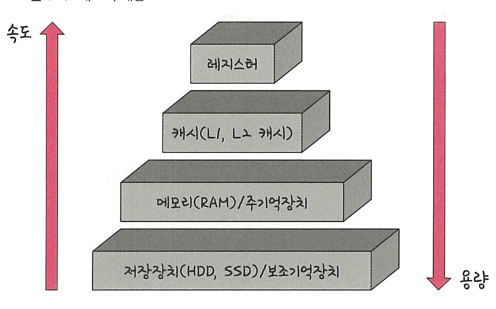
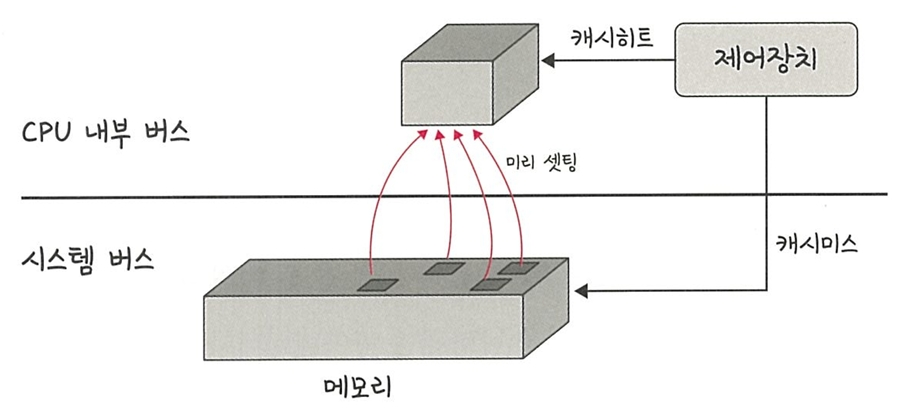
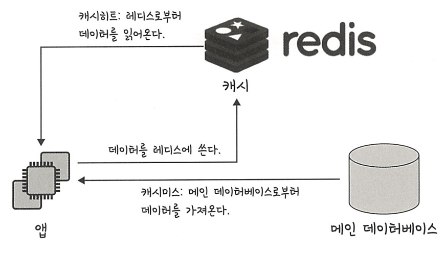

# 📘 3.2 메모리

CPU는 메모리에 올라와 있는 프로그램의 명령어를 실행할 뿐이며,  
메모리 계층 구조와 메모리 관리가 매우 중요함

---

## 🧱 3.2.1 메모리 계층

메모리 계층은 **레지스터, 캐시, 메모리, 저장장치**로 구성됨



| 계층 구성 | 설명 |
|-----------|------|
| **레지스터** | CPU 내부의 매우 작은 메모리, 속도 가장 빠름, 용량 가장 작음 |
| **캐시** | L1, L2, L3 캐시 등. 속도 빠름, 용량 작음 |
| **주기억장치** | RAM. 속도 보통, 용량 보통 |
| **보조기억장치** | HDD, SSD. 속도 느림, 용량 큼 |

- 계층 위로 올라갈수록 속도는 빠르고 가격은 비싸며, 용량은 작아짐
- 하드디스크의 데이터를 RAM에 복사해 빠르게 접근할 수 있도록 함
- 예시: 게임 실행 시 로딩 중 메시지는 아직 RAM으로 데이터가 전송되지 않았음을 의미

---

## 💨 캐시 (Cache)

- 느린 장치와 빠른 장치 사이의 **속도 병목 현상**을 줄이기 위한 중간 저장소
- 자주 접근하는 데이터를 미리 복사해 둠
- 연산 반복 방지, 무연산 재계산 방지로 **성능 향상**

> 캐시는 속도 차이를 해결하기 위한 **계층 간 중간다리 역할**

---

## 🧠 지역성의 원리

캐시를 효율적으로 설정하기 위해선 **자주 사용하는 데이터**를 기반으로 구성해야 하며,  
이를 설명하는 것이 바로 **지역성(Locality)** 

### 🔹 시간 지역성 (Temporal Locality)

- 최근 사용한 데이터를 **다시 접근**하려는 특성
- 예: for 문 반복문에서 같은 변수에 반복적으로 접근

```javascript
let arr = Array.from({length: 10}, () => 0);
for (let i = 0; i < 10; i++) {
    arr[i] = i;
}
console.log(arr);
/*
[0, 1, 2, 3, 4, 5, 6, 7, 8, 9]
*/
```

### 🔹 공간 지역성 (Spatial Locality)

- 최근 접근한 **공간 근처의 데이터**를 또 접근하려는 특성
- 배열 요소를 순차적으로 접근할 때 발생

---

## 🎯 캐시히트와 캐시미스
 


- **캐시히트**: 캐시에 데이터가 있어 바로 접근 가능
- **캐시미스**: 캐시에 없어 메모리에서 다시 불러와야 함

---

## 📌 캐시 매핑

캐시 히트율을 높이기 위해 **CPU의 레지스터와 메모리 사이의 매핑 방식** 사용

| 매핑 방식 | 설명 |
|-----------|------|
| **직접 매핑** | 하나의 메모리 블록이 하나의 캐시 위치에만 저장 가능 |
| **연관 매핑** | 아무 위치에나 저장 가능하나, 탐색 비용이 큼 |
| **집합 연관 매핑** | 직접 + 연관 매핑의 절충형. 일정 그룹 내에서 저장 가능 |

---

## 🌐 웹 브라우저의 캐시

- **쿠키**: 제한된 키-값 저장소. 서버로 전송됨.  
- **로컬 스토리지**: 클라이언트 전용 저장소. 서버로 전송되지 않음.  
- **세션 스토리지**: 탭 단위 저장소. 종료 시 삭제됨.

---

## 💾 데이터베이스의 캐시 계층
 


- DB 앞단에 Redis와 같은 인메모리 캐시를 두어 **응답 속도 향상**
- 원본 DB에 접근하지 않고 빠르게 응답 가능

---

## ✅ 정리

| 구분 | 특징 요약 |
|------|------------|
| **메모리 계층** | 레지스터 > 캐시 > RAM > 저장장치 순. 속도 빠를수록 가격 ↑ 용량 ↓ |
| **캐시** | 속도 병목 해결용 임시 저장소. 지역성 기반 |
| **지역성 원리** | 시간/공간 지역성을 통해 캐시 설정 방향 결정 |
| **캐시히트/미스** | 캐시에 있는지 여부에 따른 접근 방식 차이 |
| **캐시 매핑** | 캐시 성능 향상을 위한 저장 전략 |
| **웹 캐시** | 쿠키, 로컬스토리지, 세션스토리지로 구분됨 |
| **DB 캐시** | Redis 같은 인메모리 캐시 사용으로 응답속도 개선 |

