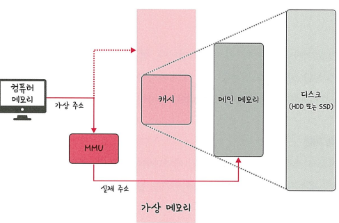
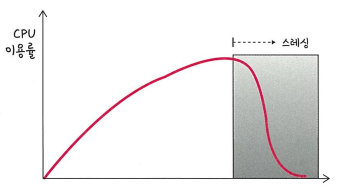

# 메모리 관리
> 운영체제의 대표적인 할 일 중 하나가 메모리 관리 입니다.
> 컴퓨터 내의 한정된 메모리를 극한으로 활용해야 하는것이다

## 가상 메모리(viryal memory)
> 메모리 관리 기법의 하나로 컴퓨터가 실제로 이용 가능한 메모리 자원을 추상화라여 리를 사용하는 사용자들에게 매우 큰 메모리로 보이게 만드는 말한다.

이미지 설명
- 이때 가상적으로 주어진 주소를 가상 주소라고 하며, 실제 메모리상에 있는 주소를 실제 주소라고 합니다. 가상주소는 메모리관리장치(MMU)에 의해 실제 주소로 변환되며, 이덕분에 사용자는 실제 주소를 의식할 필요 없이 프로그램을 구축할수 있게 된다.
가상 메모리는 가상 주수와 실제 주소가 매칭되어 있고 프로세스의 주소 정보가 들어 있는 페이지 테이블로 관리 된다.. 이때 속도 향상을 위해 TLB를 쓴다

### TLB
> 메모리와 CPU 사이에 있는 주소변환을 위한캐시이다. 페이지 테이블에 있는 리스트를 보관하며 CPU가 페이지 테이블까지 가지 않도록 해 속도를 향상시킬 수 있는 캐시 계층이다.

---
### 스와핑(Swapping)
> 스와핑은 **프로세스를 메인 메모리(RAM)**에서 **디스크(보조기억장치, 예: HDD/SSD)의 스왑 공간(Swap Space)**으로 이동시켰다가, 다시 메모리로 불러오는 운영체제의 메모리 관리 기법이다. 
> - 메모리가 부족할 때 사용됨
> - 실행 중인 프로세스 전체를 디스크로 내보내거나, 디스크에서 다시 메모리로 불러옴

### 페이지 폴트(Page Fault) 
> **페이지 폴트(Page Fault)**는 **프로세스가 필요한 페이지가 메인 메모리에 존재하지 않을 때 발생하는 예외(인터럽트)**이다. 
> 
> 운영체제의 가상 메모리 시스템에서, 필요한 **페이지(Page)**가 메모리에 없어서 디스크(보조기억장치)에서 해당 페이지를 불러와야 할 때 발생합니다.

#### 페이지(Page)
> 가상 메모리를 사용하는 최소 크기 단위

#### 프레임(frame)
> 실제 메모리 를 사용하는 최소 단위

#### 발생과정 
1. 프로세스가 특정 가상 주소에 접근하려 함
2. MMU(메모리 관리 장치)가 페이지 테이블을 확인
3. 해당 페이지가 메모리에 없으면 페이지 폴트 발생
4. 운영체제가 다음과 같은 처리 수행:
- 디스크에서 해당 페이지를 읽음 (I/O 작업)
- 페이지를 RAM에 적재
- 페이지 테이블 갱신
- 해당 명령어 재실행

---
## 스레싱(theashing)

> 메모리에 너무 많은 프로세스가 동시에 올라가게 되면 스와핑이 많이 일어나서 발생하는것이다. 페이지 폴트가 일어나면 CPU 이용률이 낮아진다. CPU 이용률이 낮아지게 되면 운영체제는 CPU 한가한가 라고 생각하여 가용성을 더 높이기 위해 더 많은 프로세스를 메모리에 올리게 됩니다. 이와 같은 악순환이 반복되면 스레싱이 일어나게 된다
이를 해결하기 위한 방법으로는 메모리를 늘리거나 , HDDD를 사용한다면 HDD를 SSD로 바꾸는 방법이 있다. 이외에 운영체제에서 이를 해결할 숭 있는 방법은 작업 세트와 PFF가 있다.

### 작업세트(working art)
> 프로세스의 과거 사용이력인 지역성을 통해 결정된 페이지 집합을 만들어서 미리 메모리에 로드 하는것 입다. 미리 메모리에 로드하면 탐색에 드는비용을 줄일 수 있고 스와핑 또한 줄일수 있다.

### PFF
> 

