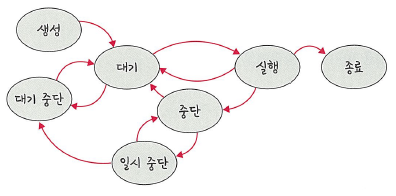

# 📘 3.3.2 프로세스의 상태

프로세스의 상태는 여러 가지 상태 값을 갖습니다.

> 🖼️ **프로세스의 상태**  
> 

---

## 🔹 주요 상태 설명

---

### ✅ 생성 상태 (Create)

- 프로세스가 생성되었을 때의 상태
- `fork()` 또는 `exec()` 함수를 통해 생성됨
- 이때 **PCB(Process Control Block)**가 할당됨

#### 🔸 fork()
- 부모 프로세스의 주소 공간을 그대로 복사하여, 새로운 자식 프로세스를 생성하는 함수
- 주소 공간만 복사할 뿐, 부모 프로세스의 비동기 작업은 상속되지 않음

#### 🔸 exec()
- 새롭게 프로세스를 생성하는 함수

```c
fork();  // 부모 프로세스 복제
exec();  // 새 프로세스 실행
```

---

### ✅ 대기 상태 (Ready)

- 메모리 공간이 충분하면 메모리를 할당받고, 아니면 아닌 상태로 **대기 중**
- CPU 스케줄러로부터 CPU 소유권을 기다리는 상태

---

### ✅ 대기 중단 상태 (Ready Suspended)

- **메모리 부족**으로 인해 일시 중단된 대기 상태

---

### ✅ 실행 상태 (Running)

- CPU 소유권과 메모리를 할당받아 명령어를 **실행 중인 상태**
- 흔히 **CPU burst**가 발생했다고 표현

---

### ✅ 중단 상태 (Blocked)

- 어떤 이벤트가 발생하기 전까지 기다리는 상태
- 예: I/O 요청에 의해 대기 중인 상태  
  → 키보드, 마우스 입력 대기 등

---

### ✅ 일시 중단 상태 (Blocked Suspended)

- 중단 상태에서 메모리 부족으로 인해 **일시적으로 더 중단된 상태**
- 실행되려 했지만 메모리 부족

---

### ✅ 종료 상태 (Terminated)

- 메모리와 CPU 자원을 모두 **반납**하고 프로세스가 종료된 상태
- 종료는 자연스럽게 또는 강제(abort)로 발생할 수 있음

```bash
kill -9 <pid>  # 강제 종료 명령
```

---

## ✅ 요약: 프로세스 상태 전이

| 상태 | 설명 |
|------|------|
| 생성 | 프로세스가 생성됨 (`fork()`, `exec()` 사용) |
| 대기 | CPU 자원 할당을 기다리는 중 |
| 대기 중단 | 메모리 부족으로 대기 상태가 일시 중단됨 |
| 실행 | CPU에서 명령어를 실행 중 |
| 중단 | I/O 등 외부 이벤트 대기 중 |
| 일시 중단 | 중단 상태에서 메모리 부족으로 추가 중단 |
| 종료 | 프로세스가 자원을 반납하고 종료됨 |