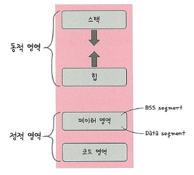

# 📘 3.3.3 프로세스의 메모리 구조

운영체제는 프로세스에 적절한 메모리를 할당하는데  
다음 구조를 기반으로 할당합니다.

> 🖼️ 프로세스의 메모리 구조  
> 

프로세스의 메모리 구조는 다음과 같이 나뉩니다:

- 스택(Stack)
- 힙(Heap)
- 데이터 영역 (BSS Segment, Data Segment)
- 코드 영역 (Code Segment)

스택은 위 주소부터 할당되고, 힙은 아래 주소부터 할당됩니다.

---

## 🔹 스택과 힙

스택과 힙은 **동적 할당**이 되며,  
동적 할당은 런타임 단계에서 메모리를 할당받는 것을 의미합니다.

### ✅ 스택(Stack)

- 지역 변수, 매개 변수, 실행되는 함수에 의해 늘어나거나 줄어드는 메모리 영역입니다.  
- 함수가 호출될 때마다 **호출 환경 정보**가 스택에 저장됩니다.  
- **재귀 함수**처럼 호출되면, 새 스택 프레임이 메모리 상에 계속 쌓이게 됩니다.  
- 함수 내 변수는 스택 영역에 저장되며, 같은 함수라도 호출 시마다 다른 인스턴스를 갖습니다.

### ✅ 힙(Heap)

- **동적으로 할당되는 변수**들이 저장됩니다.  
- `malloc()`, `free()` 함수로 메모리를 할당하고 해제합니다.  
- 자주 사용되는 동적 자료구조(예: `vector` 등)는 내부적으로 힙을 사용합니다.

---

## 🔹 데이터 영역과 코드 영역

이 영역은 **정적 할당**되는 메모리입니다.  
정적 할당은 **컴파일 단계에서 이미 메모리 할당**이 끝나는 것을 의미합니다.

데이터 영역은 다음 두 가지로 나뉩니다:

1. **BSS Segment**  
   - 초기화되지 않은 전역 변수 및 `static`, `const` 변수 저장  
   - 예: `static int count;` 처럼 0으로 초기화되거나 초기화 없이 선언된 변수

2. **Data Segment**  
   - 초기화된 전역 변수 및 `static`, `const` 변수 저장  
   - 예: `static int total = 10;` 처럼 초기값이 있는 변수

### ✅ 코드 영역 (Code Segment)

- 프로그램의 **실제 실행 코드**가 저장됩니다.  
- 컴파일된 명령어가 위치한 공간입니다.

---

## ✅ 요약

| 영역 | 설명 |
|------|------|
| 스택 | 함수 호출 시 생기는 임시 변수 저장, LIFO 구조 |
| 힙 | 동적 메모리 할당 저장소 (`malloc`, `free`) |
| 데이터 영역 | 전역/정적 변수 저장, 초기화 여부에 따라 BSS/Data로 분리 |
| 코드 영역 | 실제 실행 코드 저장 |