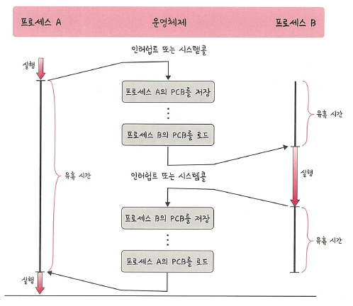

# 📘 3.3.4 PCB와 컨텍스트 스위칭

운영체제는 프로세스를 효율적으로 관리하기 위해 "PCB(Process Control Block)"라는  
데이터 구조를 사용합니다.

---

## 🔹 PCB란?

**PCB(Process Control Block)**  
- 프로세스에 대한 **메타데이터**를 저장하는 운영체제 내부 자료구조  
- 프로세스 생성 시 함께 생성되며, **커널 영역**에서 관리  
- 사용자 접근 불가 (보안 및 안정성 유지 목적)

> 📌 **메타데이터**  
> 데이터를 설명하는 데이터.  
> 예: 프로세스의 상태, 위치, 실행 정보, 권한 등

---

## 🔹 PCB에 저장되는 주요 정보

| 구분 | 내용 |
|------|------|
| **프로세스 상태** | 실행 중, 준비, 대기 등 현재 상태 |
| **프로세스 ID** | PID, 부모 PID |
| **프로세스 권한** | 자원 및 I/O 장치 접근 권한 |
| **프로그램 카운터** | 다음에 실행할 명령어 주소 |
| **CPU 레지스터 정보** | 실행을 재개하기 위한 CPU 상태 |
| **CPU 스케줄링 정보** | 우선순위, 대기 시간 등 |
| **계정 정보** | CPU 사용량, 실행 사용자 |
| **I/O 상태 정보** | 할당된 I/O 장치 목록 |

---

## 🔹 컨텍스트 스위칭이란?

"컨텍스트 스위칭(Context Switching)"은  
현재 실행 중인 프로세스의 상태(PCB)를 저장하고,  
다른 프로세스의 PCB를 로드하여 실행하는 과정입니다.

- 발생 시점:  
  - CPU 할당 시간이 끝날 때 (타이머 인터럽트)  
  - I/O 요청으로 대기 상태가 될 때  
  - 더 높은 우선순위 프로세스가 준비 상태가 될 때

---

## 🔹 컨텍스트 스위칭 발생 시점

- 타이머 인터럽트(할당 시간 소진)  
- I/O 요청으로 인해 대기 상태가 될 때  
- 더 높은 우선순위의 프로세스가 준비 상태가 될 때  
- 프로세스가 자발적으로 양보할 때 (yield)

---

## 🔹 컨텍스트 스위칭 동작 흐름  

> 🖼️ 컨텍스트 스위칭    
> 

---

# 🔹 비용: 캐시미스

컨텍스트 스위칭은 단순히 레지스터와 레이블을 저장/복원하는 것 외에도 **추가 비용**을 발생시킵니다.

## 🔸 캐시미스(cache miss)
- 컨텍스트 스위칭이 일어날 때 프로세스가 사용하던 메모리 주소 공간이 바뀌면  
  CPU 캐시(LS1/LS2 등)에 남아있던 데이터와 새 프로세스의 필요한 데이터가 달라 **캐시 미스**가 빈번히 발생합니다.
- 캐시를 다시 채우는 비용(메인 메모리 접근 비용)이 커서 **실행 성능이 하락**합니다.
- 또한 주소 변환(TLB 등) 정보도 영향을 받아 **TLB 미스**가 발생할 수 있음.

## 🔸 정리
- 캐시 미스 때문에 컨텍스트 스위칭은 단순 오버헤드(레지스터 저장/복원)보다 더 큰 비용을 유발할 수 있습니다.
- 빈번한 문맥 교체는 전체 시스템 성능을 저하시킬 수 있으므로 스케줄러는 오버헤드를 고려하여 설계됩니다.

---

# 🔹 스레드에서의 컨텍스트 스위칭

컨텍스트 스위칭은 **스레드(thread)** 간에도 발생합니다. 다만 비용 차이가 있습니다.

## 🔸 스레드 vs 프로세스 컨텍스트 스위칭
- **프로세스 전환**: 일반적으로 프로세스는 별도의 주소 공간을 가지므로 PCB뿐 아니라 페이지 테이블, TLB, 캐시 영향 등 큰 비용을 동반합니다.
- **스레드 전환**: 같은 프로세스 내 스레드는 대부분의 메모리(힙, 데이터 등)를 **공유**합니다.  
  따라서 전환 시 저장해야 할 내용이 적고 캐시/주소 공간 변화가 덜 발생하여 전환 비용이 더 적습니다.

## 🔸 스레드 컨텍스트 스위칭의 장점
- 빠른 전환(더 낮은 오버헤드)
- 공동 메모리 접근으로 데이터 교환 비용 감소

## 🔸 주의점
- 스레드는 메모리를 공유하기 때문에 동기화 문제(레이스 컨디션 등)에 더 신경 써야 합니다.

---

## ✅ 요약

| 용어 | 설명 |
|------|------|
| PCB | 프로세스의 상태·레지스터·I/O 등 실행 정보를 저장하는 자료구조 |
| 컨텍스트 스위칭 | 한 프로세스의 PCB를 저장하고 다른 프로세스 PCB를 불러 실행하는 과정 |
| 비용(캐시미스) | 캐시/TLB 미스 등으로 인한 성능 저하 발생 가능 |
| 스레드 컨텍스트 스위칭 | 프로세스 전환보다 비용이 적음(메모리 공유), 단 동기화 필요 |