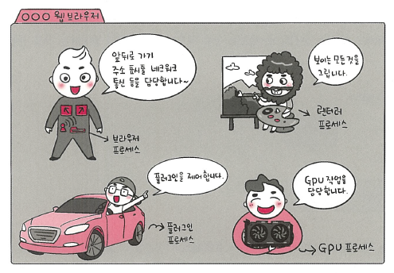
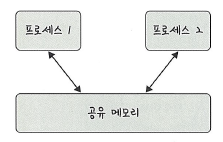
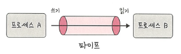
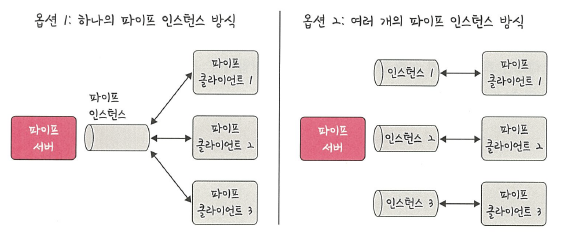
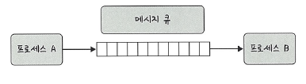

# 📘 3.3.5 멀티프로세싱 (Multiprocessing)

멀티프로세싱은 여러 개의 **프로세스(Process)** 를 통해 동시에 두 가지 이상의 작업을 수행하는 것을 의미합니다.  
이로써 하나 이상의 작업을 병렬 처리할 수 있으며,  
특정 프로세스의 메모리나 일부 영역에 문제가 발생해도  
다른 프로세스를 통해 처리할 수 있어 **신뢰성이 높습니다**.

> 하드웨어 관점에서 "멀티프로세싱"은 **여러 개의 CPU 코어/프로세서**로 작업을 처리하는 것을 의미하기도 합니다.

---

## 🔹 웹 브라우저의 멀티프로세스 구조

현대 웹 브라우저는 안정성과 성능을 위해 멀티프로세스 구조를 사용합니다.

- **브라우저 프로세스**  
  주소 표시줄, 북마크, 뒤로/앞으로 가기 버튼, 네트워크 요청, 파일 접근 권한 등 제어
- **렌더러 프로세스**  
  웹사이트의 ‘보이는’ 모든 부분을 제어 (HTML, CSS, JS 처리)
- **플러그인 프로세스**  
  웹사이트에서 사용하는 플러그인 제어
- **GPU 프로세스**  
  GPU를 이용해 화면을 그리는 부분 제어

> 🖼️ 웹 브라우저의 멀티프로세스 구조   
> 

---

## 🔹 IPC (Inter-Process Communication)

멀티프로세스 환경에서는 프로세스 간 **IPC**를 통해 데이터 전달과 공유가 필요합니다.  
IPC는 프로세스끼리 데이터를 주고받고 공유 데이터를 관리하는 메커니즘입니다.

**활용 예시**
- 클라이언트 ↔ 서버 간 요청 및 응답
- 데이터 공유 및 상태 동기화
- 실시간 알림 전송

---

### ✅ IPC 주요 방식

| 방식 | 설명 | 장점 | 단점 |
|------|------|------|------|
| **공유 메모리 (Shared Memory)** | 여러 프로세스가 동일한 메모리 영역 접근 | 빠른 속도, 데이터 복사 불필요 | 동기화 필요 |
| **파일 (File)** | 디스크에 저장된 데이터 교환 | 단순, 저장성 유지 | 접근 속도 느림 |
| **소켓 (Socket)** | 네트워크 기반 데이터 전송 (TCP/UDP) | 원격 통신 가능 | 구현 복잡 |
| **익명 파이프 (Unnamed Pipe)** | FIFO 기반 단방향 통신, 부모-자식 간 사용 | 간단, 빠름 | 단방향, 네트워크 불가 |
| **명명된 파이프 (Named Pipe)** | 서버-클라이언트 통신, 네트워크 가능 | 유연성 높음 | 구현 복잡 |
| **메시지 큐 (Message Queue)** | 커널이 관리하는 큐 자료구조를 통해 메시지를 송수신 | 코드 수정 적고 직관적, 동기화 부담 적음 | 커널 자원 사용량 증가, 메시지 크기 제한 |

---

### 🔹 방식별 특징

1. **공유 메모리**
   - 복사 오버헤드 없이 메모리를 직접 공유
   - 빠르지만 동기화 문제(뮤텍스, 세마포어 필요)
     > 

2. **파일**
   - 서버-클라이언트 간 데이터 공유 가능
   - 로그, 캐시 등 장기 저장에 유용

3. **소켓**
   - 동일/다른 컴퓨터 간 통신 가능
   - 실시간 스트리밍, 채팅 서비스에 활용

4. **익명 파이프**
   - 프로세스 간 임시 통신
   - 네트워크 미지원
     > 

5. **명명된 파이프**
   - 네트워크 환경에서도 사용 가능
   - 다중 클라이언트 지원
     > 

6. **메시지 큐 (Message Queue)**
   - 메시지를 큐(Queue) 자료구조 형태로 관리
   - 커널이 전역 변수처럼 관리하며, 다른 IPC 방식보다 사용이 직관적이고 코드 수정이 적음
   - 프로세스 간 데이터 전송 시 큐에 메시지를 넣고 꺼내는 방식
   - 공유 메모리에 비해 동기화 부담이 적음
     > 

---

## ✅ 요약

| 구분 | 설명 |
|------|------|
| **멀티프로세싱** | 여러 프로세스를 통해 병렬 작업 수행, 신뢰성 향상 |
| **웹 브라우저 구조** | 브라우저, 렌더러, 플러그인, GPU 프로세스 |
| **IPC** | 프로세스 간 데이터 교환 방식 |
| **공유 메모리** | 빠르지만 동기화 필요 |
| **파일** | 저장성 유지, 느린 속도 |
| **소켓** | 원격 통신 가능 |
| **익명 파이프** | 단방향, 로컬 한정 |
| **명명된 파이프** | 네트워크 가능, 다중 클라이언트 지원 |

---

## 📌 용어 설명

- **IPC**: Inter-Process Communication, 프로세스 간 데이터 교환 기술
- **멀티프로세싱**: 여러 프로세스를 통해 동시에 여러 작업을 처리하는 방식
- **파이프(Pipe)**: 프로세스 간 통신을 위한 데이터 통로
- **공유 메모리(Shared Memory)**: 여러 프로세스가 접근 가능한 공용 메모리 영역
- **소켓(Socket)**: 네트워크 통신의 종단점