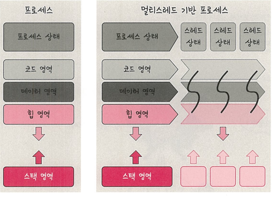

# 스레드와 멀티스레딩

## 스레드
> 스레드는 프로세스의 실행 가능한 가장 작은 단위이다. 하나의 프로세스는 여러 개의 스레드를 가질 수 있다.

- 프로세스는 코드, 데이터, 스택, 힙을 각각 독립적으로 생성한다.  
- 스레드는 코드, 데이터, 힙 영역을 서로 **공유**하고, 스택 등 나머지 영역은 각각 생성한다.

---

## 멀티스레딩
멀티스레딩은 **하나의 프로세스 내에서 여러 개의 스레드로 작업을 처리하는 기법**이다.  
스레드끼리 자원을 공유하므로 효율성이 높다.

예시: 웹 요청을 처리할 때 새 프로세스를 생성하는 대신 스레드를 사용하는 웹 서버의 경우  
- **장점**  
  - 훨씬 적은 리소스를 소비
  - 한 스레드가 `blocked` 되어도 다른 스레드는 `running` 상태 유지 가능 → 중단 없는 빠른 처리
  - 동시성(Concurrency)에 유리
- **단점**  
  - 한 스레드에 문제가 생기면 같은 프로세스 내 다른 스레드에도 영향을 줄 수 있음

---

### 동시성(Concurrency)
> 서로 독립적인 작업들을 작은 단위로 나누고, 동시에 실행되는 것처럼 보여주는 것

멀티스레드 예: **웹 브라우저의 렌더러 프로세스**

렌더러 프로세스 내에는 다음과 같은 스레드들이 존재한다.
- 메인 스레드
- 워커 스레드
- 컴포지터 스레드
- 레스터 스레드
