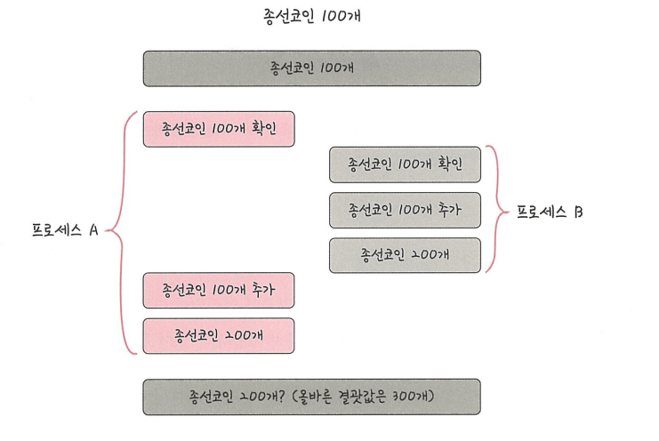
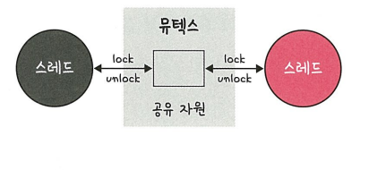
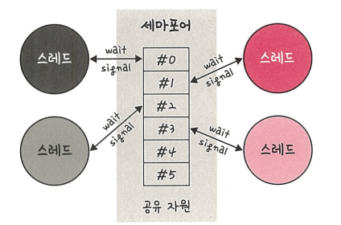
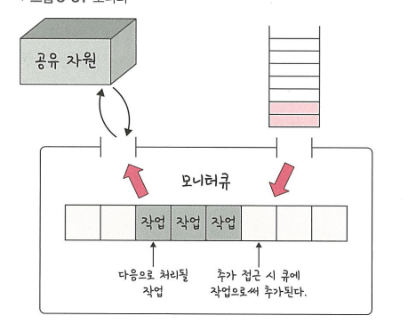

# 공유 자원과 임계 영역

## 📌 공유 자원 (Shared Resource)
> 둘 이상의 프로세스나 스레드가 동시에 접근하여 사용할 수 있는 자원

- 예: 전역 변수, 파일, 프린터, 메모리 공간 등
- 여러 스레드/프로세스가 **동시에 접근**하면 **데이터 불일치**나 **경쟁 상태(Race Condition)**가 발생할 수 있음
- 따라서 공유 자원에 접근하는 코드 구간은 **동기화(Synchronization)**가 필요함

- 설명: 프로세스 A와 프로세스 B가 동시에 접근하여 타이밍이 서로 꼬여 정상 결과값은 300인데 200이 출력된다.
---

## 📌 임계 영역 (Critical Section)
> 둘 이상의 스레드/프로세스가 공유 자원에 접근할 때, 동시에 접근하면 문제가 생기는 코드 영역

임계 영역을 다루기 위해서는 다음 조건을 만족해야 한다.

### ✅ 조건
1. **상호배제 (Mutual Exclusion)**  
   - 한 번에 하나의 프로세스/스레드만 임계 영역에 진입 가능

2. **한정 대기 (Bounded Waiting)**  
   - 임계 영역 진입을 요청한 프로세스/스레드가 **무한정 대기하지 않도록** 보장

3. **융통성 (Progress)**  
   - 임계 영역에 들어가려는 프로세스/스레드가 없으면, 다른 프로세스/스레드가 **즉시 진입** 가능

---

## 동기화 도구

### 1. 뮤텍스 (Mutex)
> 상호배제를 위해 사용되는 **잠금(Lock) 메커니즘**

- 임계 영역에 들어갈 때 `lock`을 걸고, 나올 때 `unlock`을 함
- 한 번에 하나의 스레드만 잠금을 소유 가능
- 주로 **이진 상태(잠금/해제)**로 동작 → Binary Semaphore와 유사하지만, 소유 개념이 있음
  

---

### 2. 세마포어 (Semaphore)
> 공유 자원에 접근할 수 있는 **허용 개수**를 관리하는 동기화 도구

- 내부적으로 정수 값을 가지고 자원 접근 가능 여부를 관리
- `wait(P)` → 자원 사용 요청 / 값 감소  
  `signal(V)` → 자원 사용 종료 / 값 증가

#### 📍 바이너리 세마포어
- 값이 **0 또는 1**만 가짐
- 뮤텍스와 유사하지만 **소유 개념 없음**

#### 📍 카운팅 세마포어
- 값이 **0 이상 여러 개** 가능
- 동일한 자원을 여러 개 보유할 때 사용

---

### 3. 모니터 (Monitor)
> 고수준 동기화 도구로, **공유 자원과 임계 영역을 캡슐화**한 객체

- 공유 자원에 접근할 수 있는 **메서드**만 외부에 노출
- 내부적으로 상호배제를 보장
- 조건 변수를 이용해 스레드 간 동기화 지원
