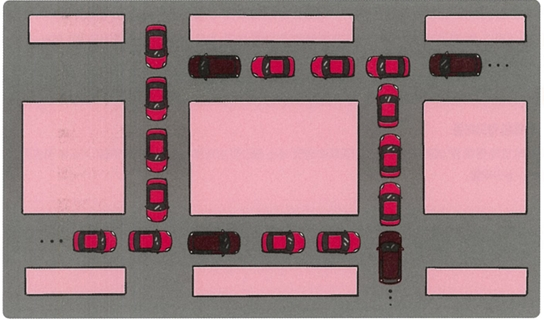

# 3.3.8 교착 상태 (Deadlock)

### 교착 상태(Deadlock) :  두 개 이상의 프로세스들이 서로가 가진 자원을 기다리며 **중단된 상태**를 의미

---

### 📌 교착 상태 예시

예시)  
- 프로세스 A가 프로세스 B의 자원을 요청하고,  
- 프로세스 B도 프로세스 A의 자원을 요청하는 상황  
→ 서로가 상대방이 가진 자원을 기다리게 되어 무한 대기 상태가 됨

---

### 🔹 교착 상태의 원인
1. **상호 배제 (Mutual Exclusion)**  
   - 한 프로세스가 자원을 독점하고 있으며, 다른 프로세스는 해당 자원에 접근 불가능한 상태

2. **점유 대기 (Hold and Wait)**  
   - 특정 자원을 점유한 프로세스가 다른 자원을 추가로 요청하는 상태

3. **비선점 (No Preemption)**  
   - 다른 프로세스가 점유한 자원을 강제로 빼앗을 수 없음

4. **환형 대기 (Circular Wait)**  
   - 프로세스 A → B의 자원을 요청  
     프로세스 B → A의 자원을 요청하는 식으로  
     여러 프로세스가 서로의 자원을 기다리는 상황

---

### 🔹 교착 상태의 해결 방법
1. **예방 (Prevention)**  
   - 자원을 할당할 때 교착 조건이 성립하지 않도록 설계

2. **회피 (Avoidance)**  
   - 교착 상태 가능성이 있을 경우, 자원 할당을 제한  
   - 대표적으로 **은행원 알고리즘** 사용  
     → 프로세스 요청 자원과 최대 보유량을 비교해 자원 할당 가능 여부 판단

3. **탐지 후 회복 (Detection & Recovery)**  
   - 교착 상태가 발생했는지 사이클 탐지  
   - 관련된 프로세스를 강제 종료 또는 자원 회수

4. **무시 (Ignore)**  
   - 교착 상태가 드물게 발생하거나 처리 비용이 더 클 경우, 무시하고 시스템 운영  
   - 예: UNIX 계열에서 “응답 없음” 상태 시 프로세스 종료

---

### 📌 용어
- **은행원 알고리즘 (Banker’s Algorithm)** :  
  총 자원의 양과 현재 할당된 자원의 양을 기준으로 안정/불안정 상태를 구분하고, 안정 상태로 자원을 할당하는 알고리즘
