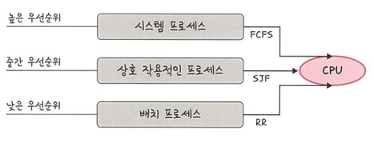

# 📘 3.4.2 선점형 방식 (Preemptive)

**선점형 방식(Preemptive)** 은 현재 실행 중인 프로세스를  
운영체제가 강제로 중단시키고, 다른 프로세스에 **CPU 소유권을 할당하는 방식** 
현대 운영체제 대부분이 사용하는 방식

---

## 🔹 라운드 로빈 (Round Robin, RR)
- 현대 컴퓨터가 많이 사용하는 **선점형 스케줄링 알고리즘**
- 각 프로세스에 동일한 **할당 시간(Time Quantum)** 을 부여  
- 주어진 시간이 지나면, 프로세스는 준비 큐(Ready Queue)의 맨 뒤로 이동

📍 특징
- 할당 시간이 너무 크면 → **FCFS**와 유사  
- 할당 시간이 너무 작으면 → 컨텍스트 스위칭 오버헤드 증가  
- 전체 작업 시간은 길어지지만 **평균 응답 시간은 짧아짐**  
- 로드밸런서에서 **트래픽 분산 알고리즘**으로도 사용됨

---

## 🔹 SRF (Shortest Remaining Time First)
- SJF(Shortest Job First)의 선점형 버전
- 현재 실행 중인 프로세스보다 **더 짧은 실행 시간이 남은 작업**이 들어오면  
  실행 중인 프로세스를 중단하고, 새로 들어온 프로세스를 실행

📍 특징
- 실행 시간이 짧은 작업에 유리
- **Starvation** 발생 가능 (긴 작업이 계속 밀릴 수 있음)

---

## 🔹 다단계 큐 (Multilevel Queue)
- 우선순위에 따라 준비 큐를 여러 개로 나눠 사용
- 각 큐마다 다른 스케줄링 알고리즘 적용 가능 (예: FCFS, SJF, RR)
- 큐 간 프로세스 이동이 불가능 → 스케줄링 부담은 적지만 유연성은 떨어짐

📍 예시
- 높은 우선순위 큐 : 시스템 프로세스 → **FCFS**  
- 중간 우선순위 큐 : 상호작용적 프로세스 → **SJF**  
- 낮은 우선순위 큐 : 배치 프로세스 → **RR**

---
