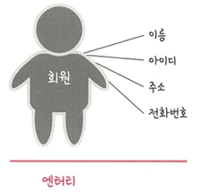

# 📘 4.1 데이터베이스의 기본

데이터베이스(DB, DataBase)는 일정한 규칙이나 규약에 따라 구조화되어 저장되는 **데이터의 모음**  
이를 제어하고 관리하는 통합 시스템을 **DBMS(DataBase Management System)** 라고 하며,  
데이터베이스 안의 데이터는 DBMS가 제공하는 **쿼리 언어(Query Language)** 를 통해 삽입, 삭제, 수정, 조회할 수 있음

- 데이터베이스는 실시간 접근과 동시에 여러 사용자가 공유 가능하다.

---

## 📌 데이터베이스와 DBMS 구조

- 데이터베이스 위에 **DBMS**가 있고, 그 위에 **응용 프로그램**이 위치
- 예: MySQL(DBMS) + Node.js, PHP 같은 응용 프로그램 → 데이터베이스에 접근하여 데이터 관련 로직을 처리

---

## 🔹 4.1.1 엔터티 (Entity)

**엔터티(Entity)** : 사람, 장소, 물건, 사건, 개념 등 여러 속성을 가진 명사적 개체를 의미  
예시: `회원` 엔터티  
- 속성: 이름, 아이디, 주소, 전화번호 등

---

### 엔터티 속성
- 서비스 요구 사항에 따라 속성이 정해짐  
- 불필요한 속성은 제외될 수 있음  
  (예: 주소 속성이 서비스 요구와 무관하면 제거)

---

### 약한 엔터티와 강한 엔터티
- **약한 엔터티 (Weak Entity)** : 단독으로는 존재할 수 없고, 다른 엔터티의 존재 여부에 종속되는 엔터티  
- **강한 엔터티 (Strong Entity)** : 단독으로 독립적으로 존재 가능한 엔터티

📍 예시
- 건물과 방의 관계  
  - 건물: 강한 엔터티  
  - 방: 건물이 있어야 존재 → 약한 엔터티
