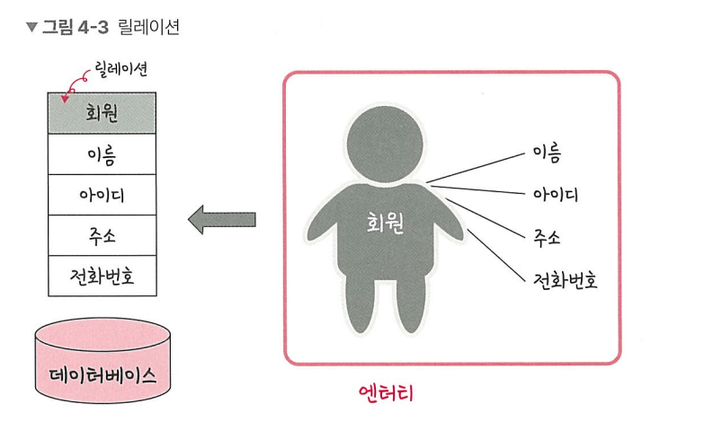
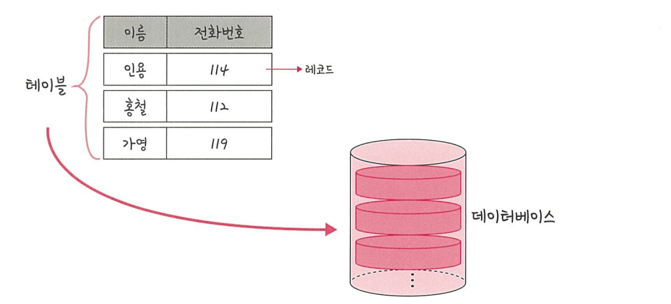

# 📘 릴레이션 (Relation)

> **데이터베이스에서 정보를 구분하여 저장하는 기본 단위**\
> 엔터티(Entity)에 관한 데이터를 데이터베이스는 **하나의 릴레이션**에
> 담아 관리한다.

-   관계형 데이터베이스(RDB) → **릴레이션 = 테이블(Table)**\
-   NoSQL 데이터베이스 → **릴레이션 = 컬렉션(Collection)**

------------------------------------------------------------------------

## 📂 테이블과 컬렉션

데이터베이스의 종류는 크게 **관계형 데이터베이스**와 **NoSQL
데이터베이스**로 나눌 수 있다.

EX)
- 대표적인 관계형 데이터베이스: **MySQL**
- 대표적인 NoSQL 데이터베이스: **MongoDB**

구조 차이를 비교하면 다음과 같다:

-   **MySQL** → 레코드(Record) → 테이블(Table) → 데이터베이스(Database)\
-   **MongoDB** → 도큐먼트(Document) → 컬렉션(Collection) →
    데이터베이스(Database)

-   레코드가 모여 **테이블**을 이루고,
-   테이블이 모여 **데이터베이스**를 이룬다.

------------------------------------------------------------------------

✨ 정리
- 관계형 데이터베이스는 `테이블` 중심
- NoSQL 데이터베이스는 `컬렉션` 중심
