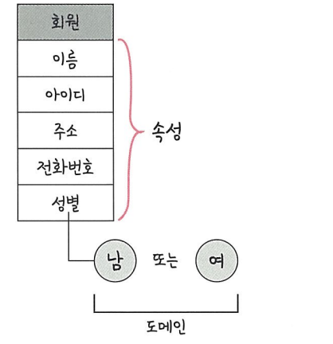

# 📌 도메인 (Domain)

> **릴레이션의 각 속성이 가질 수 있는 값의 집합**  

### 특징
- 각 속성은 **하나의 도메인**만 가진다.  
- 속성 값은 반드시 **자신의 도메인에 속한 값**이어야 한다.  
- 도메인은 일반적으로 **유한한 값의 집합**이다.  

### ex
- 속성: 성별 → 도메인 {남, 여}  
- 속성: 나이 → 도메인 {0 ~ 120}  
- 속성: 이메일 → 도메인 {형식이 맞는 문자열}  

📂 회원 릴레이션 예시  
- 이름  
- 아이디  
- 주소  
- 전화번호  
- 성별 → 도메인 {남, 여}  
