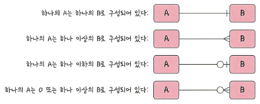
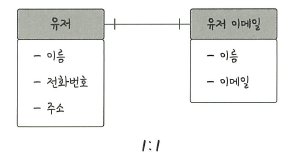
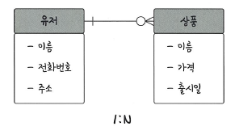
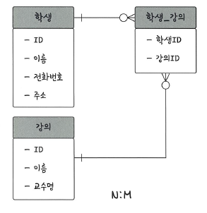

# 📘 4.1.6 관계

데이터베이스에는 하나의 테이블만 존재하지 않습니다.  
여러 개의 테이블이 있으며, 이들은 서로 **관계(Relationship)** 를 통해 연결됩니다.  
이러한 관계를 관계화살표(ERD)로 표현합니다.

---

## 📘 1:1 관계 (One to One)

예를 들어, 유저당 유저 이메일은 한 개씩만 있을 수 있습니다.  
이 경우 **1:1 관계**가 됩니다.

**특징**  
- 한 엔터티의 레코드가 다른 엔터티의 레코드와 **단 하나**만 연결  
- 테이블을 두 개로 분리하여 구조를 단순화  

---

## 📘 1:N 관계 (One to Many)

예를 들어 쇼핑몰을 운영한다고 해봅시다.  
한 유저가 여러 개의 상품을 장바구니에 담을 수 있습니다.  
이 경우 **1:N 관계**가 됩니다.  
물론 하나도 담지 않는 경우(0개)도 가능하므로 이를 포함해 표현할 수 있습니다.

**특징**  
- 한 엔터티(예: 유저)가 다른 엔터티(예: 상품)와 **여러 개** 연결  
- 가장 흔히 사용되는 관계  

---

## 📘 N:M 관계 (Many to Many)

학생과 강의의 관계를 예로 들어봅시다.  
- 한 학생은 여러 강의를 수강할 수 있음  
- 한 강의도 여러 학생을 포함할 수 있음  
이 경우 **N:M 관계**가 됩니다.

**특징**  
- 두 테이블을 직접 연결하지 않고,  
  **중간 테이블(연결 테이블, 조인 테이블)** 을 둬서 관리  
- 예: `학생` – `학생_강의` – `강의`

---

## ✅ 요약

| 관계 유형 | 설명 | 예시 |
|-----------|------|------|
| **1:1** | 한 레코드가 다른 레코드와 단 하나만 연결 | 유저 ↔ 유저 이메일 |
| **1:N** | 한 레코드가 다른 레코드 여러 개와 연결 | 유저 ↔ 상품 |
| **N:M** | 다대다 관계, 중간 테이블 필요 | 학생 ↔ 강의 |

---

## 📌 용어 정리

- **1:1 관계**: 엔터티 간 일대일 매핑 관계  
- **1:N 관계**: 한 엔터티가 다른 엔터티 여러 개와 연결  
- **N:M 관계**: 다대다 관계, 중간 테이블 필요  