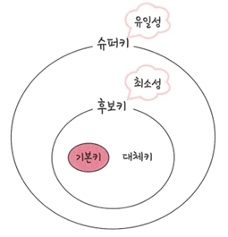
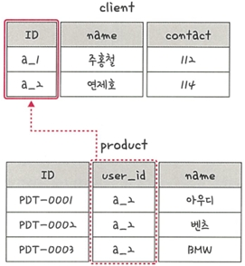

# 📘 4.1.7 키 (Key)

데이터 간의 관계를 명확하게 하고 엔티티를 구별하기 위해 설정된 장치.  
키에는 **기본키, 외래키, 후보키, 대체키, 슈퍼키**가 있음

---

## 🔹 기본키 (Primary Key, PK)
- 엔티티의 각 인스턴스를 **유일하게 식별**할 수 있는 키
- 유일성과 최소성을 만족해야 함
- 보통 주민등록번호, 학번, 사번처럼 고유 번호로 설정
- NULL 값을 가질 수 없음
- 하나의 테이블에 **한 개만 존재**

📍 예시 (기본키가 안 되는 키)

 
  - 기본키에 해당하는 데이터는 중복되어서는 안되지만 
    PDT-0002가 중복되기 때문에 ID라는 필드는 기본키가 되지 말아야 함
    
📍 예시 (기본키가 되는 키)

 
---

## 🔹 자연키 (Natural Key)
- 중복된 값들을 제외하며 중복되지 않는 것을 '자연스레' 뽑다가 나오는 키
- 언젠가는 변하는 속성을 가짐

---

## 🔹 인조키 (Artificial Key, Surrogate Key)
- 자연 속성이 아닌, 인위적으로 만든 키
- 보통 오라클은 **시퀀스(sequence)**, MySQL은 **auto increment** 등을 사용하여 생성

---

## 🔹 외래키 (Foreign Key, FK)
- 다른 테이블의 기본키를 참조하는 키
- 테이블 간의 **관계(Relationship)** 를 설정하는 데 사용
- 참조 무결성을 유지하기 위해 사용됨
- 하나의 테이블에 여러 개 설정 가능

📍 예시  
- client 테이블의 기본키인 `ID`가 product 테이블의 `user_id`라는 외래키로 설정될 수 있음
- `user_id`는 `a_2`라는 값이 중복됨

---

## 🔹 후보키 (Candidate Key)
- 기본키가 될 수 있는 후보들
- **유일성**과 **최소성**을 만족
- 하나의 테이블에 여러 개 존재할 수 있음

📍 예: ID, 주민등록번호, 이메일 → 모두 유일하다면 후보키 가능

---

## 🔹 대체키 (Alternate Key)
- 후보키 중에서 기본키로 선택되지 않은 키
- 보조 식별자로 활용 가능

---

## 🔹 슈퍼키 (Super Key)
- 각 레코드를 유일하게 식별할 수 있는 키의 집합
- 유일성은 만족하지만 최소성은 만족하지 않아도 됨
- 기본키 + 추가 속성이 포함된 경우도 슈퍼키가 될 수 있음

---

## ✅ 키 정리

| 키 | 설명 | 특징 |
|----|------|------|
| **기본키 (Primary Key)** | 레코드를 유일하게 식별 | 유일성 + 최소성, NULL 불가 |
| **자연키 (Natural Key)** | 자연스레 나오는 키 | 언젠가는 변하는 속성을 가짐 |
| **인조키 (Artificial Key)** | 인위적으로 만든 키 | Auto Increment 등 |
| **외래키 (Foreign Key)** | 다른 테이블의 기본키 참조 | 참조 무결성 보장 |
| **후보키 (Candidate Key)** | 기본키가 될 수 있는 후보 | 유일성 + 최소성 |
| **대체키 (Alternate Key)** | 후보키 중 기본키로 선택되지 않은 키 | 보조 식별자 |
| **슈퍼키 (Super Key)** | 레코드를 유일하게 식별하는 키 집합 | 최소성은 만족하지 않아도 됨 |

