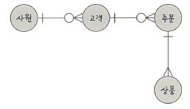
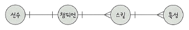

# 📘 4.2.2 예제로 배우는 ERD

이번에는 실제 요구사항을 기반으로 **ERD(Entity Relationship Diagram, 개체 관계도)** 를 작성해보겠습니다.  
ERD는 데이터베이스를 설계할 때 **엔터티(Entity)**, **관계(Relationship)**, **속성(Attribute)** 을 시각적으로 표현한 다이어그램입니다.  

---

## 📘 예제 1: 승원 영업부서의 ERD

**요구 사항**  
- 영업사원은 0 ~ n명의 고객을 관리한다.  
- 고객은 0 ~ n개의 주문을 넣을 수 있다.  
- 주문에는 1 ~ n개의 상품이 들어간다.  

**ERD 예시**

**해석**  
- 영업사원 ↔ 고객: 1:N 관계 (한 명의 영업사원이 여러 고객 관리 가능)  
- 고객 ↔ 주문: 1:N 관계 (한 고객이 여러 주문 가능)  
- 주문 ↔ 상품: N:M 관계 (한 주문에 여러 상품, 한 상품이 여러 주문에 포함 가능 → **중간 테이블 필요**)  

---

## 📘 예제 2: 무무오브레전드의 ERD

**요구 사항**  
- 선수들은 1명의 챔피언을 고를 수 있다.  
- 챔피언은 한 개 이상의 스킬을 갖는다.  
- 스킬은 한 개 이상의 특성을 갖는다.  

**ERD 예시**

**해석**  
- 선수 ↔ 챔피언: 1:1 관계 (선수는 한 챔피언만 선택)  
- 챔피언 ↔ 스킬: 1:N 관계 (한 챔피언이 여러 스킬 보유)  
- 스킬 ↔ 특성: 1:N 관계 (한 스킬이 여러 특성 가짐)  

---

## ✅ 요약

| 예제 | 주요 관계 | 설명 |
|------|-----------|------|
| 승원 영업부서 | 영업사원–고객(1:N), 고객–주문(1:N), 주문–상품(N:M) | 주문–상품은 다대다 관계라서 중간 테이블 필요 |
| 무무오브레전드 | 선수–챔피언(1:1), 챔피언–스킬(1:N), 스킬–특성(1:N) | 게임 도메인의 개체 관계를 ERD로 표현 |

---

## 📌 보충 설명

- **ERD 작성 시 주의사항**
  - **엔터티(Entity)**: 데이터베이스의 테이블이 됨  
  - **속성(Attribute)**: 테이블의 필드(컬럼)가 됨  
  - **관계(Relationship)**: 엔터티 간의 연관성  
  - **관계 차수(Cardinality)**: 1:1, 1:N, N:M 형태로 정의  

- **N:M 관계 처리 방법**  
  - 데이터베이스에서는 N:M을 직접 구현하지 않고, **중간 테이블**을 둬서 두 개의 1:N 관계로 풀어낸다.  
  - 예: 주문–상품 관계 → `주문_상품` 테이블 생성  