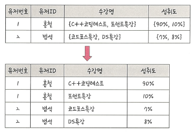
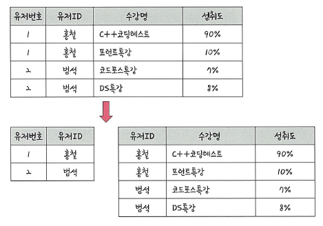
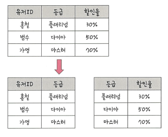
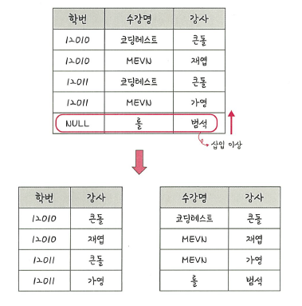

# 📘 4.2.3 정규화 과정

**정규화(Normalization)** 는 릴레이션 간의 잘못된 종속 관계로 인해 발생하는 데이터베이스 **이상 현상(Anomaly)** 을 해결하고,  
저장 공간을 효율적으로 사용하기 위해 하나의 릴레이션을 여러 개로 분리하는 과정입니다.

---

## 📌 이상 현상(Anomaly)

- **삽입 이상(Insertion Anomaly)**  
  : 새로운 데이터를 삽입할 때 불필요한 데이터까지 함께 입력해야 하는 문제  
- **삭제 이상(Deletion Anomaly)**  
  : 데이터를 삭제할 때 필요한 데이터까지 함께 삭제되는 문제  
- **갱신 이상(Update Anomaly)**  
  : 데이터를 갱신할 때 일부만 수정되어 데이터 불일치가 발생하는 문제  

---

## 📌 정규화 원칙

정규화의 목표는 "같은 의미를 표현하지만 더 좋은 구조의 릴레이션"을 만드는 것입니다.  
- 데이터 **중복 최소화**  
- 독립적인 관계는 별도의 릴레이션으로 분리  
- 각 릴레이션은 독립적이고 명확하게 표현 가능해야 함  

---

## 📘 제1정규형 (1NF)

릴레이션의 모든 속성 값은 더 이상 분해할 수 없는 **원자값(Atomic Value)** 으로만 구성되어야 합니다.  
즉, 속성 값이 **반복**되거나 **집합** 형태를 가져서는 안 됩니다.

예시:  
- [잘못된 테이블] 하나의 수강명 필드에 "C++코딩테스트, 프로젝트특강" 같이 여러 값 저장  
- [제1정규형 변환] 수강명을 행 단위로 분리 → 중복 제거

---

## 📘 제2정규형 (2NF)

제1정규형을 만족하면서, 기본키의 일부분에만 종속되는 속성을 제거한 형태입니다.  
즉, **부분 함수 종속(Partial Dependency)** 을 제거해야 합니다.

예시:  
- [잘못된 테이블] {유저ID, 수강명} → 성취도  
- [제2정규형 변환] '유저ID, 수강명'과 성취도를 분리하여 새로운 릴레이션 구성

---

## 📘 제3정규형 (3NF)

제2정규형을 만족하면서, 기본키가 아닌 모든 속성이 **이행적 함수 종속(Transitive Dependency)** 을 제거한 형태입니다.  
즉, 기본키 → A → B 형태의 종속 관계가 없어야 합니다.

예시:  
- 유저ID → 등급 → 할인율  
- [제3정규형 변환] 등급과 할인율을 별도의 릴레이션으로 분리

---

## 📘 보이스/코드 정규형 (BCNF)

BCNF는 제3정규형의 강화된 형태입니다.  
결정자가 후보키가 아닌 함수 종속 관계를 제거하여, 모든 결정자가 후보키가 되도록 하는 정규형입니다.

예시:  
- 학번–수강명–강사 테이블에서 "강사 → 수강명"이라는 종속성 존재  
- [BCNF 변환] 강사와 수강명을 분리하여 새로운 테이블 생성

---

## ✅ 요약

| 정규형 | 설명 | 제거 대상 |
|--------|------|----------|
| 제1정규형 (1NF) | 속성 값은 더 이상 분해할 수 없는 원자값 | 반복·집합 속성 |
| 제2정규형 (2NF) | 기본키의 일부분에만 종속된 속성 제거 | 부분 함수 종속 |
| 제3정규형 (3NF) | 기본키가 아닌 속성 간의 종속 제거 | 이행적 함수 종속 |
| BCNF | 모든 결정자가 후보키 | 비후보키 결정자 |

---

## 📌 용어 정리

- **부분 함수 종속**: 기본키의 일부 속성에만 의존하는 종속성  
- **이행적 함수 종속**: A → B, B → C일 때 A → C 관계가 성립하는 경우  
- **결정자**: 함수 종속 관계에서 다른 속성을 결정짓는 속성  
- **후보키**: 튜플을 유일하게 식별할 수 있는 최소 속성 집합  