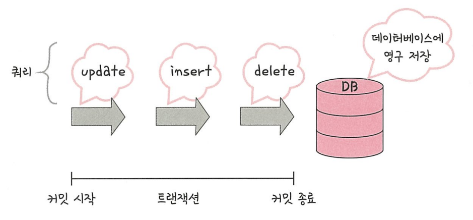
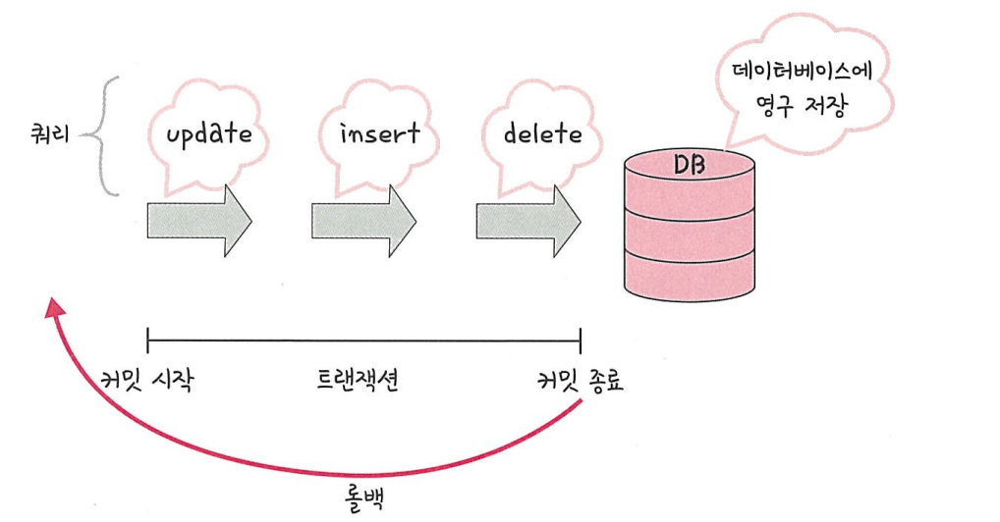
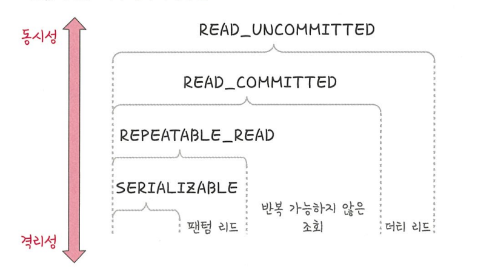

# 📌 트랜잭션 (Transaction)

> 데이터베이스에서 하나의 논리적 작업 단위를 이루는 연산들의 집합\
> **ACID (원자성, 일관성, 격리성, 지속성)** 성질을 만족해야 한다.

------------------------------------------------------------------------

## 1️⃣ 원자성 (Atomicity)

-   트랜잭션의 연산은 모두 수행되거나, 전혀 수행되지 않아야 한다.
-   **Commit** : 모든 작업을 DB에 반영

-   **Rollback** : 실행 중 오류 발생 시 작업을 취소하고 원상 복구
    
-   **트랜잭션 전파** : 트랜잭션이 다른 메서드 호출 시 함께 전파되는
    특성
>

------------------------------------------------------------------------

## 2️⃣ 일관성 (Consistency)

-   트랜잭션 실행 전후에 데이터베이스는 **일관된 상태**를 유지해야
    한다.
-   제약 조건, 무결성 조건 등이 항상 만족되어야 함

------------------------------------------------------------------------

## 3️⃣ 격리성 (Isolation)

-   동시에 실행되는 트랜잭션이 서로의 연산에 영향을 주지 않도록 보장

### ❌ 격리 수준에 따라 발생하는 문제

-   **Dirty Read** : 커밋되지 않은 데이터를 읽음
-   **Non-Repeatable Read** : 같은 쿼리 결과가 다르게 나옴
-   **Phantom Read** : 같은 조건 검색 시 새로운 행이 나타남

### ✅ 격리 수준 (Isolation Level)

1.  Read Uncommitted → 가장 낮음, Dirty Read 발생 가능
2.  Read Committed → Dirty Read 방지, 대부분의 DB 기본값
3.  Repeatable Read → Non-Repeatable Read 방지
4.  Serializable → 가장 높음, 모든 문제 방지 (성능 저하)

------------------------------------------------------------------------

## 4️⃣ 지속성 (Durability)

-   트랜잭션이 성공적으로 완료되면 그 결과는 **영구히 DB에 반영**된다.
-   **체크섬(Checksum)** : 데이터 손상 여부 검증
-   **저널링(Journaling)** : 로그 기록을 통한 장애 복구 지원

------------------------------------------------------------------------

✨ 정리 : 트랜잭션은 **ACID (원자성·일관성·격리성·지속성)**을 만족해야
하며,\
안정적이고 신뢰할 수 있는 데이터베이스 동작을 보장한다.
