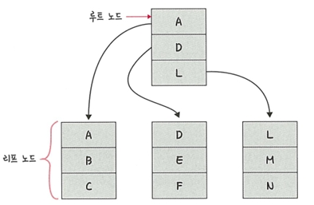
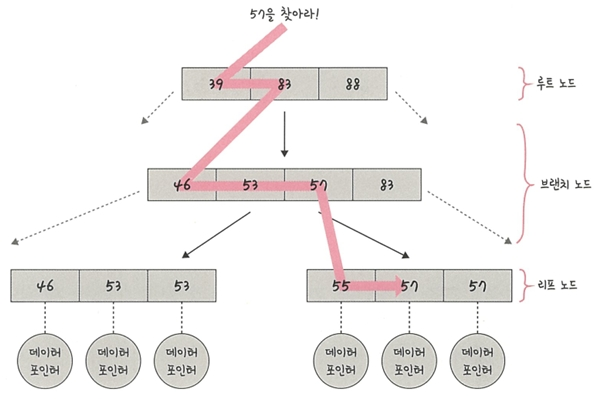

# 📘 4.5.2 B-트리 (B-Tree)

인덱스는 보통 **B-트리**라는 자료 구조로 이루어져 있으며  
이는 **루트 노드, 리프 노드,** 
그리고 루트 노드와 리프 노드 사이에 있는 **브랜치 노드**로 나뉨

---

## 📌 B-트리 예제 1

- 예를 들어 `E`를 찾는다고 할 때, 전체 테이블을 탐색하는 것이 아니라  
  `E`가 있을법한 리프 노드로 들어가서 `E`를 탐색하면 쉽게 찾을 수 있음  
- 이 자료 구조 없이 `E`를 탐색하고자 하면 `A, B, C, D, E` 다섯 번을 탐색해야 하지만, 
  이렇게 노드들로 나누면 두 번만에 리프 노드에서 찾을 수 있음  

---

## 📌 B-트리 예제 2 (키 57에 해당하는 데이터 검색)

- 트리 탐색은 루트 노드부터 시작해 **브랜치 노드 → 리프 노드** 순으로 진행됨.  
- 예: 57 값을 찾는 경우  
  1. `57`보다 같거나 클 때까지 `<=`를 기반으로 처음 루트 노드에서는 `39, 83`
  2.  이후 아래 노드로 내려와 `46, 53, 57` 등 정렬된 값을 기반으로 탐색  
  3. 리프 노드 범위에서 57을 탐색  
- 이렇게 루트 노드부터 시작하여 마지막 리프 노드에 도달해서 `57`이 가리키는 데이터 포인터를 통해 결괏값 반환

---

## 📌 인덱스가 효율적인 이유와 대수확장성

- 인덱스가 효율적인 이유 : 효율적인 단계를 거쳐  모든 요소에 접근할 수 있는
  **균형 잡힌 트리 구조**와 **트리 깊이의 대수확장성** 때문

- 대수확장성 : 트리 깊이가 리프 노드 수에 비해 매우 느리게 성장하는 것을 의미함
- 기본적으로 인덱스가 한 깊이씩 증가할 때마다 최대 인덱스 항목의 수는 `4`배씩 증가 

  

>📍 트리의 대수확장성

| 트리 깊이 | 인덱스 항목 수 | 
|-----------|----------------|
| 3 | 64 |
| 4 | 256 |
| 5 | 1,024 |
| 6 | 4,096 |
| 7 | 16,384 |
| 8 | 65,536 |
| 9 | 262,144 |
| 10 | 1,048,576 |

- 앞의 표처럼 트리 깊이는 열 개짜리로, 100만 개의 레코드를 검색할 수 있다는 의미
- 실제 인덱스는 이것보다 훨씬 더 효율적이며, 그렇기 때문에 인덱스가 효율적이라고 볼 수 있음

📍 깊이가 10일 경우, 약 **100만 개의 레코드**를 검색할 수 있음 → 인덱스의 강력한 효율성
