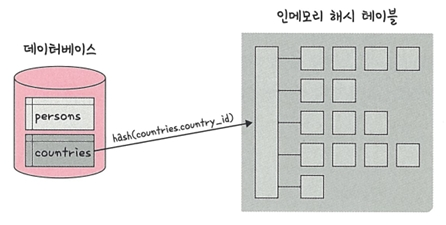
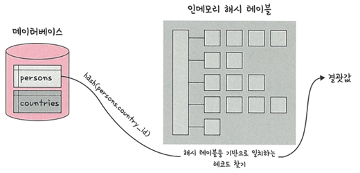

# 📘 4.7.3 해시 조인 (Hash Join)

---

## 🔹 해시 조인이란?
- **해시 테이블(Hash Table)** 을 기반으로 두 개의 테이블을 조인하는 방식
- 한 테이블을 메모리에 올려 **해시 테이블**로 변환 후, 다른 테이블과 매칭
- 일반적으로 **중첩 루프 조인보다 효율적**
- 메모리에 올릴 수 없을 정도로 크면 디스크 사용 → 성능 저하 발생
- **동등 조인(=)** 에서만 사용 가능

---

## 📌 MySQL에서의 해시 조인
- MySQL 8.0.18 릴리스부터 해시 조인 기능 지원
- 해시 조인의 과정은 크게 **빌드 단계(Build Phase)** 와 **프로브 단계(Probe Phase)** 로 나뉨

---

## 🔹 빌드 단계 (Build Phase)

- 입력 테이블 중 하나를 메모리에 올려 **해시 테이블** 생성
- 예: `persons`와 `countries` 테이블을 조인 시,  
  `countries.country_id`를 기준으로 해시 테이블을 빌드
- 이후 조인 조건에 사용되는 필드가 해시 테이블의 키가 됨

---

## 🔹 프로브 단계 (Probe Phase)

- 다른 테이블을 읽으면서, 각 레코드의 조인 키를 이용해  
  **해시 테이블을 탐색**하여 일치하는 값을 찾음
- 예: `persons.country_id` 값을 키로 활용해,  
  해시 테이블에서 동일한 `country_id`를 찾아 결과 반환

---

## 📌 해시 조인의 장점
- 테이블을 **한 번씩만 읽기 때문에** 성능이 우수
- 대용량 테이블 조인 시 **중첩 루프 조인보다 효율적**
- 메모리 사용량은 시스템 변수(`join_buffer_size`)에 의해 제어되며, 런타임 시 조정 가능

---
