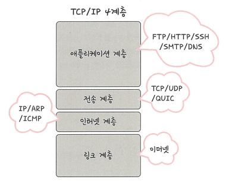

## 🌐 TCP/IP 4계층 모델

> 인터넷에서 컴퓨터들이 정보를 주고받기 위해 사용하는 **인터넷 프로토콜 스위트(Internet Protocol Suite)**  
> 일반적으로 **TCP/IP 4계층 모델** 또는 **OSI 7계층 모델**로 설명됨

---

## 📦 계층 구조

| 계층 | 설명 | 대표 프로토콜 |
|------|------|----------------|
| **응용 계층** Application Layer | 사용자와 직접적으로 상호작용하며 데이터를 처리 | HTTP, FTP, DNS, SMTP |
| **전송 계층** Transport Layer | 통신의 신뢰성과 순서를 보장 | TCP, UDP |
| **인터넷 계층** Internet Layer | 목적지까지의 **패킷 전달 및 라우팅** 담당 | IP, ICMP, ARP |
| **네트워크 인터페이스 계층** Network Interface Layer | 실제 데이터 전송을 위한 물리적 연결 관리 | 이더넷, Wi-Fi 등 (MAC, PHY 계층 포함) |

---

### TCP/IP 계층

---

### 🧩 애플리케이션 계층 (Application Layer)

> 응용 프로그램이 사용하는 프로토콜 계층으로,  
> **웹 서비스, 이메일, 파일 전송 등 실질적인 사용자 서비스**를 제공하는 계층

#### ✅ 주요 프로토콜

- **FTP**  
  : 장치 간 **파일 전송**에 사용되는 표준 통신 프로토콜  
  (File Transfer Protocol)

- **SSH**  
  : 보안되지 않은 네트워크에서 **암호화된 안전한 통신**을 가능하게 함  
  (Secure Shell)

- **HTTP (HyperText Transfer Protocol)**  
  : **WWW (World Wide Web)** 기반의 데이터 통신을 위한 프로토콜  
  웹 사이트를 이용할 때 주로 사용되며, 웹의 핵심이 되는 통신 규약

- **SMTP**  
  : 이메일을 **전송**하기 위한 표준 인터넷 프로토콜  
  (Simple Mail Transfer Protocol)

- **DNS**  
  : 도메인 이름을 IP 주소로 **변환해주는 시스템**  
  (Domain Name System)

---

📌 애플리케이션 계층은 **사용자와 가장 밀접한 계층**으로,  
실제 우리가 사용하는 대부분의 인터넷 서비스는 이 계층을 통해 이루어진다

---

### 전송계층

### 🔄 OSI 7계층과의 비교 

| OSI 7계층       | TCP/IP 4계층          |
|----------------|------------------------|
| 응용, 표현, 세션 계층 | 응용 계층 (Application) |
| 전송 계층         | 전송 계층 (Transport)    |
| 네트워크 계층       | 인터넷 계층 (Internet)   |
| 데이터 링크, 물리 계층 | 네트워크 인터페이스 계층 (Link) |