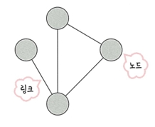
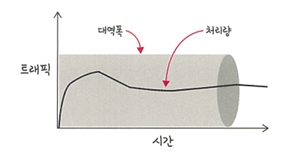
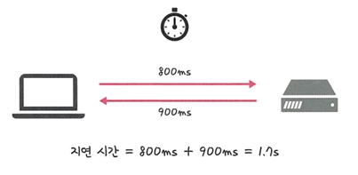

# 📡 2.1 네트워크의 기초
 **네트워크**: 노드(node)와 링크(link)가 서로 연결되어 있으며 리소스를 공유하는 집합 
 
 
  - **노드**: 서버, 라우터, 스위치 등 네트워크 장치를 의미
  - **링크**: 유선 또는 무선 
 

---

## ✅ 2.1.1 처리량과 지연 시간

- **처리량 (Throughput)**: 얼마나 많은 데이터를 빠르게 처리할 수 있는가?
- **지연 시간 (Latency)**: 요청하고 응답받기까지 얼마나 걸리는가?

---

## 🔸 1. 처리량 (Throughput)

### 📌 정의
- **링크 내에서 성공적으로 전달된 데이터의 양** → 보통 얼만큼의 트래픽을 처리했는지 나타냄
  - '많은 트래픽을 처리한다 = 많은 처리량을 가진다'

### 📌 단위
- `bps (bits per second)` : 초당 전송 또는 수신되는 비트 수

### 📌 비유 예시
- 🚗 고속도로에 1초에 몇 대의 차가 지나가는가? → 처리량

### 📈 그림으로 보기

- **트래픽**: 특정 시점에 링크 내에 '흐르는' 데이터의 양
  - 서버에 저장된 파일(문서, 이미지, 동영상 등)을 클라이언트(사용자)가 다운로드 할 때 발생되는 데이터의 누적량

- **대역폭**: 주어진 시간 동안 네트워크 연결을 통해 흐를 수 있는 최대 비트 수

 ### 📌 개념 보충
- '트래픽이 많아졌다. = 흐르는 데이터가 많아졌다.'
- '처리량이 많아졌다. = 처리되는 트래픽이 많아졌다.'

### 📌 처리량에 영향을 주는 요소
- 사용자 수 증가 → 트래픽 증가
- 네트워크 장치 간의 대역폭
- 네트워크 중간에 발생하는 에러
- 장치의 하드웨어 스펙(장비의 성능)

---

## 🔸 2. 지연 시간 (Latency)

### 📌 정의
- **요청을 보내고 응답이 오기까지 걸리는 시간**
- 즉, 메시지가 두 장치 사이를 왕복하는 데 걸리는 시간

### ⏱ 예시

### 📌 영향을 주는 요소
- 전송 매체 (유선, 무선)
- 패킷 크기
- 라우터 처리 성능

### 📌 비유 예시
- 📦 인터넷 쇼핑 시 주문~배송까지 걸리는 시간 = 지연 시간

---

## ✅ 비교표

| 항목        | 처리량 (Throughput)                    | 지연 시간 (Latency)                         |
|-------------|-----------------------------------------|---------------------------------------------|
| **정의**    | 단위 시간에 처리된 데이터 양            | 요청~응답까지 걸린 시간                     |
| **단위**    | bps (bits per second)                  | 초(s), 밀리초(ms)                           |
| **중요성**  | 빠른 다운로드, 스트리밍 속도             | 빠른 반응성, 웹 응답 시간                   |
| **비유**    | 고속도로에서 차가 얼마나 많이 지나갔나   | 주문한 택배가 얼마나 빨리 도착하나         |
| **영향요소**| 대역폭, 트래픽, 장비 성능               | 매체 종류, 라우터, 패킷 크기                |

---

## 🎯 결론

- **좋은 네트워크**란?
  - **처리량이 높고**  
  - **지연 시간은 짧은** 네트워크

---
