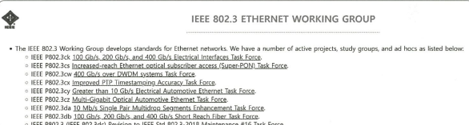

## 🔒 네트워크 프로토콜 표준화

> 서로 다른 장치들이 데이터를 주고받기 위해 **공통된 규칙(인터페이스)**을 설정한 것  
> 해당 규칙은 **IEEE**, **IETF** 같은 *국제 표준화 기구*에서 정함 (기업이나 개인이 임의로 정하지 않음)

 

---

### 📡 IEEE 802.3

- 유선 LAN(Local Area Network)에서 사용하는 표준 프로토콜
- 이더넷 기반으로, **유선 LAN을 구축할 때** 사용됨
- 데이터 링크 계층의 **MAC 계층** 정의

---

### 🌐 HTTP (HyperText Transfer Protocol)

- **웹 상에서 데이터를 주고받는 데 사용되는 표준 프로토콜**
- 클라이언트와 서버가 **약속된 형식(인터페이스)**을 통해 통신함
- **IETF**에서 표준화함
- 대표적인 **애플리케이션 계층 프로토콜**

---

### 📚 관련 표준화 기구

| 표준화 기구 | 설명 |
|-------------|------|
| IEEE        | 전기·전자 기술 분야의 국제 표준 제정 기구 |
| IETF        | 인터넷 관련 기술 표준을 정하는 기구 |