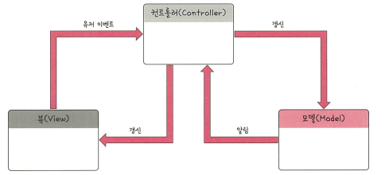

## 🔒 MVC 패턴 (MVC Pattern)

> 모델(Model), 뷰(View), 컨트롤러(Controller)
> **역할을 분리**하여 유지보수성과 확장성을 높이는 대표적인 디자인 패턴
> **SOLID 원칙 중 SRP(단일 책임 원칙)**을 자연스럽게 구현한 대표 패턴

### 📊 구조

---

### 🧩 구성 요소 설명

#### 📁 Model (모델)
- 애플리케이션의 **핵심 데이터와 상태**를 담당
- 예: 데이터베이스, 상수, 변수 등
- 사용자가 데이터를 입력하거나 수정하면 컨트롤러가 이 요청을 받아 모델을 **생성하거나 갱신**한다.

---

#### 🖼️ View (뷰)
- 사용자에게 보이는 **UI 요소**를 담당
- 예: `input`, `checkbox`, `textarea` 등 HTML 요소
- 모델의 데이터를 기반으로 화면을 구성하며, 사용자가 인터랙션하는 부분

---

#### 🧠 Controller (컨트롤러)
- 모델과 뷰를 연결하는 **중재자 역할**을 한다.
- 사용자 입력(Event)을 받아 처리하고, 모델을 조작하거나 뷰를 갱신
- 또한 모델/뷰의 **생명주기 관리**, **변경 사항 알림 처리**도 수행

---

### 🎯 요약

| 구성 요소 | 역할 |
|-----------|------|
| Model | 데이터와 비즈니스 로직을 담당 |
| View | 사용자에게 보여지는 화면 |
| Controller | 입력 이벤트를 처리하고, 모델과 뷰를 연결 |

✅ 각 구성 요소는 **단일 책임 원칙(SRP)**을 따르도록 설계되어 있다.
각각 하나의 명확한 역할만 수행함으로써 코드의 유지보수성과 확장성을 높여줌

##### 🔁 관련 개념 정리
*단일 책임 원칙(SRP)* : 하나의 모듈(또는 클래스)은 하나의 책임만 가져야 한다는 설계 원칙

---

### 🚀 대표 프레임워크

- **Spring Framework (Java)**  
  : MVC 패턴을 기반으로 한 대표적인 백엔드 프레임워크

  ### 🌐 스프링과 MVC

> **Spring Framework의 Web MVC**는 웹 서비스를 구축하는 데 매우 유용한 기능들을 제공

- 예를 들어,  
  `@RequestParam`, `@RequestHeader`, `@PathVariable` 같은 **애너테이션 기반 요청 처리 방식**을 통해  
  사용자의 요청 값을 쉽게 분석할 수 있고, 요청의 유효성도 손쉽게 검증할 수 있다.

- 예: 숫자를 입력해야 하는데 문자를 입력한 경우 → 컨트롤러에서 자동 검증 가능

- **장점 요약:**
  - 재사용 가능한 코드
  - 테스트 용이
  - 명확하고 리더블한 구조 유지

- **Django (Python)**  
  : MTV 패턴이지만, MVC 패턴과 매우 유사한 구조

- **Express (Node.js)**  
  : 미들웨어 기반의 MVC 구조를 만들 수 있음

---

### 💡 실생활 비유: **음식 주문 시스템**

| 역할 | 실생활 예시 | 설명 |
|------|--------------|------|
| Model | 주방 | 요리(데이터)를 만드는 곳 |
| View | 식탁 | 손님이 음식을 보는 공간 |
| Controller | 웨이터 | 손님의 주문을 받아 주방에 전달하고, 요리가 나오면 식탁에 전달 |

> 손님(View)이 "된장찌개 주세요!" 라고 하면  
> → 웨이터(Controller)가 주방(Model)에 주문을 전달  
> → 주방은 된장찌개를 만들어  
> → 웨이터가 식탁(View)에 가져다 줍니다.
