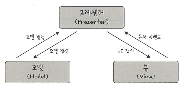

# 📘 MVP 패턴

## 🔹 MVP 패턴 (Model-View-Presenter Pattern)

### 🧩 MVP 패턴이란?

> **MVP(Model-View-Presenter)** 패턴은 MVC 패턴에서 파생된 아키텍처 패턴으로,  
> MVC에서 컨트롤러(Controller)에 해당하는 부분을 **프레젠터(Presenter)**로 대체한 구조입니다.



---

### ✅ 구조

- **Model**: 애플리케이션의 데이터 및 비즈니스 로직을 처리하는 계층  
- **View**: 사용자 인터페이스(UI)를 담당하며 사용자 입력을 받음  
- **Presenter**: View와 Model 사이에서 중개자 역할을 수행  
  - View에서 이벤트가 발생하면 Presenter로 전달됨  
  - Presenter는 로직을 처리하고, Model의 데이터를 View에 전달하여 UI 갱신을 수행

📌 구조도:
```
┌─────────────────────┐
│ 프레젠터(Presenter) │
└─────────────────────┘
    ↑          ↑
모델 변경   UI 갱신
    ↑          ↑
┌────────────┐ ┌──────────┐
│ 모델(Model)│ │ 뷰(View) │
└────────────┘ └──────────┘
    ↓          ↓
모델 갱신 유저 이벤트
```

---

### ✅ 특징 및 장점

- 🔄 **View와 Model 간의 직접적인 연결 없음**  
- 🔎 **테스트 용이성 증가**  
- 🧩 **View의 역할이 단순화됨**  
- 🔗 **강한 결합도와 명확한 책임 분리**

---

### ✅ MVC vs MVP

| 항목 | MVC 패턴 | MVP 패턴 |
|------|----------|----------|
| 제어 흐름 | Controller가 View와 Model을 모두 제어 | Presenter가 View와 Model을 모두 제어 |
| View ↔ Model 직접 연결 | 일부 직접 연결 허용 | 완전히 분리되어 Presenter를 통해서만 연결 |
| 테스트 용이성 | 중간 정도 | Presenter 단위로 테스트 용이 |
| View 책임 | UI + 일부 로직 처리 | UI만 처리, 로직은 Presenter에 위임 |

---

### ✅ 언제 사용하면 좋은가?

- ✅ UI 로직과 비즈니스 로직을 철저히 분리하고 싶은 경우  
- ✅ 뷰의 역할을 최소화하고 테스트 가능한 구조를 만들고 싶은 경우  
- ✅ Android 등 플랫폼에서 View와 Presenter 간 역할이 명확히 구분되었으면 하는 경우

---

## 🔹 예시: Android 앱에서의 MVP

- **Model**: Repository, NetworkManager 등 데이터 소스 처리  
- **View**: Activity, Fragment (UI만 처리)  
- **Presenter**: Activity와 통신하며 유저 입력에 따라 Model을 제어

```java
// View (인터페이스)
interface LoginView {
    void showLoading();
    void hideLoading();
    void showLoginSuccess();
    void showLoginError(String message);
}

// Presenter
class LoginPresenter {
    private final LoginView view;
    private final AuthService authService;

    void onLoginButtonClicked(String username, String password) {
        view.showLoading();
        authService.login(username, password, result -> {
            view.hideLoading();
            if (result.isSuccess()) view.showLoginSuccess();
            else view.showLoginError("로그인 실패");
        });
    }
}
```

### 📘 **용어 정리**

| 용어         | 설명                                                                 |
|--------------|----------------------------------------------------------------------|
| MVP 패턴     | Model, View, Presenter로 구성된 아키텍처 패턴. MVC에서 Controller 대신 Presenter 사용 |
| Model        | 애플리케이션의 데이터 및 비즈니스 로직을 처리하는 계층                        |
| View         | 사용자 인터페이스(UI)를 구성하고 사용자 입력을 Presenter로 전달하는 계층         |
| Presenter    | View와 Model 간의 중개자로, 로직을 처리하고 결과를 View에 반영하는 역할            |
| 단방향 흐름  | View → Presenter → Model → View 로 흐름이 명확히 정의되는 구조                   |
| 역할 분리    | 각 계층이 명확히 분리되어 있어 유지보수성과 테스트 용이성이 높아지는 설계 원칙        |
| 테스트 용이성 | Presenter에 로직이 집중되어 있어 단위 테스트 수행이 쉬운 특징                       |
| Android MVP | 안드로이드 앱에서 View(Activity/Fragment)와 Presenter를 명확히 구분하여 사용하는 방식 |
