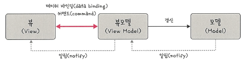

# 📘 MVVM 패턴

## 🔹 MVVM 패턴 (Model-View-ViewModel Pattern)

### 🧩 MVVM 패턴이란?

> **MVVM(Model-View-ViewModel)** 패턴은 MVC 패턴에서 파생된 아키텍처로,  
> MVC의 Controller에 해당하는 부분이 **ViewModel**로 바뀐 구조입니다.  
> ViewModel은 View에 특화된 Model로, **데이터 바인딩**과 **커맨드(command)**를 통해  
> View와 양방향으로 통신할 수 있는 점이 특징입니다.



---

### ✅ 구조

- **Model**: 앱의 핵심 데이터 및 비즈니스 로직 처리 담당  
- **View**: UI 구성 및 사용자 입력 처리. ViewModel과 바인딩됨  
- **ViewModel**:  
  - View와 Model을 연결  
  - View의 입력을 바탕으로 명령(Command) 전달  
  - Model의 데이터를 받아 View에 전달하며 View를 직접 참조하지 않음

📌 구조도:
```
┌──────────┐      data binding      ┌────────────────┐       update       ┌───────────┐
│   View   │  ←──────────────────→  │   ViewModel    │  ←───────────────  │   Model   │
└──────────┘      command(cmd)      └────────────────┘     notify()       └───────────┘
        ↑                                                        ↑
        └────────────────────── notify() ────────────────────────┘
```

---

### ✅ 특징 및 장점

- 🔄 **View와 ViewModel 간 양방향 데이터 바인딩**  
- 🔗 **ViewModel이 View를 직접 참조하지 않음 → 높은 테스트 용이성**  
- 💡 **UI 코드와 로직이 분리 → 재사용성과 유지보수성 향상**  
- 🧪 **단위 테스트가 쉬움 → View 없이도 ViewModel 단위 테스트 가능**

---

### ✅ MVC / MVP / MVVM 비교

| 항목 | MVC 패턴 | MVP 패턴 | MVVM 패턴 |
|------|----------|----------|------------|
| 제어 계층 | Controller | Presenter | ViewModel |
| View ↔ Model | 부분 연결 | 완전 분리 | ViewModel 통해 양방향 연결 |
| View ↔ 중개자 | View는 Controller에 의존 | View는 Presenter에 의존 | View는 ViewModel과 데이터 바인딩 |
| 테스트 용이성 | 보통 | 높음 | 매우 높음 |
| UI 로직 위치 | View, Controller | Presenter | ViewModel |

---

### ✅ MVVM의 대표적인 사용 예: Vue.js

- **Vue.js**는 MVVM 아키텍처를 대표하는 프론트엔드 프레임워크입니다.
- `watch`, `computed`, `v-model`, `@click` 등을 활용하여 **양방향 반응형 데이터 바인딩** 구현 가능
- 함수 없이도 `html` 템플릿에서 변수 변경만으로 UI 업데이트 가능

#### ✅ 주요 특징
- **재사용 가능한 컴포넌트 기반**  
- **자동 UI 갱신 기능 (reactivity)**  
- **간결한 선언적 코드 구성 가능**

#### ✅ MVVM 패턴 기반 프레임워크 활용 예:
- 🏎️ **BMW**, ☁️ **Google**, 🚗 **루이비통** 등의 기업에서 Vue.js를 활용한 UI 구축

---

## 🔹 주요 개념 정리

| 용어            | 설명                                                                 |
|-----------------|----------------------------------------------------------------------|
| MVVM 패턴       | Model, View, ViewModel 구조로 ViewModel이 중간 매개자 역할 수행     |
| Model           | 애플리케이션의 핵심 데이터와 비즈니스 로직을 담당                   |
| View            | 사용자 인터페이스(UI)를 담당하며 ViewModel과 바인딩됨               |
| ViewModel       | View의 상태와 동작을 표현하며, Model과 통신하고 View와는 바인딩으로 연결 |
| 데이터 바인딩   | 화면에 보이는 데이터를 ViewModel의 메모리와 동기화시키는 기법       |
| 커맨드(Command) | 사용자 인터랙션을 ViewModel에서 처리하기 위한 명령 형식             |
| 반응형 바인딩   | 변수 변화에 따라 UI가 자동으로 갱신되는 특성                         |
