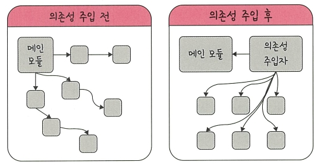

# 🧠 싱글톤 패턴(Singleton Pattern)

---

## 📌 싱글톤 패턴이란?


- 싱글톤 패턴(Singleton Pattern)은 **클래스의 인스턴스를 오직 하나만 생성**하도록 보장하는 디자인 패턴
- 동일한 인스턴스를 **여러 모듈에서 공유**하여 사용하며, 주로 다음과 같은 상황에서 사용됨:
  - 데이터베이스 연결
  - 설정 정보 관리
  - 로깅 시스템

### ✅ 장점
- 인스턴스 생성 비용을 줄일 수 있음
- 전역 인스턴스를 통해 **일관된 접근** 가능

### ❌ 단점
- **의존성이 증가**하여 테스트가 어려워질 수 있음

---

## 📌 자바스크립트에서의 싱글톤 패턴

### ❌ 일반 객체 비교

```js
const obj = { a: 27 };
const obj2 = { a: 27 };

console.log(obj === obj2); // false
```

- 객체 리터럴은 같은 내용을 갖더라도 **서로 다른 인스턴스**로 생성되기 때문에 `false`가 출력

---

### ✅ 생성자 기반 싱글톤 패턴

```js
class Singleton {
  constructor() {
    if (!Singleton.instance) {
      Singleton.instance = this;
    }
    return Singleton.instance;
  }

  getInstance() {
    return this;
  }
}

const a = new Singleton();
const b = new Singleton();

console.log(a === b); // true
```

#### 💬 설명:
- `Singleton.instance`는 정적(static) 프로퍼티로 클래스 전체에서 공유됨
- `constructor()` 내부에서 이미 인스턴스가 존재하면 `this`를 새로 만들지 않고 기존 인스턴스를 반환
- 따라서 `a`와 `b`는 **동일한 객체**를 참조하게 됨

---

## 📌 데이터베이스 연결 예시

```js
const URL = 'mongodb://localhost:27017/kundolapp';

const createConnection = url => ({ "url": url });

class DB {
  constructor(url) {
    if (!DB.instance) {
      DB.instance = createConnection(url);
    }
    return DB.instance;
  }

  connect() {
    return this.instance;
  }
}

const a = new DB(URL);
const b = new DB(URL);

console.log(a === b); // true
```

#### 💬 설명:
- DB 연결은 무겁고 리소스를 많이 소모하므로, **한 번만 생성해서 재사용**하는 것이 효율적
- `DB.instance`가 없을 때만 연결을 생성하며, 이후에는 재사용
- `a`, `b`는 같은 DB 연결 객체를 참조함

---

## 📌 자바에서의 싱글톤 패턴

```java
class Singleton {
  private static class SingleInstanceHolder {
    private static final Singleton INSTANCE = new Singleton();
  }

  public static Singleton getInstance() {
    return SingleInstanceHolder.INSTANCE;
  }
}
```

```java
public class HelloWorld {
  public static void main(String[] args) {
    Singleton a = Singleton.getInstance();
    Singleton b = Singleton.getInstance();

    System.out.println(a.hashCode());
    System.out.println(b.hashCode());
    System.out.println(a == b); // true
  }
}
```

#### 💬 설명:
- 정적 내부 클래스는 JVM이 클래스 로딩을 늦추므로 **지연 로딩(lazy loading)**이 됨
- `INSTANCE`는 클래스가 호출될 때 단 한 번만 초기화되며, 스레드 안전성도 보장됨

---

## 📌 mongoose의 싱글톤 패턴

```js
Mongoose.prototype.connect = function(uri, options, callback) {
  const _mongoose = this instanceof Mongoose ? this : mongoose;
  const conn = _mongoose.connection;

  return _mongoose._promiseOrCallback(callback, cb => {
    conn.openUri(uri, options, err => {
      if (err != null) return cb(err);
      return cb(null, _mongoose);
    });
  });
};
```

#### 💬 설명:
- `connect()`는 **항상 동일한 Mongoose 인스턴스를 반환**하도록 설계되어 있음
- 내부에서 `this instanceof Mongoose` 조건을 활용해 전역 인스턴스를 관리
- 이를 통해 여러 모듈에서 mongoose를 연결해도 **중복 연결 없이 재사용**됨

---

## 📌 MySQL의 싱글톤 패턴

```js
// 메인모듈
const mysql = require('mysql');

const pool = mysql.createPool({
  connectionLimit: 10,
  host: 'example.org',
  user: 'kundol',
  password: 'secret',
  database: '승철이디비'
});

pool.connect();
```

```js
// 모듈 A
pool.query(query, (err, results) => {
  if (err) throw err;
  console.log('The solution is: ', results[0].solution);
});

// 모듈 B
pool.query(query, (err, results) => {
  if (err) throw err;
  console.log('The solution is: ', results[0].solution);
});
```

#### 💬 설명:
- `createPool()`을 통해 **연결 풀(Connection Pool)**을 생성하고 재사용
- 메인 모듈에서 생성한 풀을 다른 모듈 A, B에서도 **동일하게 참조**함으로써 싱글톤처럼 작동함
- 효율적인 DB 연결 유지에 매우 유용함

---

## 📌 싱글톤 패턴의 단점

1. **테스트 어려움 (TDD 부적합)**  
   - 테스트마다 독립적인 인스턴스가 필요하지만, 싱글톤은 하나의 인스턴스를 공유하므로 테스트 격리가 어려움

2. **의존성 증가**  
   - 모듈 간의 결합도가 높아져 유지보수가 어려워질 수 있음

---

## 📌 의존성 주입 (Dependency Injection)


- 의존성 주입(DI)은 **필요한 객체를 직접 생성하지 않고 외부에서 주입**받는 방식
- **결합도를 낮추고 테스트 용이성**을 확보할 수 있음

### 🆚 구조 비교

| 의존성 주입 전 | 의존성 주입 후 |
|----------------|----------------|
| 메인 모듈이 직접 하위 모듈 생성 | 별도의 주입자가 객체 생성 후 전달 |

### ✅ 장점
- 테스트가 쉬워지고, 구조가 유연해짐
- 모듈 간 관계가 명확해짐

### ❌ 단점
- 클래스 수 증가, 초기 설계 복잡도 상승 가능

---

## ✅ 한 줄 요약

| 항목 | 설명 |
|------|------|
| 정의 | 하나의 인스턴스를 만들어 공유하는 패턴 |
| 사용 목적 | 비용 절감, 리소스 공유, 일관된 접근 |
| 주요 예시 | DB 연결, 설정 객체, 로깅 등 |
| 구현 방식 | 자바스크립트(클래스 + 정적 변수), 자바(내부 클래스) 등 |
| 단점 | 테스트 어려움, 의존성 증가 |
| 해결책 | **의존성 주입(DI)** 구조 도입 |

