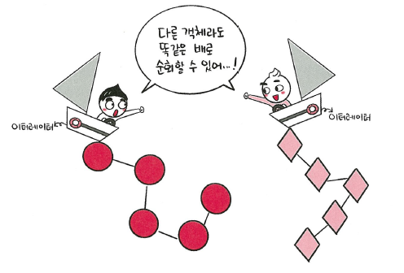

# 📘 1.1.6 이터레이터 패턴

이터레이터 패턴(iterator pattern)은 **이터레이터(iterator)** 를 사용하여 **컬렉션(collection)** 의 요소들에 접근하는 디자인 패턴입니다.  
이를 통해 순회할 수 있는 여러 가지 자료형의 구조와는 상관없이 이터레이터라는 하나의 인터페이스로 순회가 가능합니다.

---

### 🔍 핵심 개념

- **이터레이터**는 동일한 방식으로 배열, 트리, 그래프 등 다양한 구조를 순회할 수 있도록 해줍니다.
- 다양한 자료형의 순회 방식이 통일됨으로써, 순회 로직을 단순화할 수 있습니다.

---

### 🖼️ 이터레이터 패턴



> **"다른 객체라도 똑같은 방식으로 순회할 수 있어…!"**

(동그라미, 네모 등 자료형과 관계없이 하나의 이터레이터로 순회 가능)

---

### 💻 자바스크립트에서의 이터레이터 패턴

```javascript
const mp = new Map()
mp.set('a', 1)
mp.set('b', 2)
mp.set('c', 3)

const st = new Set()
st.add(1)
st.add(2)
st.add(3)

for (let a of mp) console.log(a)
for (let a of st) console.log(a)

/*
['a', 1]
['b', 2]
['c', 3]
1
2
3
*/
```

✅ 위 코드는 Map과 Set 모두에 대해 동일한 for...of 문을 사용할 수 있음을 보여줍니다.
이처럼 서로 다른 자료 구조지만 이터러블 객체로써 순회할 수 있게 해주는 것이 이터레이터 프로토콜입니다.

📎 참고: for...of는 값 순회, for...in은 키 순회에 사용됩니다.

---

### 🧩 이터레이터 프로토콜의 구성
이터러블 객체는 Symbol.iterator 메서드를 구현하고 있어야 하며,
해당 메서드는 이터레이터(iterator) 객체를 반환해야 합니다. 이터레이터 객체는 다음과 같은 구조를 가집니다.

```javascript
{
  next: () => ({ value: any, done: boolean })
}
```
- value: 현재 값
- done: 순회가 끝났는지 여부 (true면 종료)

---

### 📦 대표적인 이터러블 객체들

- Array
- String
- Map
- Set
- arguments 객체
- NodeList (브라우저 환경)

---

### 📘 **용어 정리**
| 용어               | 설명                                              |
|--------------------|---------------------------------------------------|
| 이터레이터 프로토콜 | 이터러블한 객체들을 순회할 때 쓰이는 규칙         |
| 이터러블한 객체     | 반복 가능한 객체로, 배열을 일반화한 개념          |
