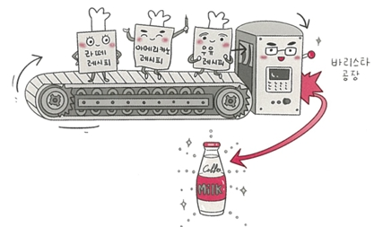

# 📦 팩토리 패턴 (Factory Pattern)

팩토리 패턴은 객체를 사용하는 코드에서 객체 생성 부분을 분리해 **상위 클래스에서 객체 생성을 결정하고, 하위 클래스에서 구체적인 내용을 정의**하도록 하는 패턴으로 객체 생성 로직을 캡슐화하여 유연한 구조를 제공함

---

## ✅ 팩토리 패턴 개념 요약

- 객체 생성의 책임을 상위 클래스에서 분리
- 생성할 객체의 구체적인 타입은 하위 클래스에서 결정
- 결합도를 낮추고 유연성과 재사용성을 증가시킴
- 단위 테스트가 용이함

예: 커피 주문 시 "Latte"를 선택하면 Latte 객체가 생성되고, "Espresso"를 선택하면 Espresso 객체가 생성됨.



---

## 💡 자바스크립트에서의 팩토리 패턴 예제

### 📌 1. 기본적인 new Object 예시

```js
const num = new Object(42);
const str = new Object('abc');

console.log(num.constructor.name); // Number
console.log(str.constructor.name); // String
```

> **설명:** 값에 따라 생성되는 객체의 타입이 다름 → 객체 타입 결정이 팩토리처럼 작동

---

### 📌 2. 커피 팩토리 구현 예제

```js
class CoffeeFactory {
  static createCoffee(type) {
    const factory = factoryList[type];
    return factory.createCoffee();
  }
}

class Latte {
  constructor() {
    this.name = "latte";
  }
}

class Espresso {
  constructor() {
    this.name = "Espresso";
  }
}

class LatteFactory extends CoffeeFactory {
  static createCoffee() {
    return new Latte();
  }
}

class EspressoFactory extends CoffeeFactory {
  static createCoffee() {
    return new Espresso();
  }
}

const factoryList = {
  LatteFactory,
  EspressoFactory,
};

const main = () => {
  const coffee = CoffeeFactory.createCoffee("LatteFactory");
  console.log(coffee.name); // latte
};

main();
```

> **설명:** `CoffeeFactory`는 상위 클래스, 하위 클래스 `LatteFactory`, `EspressoFactory`가 객체를 생성  
> `createCoffee()`는 static 메서드로 호출되며 메모리 할당을 줄일 수 있음

---

## 💡 자바에서의 팩토리 패턴 예제

```java
enum CoffeeType {
  LATTE,
  ESPRESSO
}

abstract class Coffee {
  protected String name;
  public String getName() {
    return name;
  }
}

class Latte extends Coffee {
  public Latte() {
    name = "latte";
  }
}

class Espresso extends Coffee {
  public Espresso() {
    name = "Espresso";
  }
}

class CoffeeFactory {
  public static Coffee createCoffee(CoffeeType type) {
    switch (type) {
      case LATTE: return new Latte();
      case ESPRESSO: return new Espresso();
      default: throw new IllegalArgumentException("Invalid coffee type: " + type);
    }
  }
}

public class Main {
  public static void main(String[] args) {
    Coffee coffee = CoffeeFactory.createCoffee(CoffeeType.LATTE);
    System.out.println(coffee.getName()); // latte
  }
}
```

> **설명:** `enum CoffeeType`으로 타입 관리, `CoffeeFactory`가 Coffee 객체를 생성  
> 클래스 확장성과 가독성 증가, 추상화된 객체 생성 로직 분리

---

## 📌 팩토리 패턴 장점

- 객체 생성 로직과 사용을 분리 → 유지보수성, 유연성 향상
- 객체 생성 방식 변경이 쉬움
- OCP(Open/Closed Principle)에 부합

## ⚠️ 단점

- 클래스 수가 많아짐 (하위 팩토리 클래스 증가)
- 코드가 복잡해질 수 있음

---

## ✅ 한줄 요약

| 항목 | 설명 |
|------|------|
| 목적 | 객체 생성 로직 분리, 추상화 |
| 구현 방식 | 상위 클래스에서 하위 클래스를 결정하거나 위임 |
| 예시 | 커피 공장 예시 (LatteFactory, EspressoFactory 등) |
| 장점 | 결합도 감소, 유지보수성 증가, 확장성 향상 |
| 단점 | 클래스 수 증가, 복잡성 증가 |